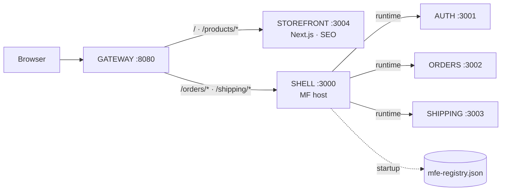

# micro-shop

A small but **complete, working micro-frontend architecture** for learning and teaching:
**Module Federation 2.0** on **Rspack 2**, **React 19**, **React Router 8**, a **Next.js 16**
storefront for SEO, a shared **shadcn/ui + Tailwind v4** design system, typed contracts and
events, failure isolation, versioned deploys with rollback, observability, and tests.

> 📘 **New here? Start with the [guide](docs/GUIDE.md).** It builds the system up stage by
> stage and explains every decision, with diagrams, real measurements, questions and
> experiments. It ends with a plan for presenting it to your team.



## Applications

| App        | Kind               | Port | Exposes / serves                         | Owns URLs            |
| ---------- | ------------------ | ---- | ---------------------------------------- | -------------------- |
| gateway    | reverse proxy      | 8080 | one public origin for both zones         | routes everything    |
| storefront | Next.js zone       | 3004 | static product pages, sitemap, robots    | `/`, `/products/*`   |
| shell      | MF host            | 3000 | layout, routing, error isolation         | top-level routes     |
| auth       | MF remote          | 3001 | `./session`, `./LoginForm`, `./UserMenu` | (none)               |
| orders     | MF remote          | 3002 | `./OrdersApp`                            | `/orders/*`          |
| shipping   | MF remote          | 3003 | `./ShippingApp`                          | `/shipping/*`        |

| Package                     | What                                                   |
| --------------------------- | ------------------------------------------------------ |
| `@micro-shop/ui`            | shadcn/ui components + theme tokens (build-time)       |
| `@micro-shop/contracts`     | public types: session API, URLs, events (types only)   |
| `@micro-shop/event-bus`     | typed publish/subscribe over `window`, with replay     |
| `@micro-shop/observability` | logger tagged with the app name, pluggable sinks       |

## Quick start

Requires Node ≥ 22.12 and pnpm.

```bash
pnpm install
pnpm dev            # every app + storefront + gateway, as separate processes
```

Open **http://localhost:8080** and sign in with `ada@example.com` / `demo`.

Each team can also run its app alone: `pnpm dev:auth` (3001), `pnpm dev:orders` (3002),
`pnpm dev:shipping` (3003), `pnpm dev:shell` (3000), `pnpm dev:storefront` (3004).

## Scripts

| Command | What it does |
| --- | --- |
| `pnpm dev` | Run everything in development mode |
| `pnpm build` / `pnpm build:<app>` | Build every app, or one, into its own artifact |
| `pnpm typecheck` | Typecheck every app and package, including contract type-tests |
| `pnpm test` | Unit tests (Vitest) |
| `pnpm test:e2e` | End-to-end tests (Playwright, uses your local Chrome; starts everything itself) |
| `pnpm release <app>` / `pnpm release all` | Upload a remote's build to the local CDN as a new version and make it live |
| `pnpm release rollback <app> <version>` | Point the registry back at an earlier version |
| `pnpm release status` | Show the live and uploaded versions |
| `pnpm start:prod` | Serve built artifacts only (CDN, shell, storefront, gateway) on http://localhost:8080 |

Release demo: `pnpm build && pnpm release all && pnpm start:prod`, then in another terminal
build Orders as a new version and `pnpm release orders`; reload the page. See
[GUIDE, Chapter 9](docs/GUIDE.md#chapter-9-production-deploy-version-observe-test).

## Adding shadcn components

```bash
cd packages/ui
pnpm dlx shadcn@latest add dialog
```

## Documentation

| Document | Read it for |
| --- | --- |
| [docs/GUIDE.md](docs/GUIDE.md) | **The full guide**: 10 chapters, diagrams, exercises, presenting to a team |
| [docs/production-architecture.md](docs/production-architecture.md) | CDN, caching, versioning, rollback, compatibility, security (CSP, CORS, SRI), monitoring, ownership |
| [docs/module-federation.md](docs/module-federation.md) | Deep dive: MF configuration, the network sequence, the async boundary |
| [docs/architecture.md](docs/architecture.md) | Deep dive: ownership, the Auth boundary, remote code and origins |
| [docs/shared-packages.md](docs/shared-packages.md) | Deep dive: build-time vs runtime sharing, contracts, Tailwind across apps |

## What's built

1. ✅ Shell loads Orders (host, remote, shared, manifest, async boundary)
2. ✅ Auth remote (business boundaries, framework-agnostic API)
3. ✅ Shared UI (shadcn/ui) + contracts
4. ✅ Shipping + URL routing (shared router, URL contract, cross-app navigation)
5. ✅ Cross-app events (`order.created` → Shipping reacts; replay; event log)
6. ✅ Failure isolation (per-remote error boundaries, retry, fail-closed auth, `?break=<app>`)
7. ✅ Next.js storefront for SEO + a gateway composing two zones on one origin
8. ✅ Independent deployment (runtime registry, versioned CDN, rollback), observability, tests
