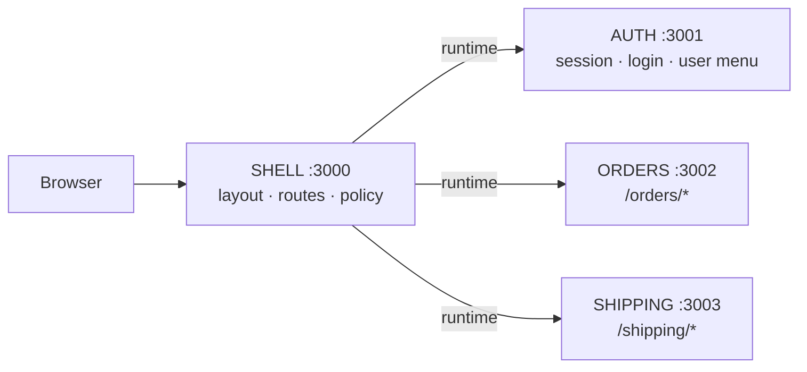

# micro-shop

A deliberately small, working **micro-frontend** architecture for learning and teaching
**Module Federation 2.0**, built with **Rspack 2**, **React 19**, **React Router 8**,
**TypeScript**, **pnpm workspaces**, **Tailwind CSS v4** and **shadcn/ui**.

> 📘 **New here? Start with the [guide](docs/GUIDE.md).** It explains every decision in this
> repository chapter by chapter, with diagrams, code, questions and experiments.



| App      | Role   | Port | Exposes                                  | Owns URLs     |
| -------- | ------ | ---- | ---------------------------------------- | ------------- |
| shell    | host   | 3000 | nothing                                  | `/`           |
| auth     | remote | 3001 | `./session`, `./LoginForm`, `./UserMenu` | none          |
| orders   | remote | 3002 | `./OrdersApp`                            | `/orders/*`   |
| shipping | remote | 3003 | `./ShippingApp`                          | `/shipping/*` |

| Package                 | What                                         | Shared how                          |
| ----------------------- | -------------------------------------------- | ----------------------------------- |
| `@micro-shop/ui`        | shadcn/ui components + theme tokens          | build time (bundled into each app)  |
| `@micro-shop/contracts` | public types: session API, URLs, events      | build time, types only (0 bytes)    |
| `@micro-shop/event-bus` | typed publish/subscribe over `window` events | build time; `window` is the transport |

## Quick start

Requires Node ≥ 22.12 and pnpm.

```bash
pnpm install
pnpm dev            # starts all four apps (four separate processes)
```

Open http://localhost:3000 and sign in with `ada@example.com` / `demo`.

Or run each application on its own, the way each team would:

```bash
pnpm dev:auth       # http://localhost:3001
pnpm dev:orders     # http://localhost:3002
pnpm dev:shipping   # http://localhost:3003
pnpm dev:shell      # http://localhost:3000
```

## Build and check

```bash
pnpm build          # every app → apps/<app>/dist (separate artifacts)
pnpm build:orders   # one app
pnpm typecheck      # all apps and packages
```

## Adding shadcn components

```bash
cd packages/ui
pnpm dlx shadcn@latest add dialog
```

## Documentation

| Document | Read it for |
| --- | --- |
| [docs/GUIDE.md](docs/GUIDE.md) | **The full guide**: why, how, diagrams, exercises, presenting to a team |
| [docs/module-federation.md](docs/module-federation.md) | Deep dive: MF configuration, the network sequence, the async boundary |
| [docs/architecture.md](docs/architecture.md) | Deep dive: ownership, the Auth boundary, remote code and origins |
| [docs/shared-packages.md](docs/shared-packages.md) | Deep dive: build-time vs runtime sharing, contracts, Tailwind across apps |

## Roadmap

1. ✅ Shell loads Orders (host, remote, shared, manifest)
2. ✅ Auth remote (business boundaries)
3. ✅ Shared UI (shadcn/ui) + contracts
4. ✅ Shipping + URL routing (cross-app navigation through URLs)
5. ✅ Cross-app events (`order.created` → Shipping reacts; event log in the shell)
6. ✅ Failure isolation (per-remote error boundaries, retry, fail-closed auth, `?break=<app>`)
7. ✅ Next.js storefront for SEO pages + a local gateway (`http://localhost:8080`)
8. Independent deployment, versioning, rollback, observability, tests
