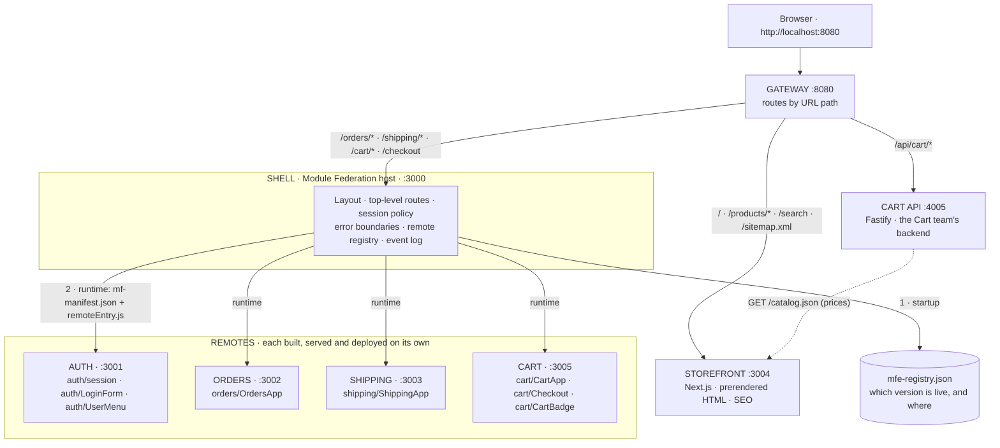
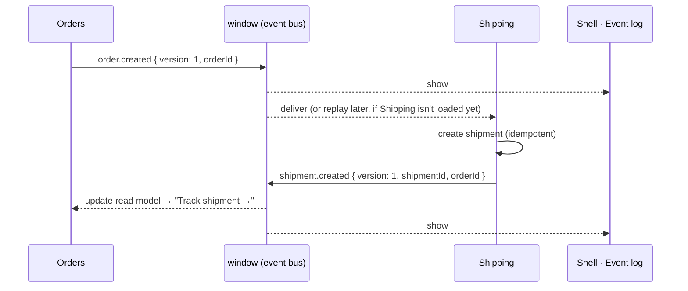

<div align="center">

# micro-shop

**A small but complete micro-frontend architecture you can run, break, and learn from.**

Six independently built frontends and a backend, one product. Runtime composition with Module Federation 2.0,
an SEO zone with Next.js, typed contracts and events, failure isolation, versioned deploys
with instant rollback, observability, and tests, all in one pnpm workspace.


[**Read the guide**](docs/GUIDE.md) ·
[Developer overview](docs/developer-overview.md) ·
[Production architecture](docs/production-architecture.md) ·
[Quick start](#quick-start)

</div>

---

## Contents

- [Why this project](#why-this-project)
- [Architecture](#architecture)
- [Quick start](#quick-start)
- [A five-minute tour](#a-five-minute-tour)
- [Applications](#applications)
- [Shared packages](#shared-packages)
- [How the apps talk to each other](#how-the-apps-talk-to-each-other)
- [Failure isolation](#failure-isolation)
- [Independent deployment and rollback](#independent-deployment-and-rollback)
- [Observability](#observability)
- [Testing](#testing)
- [Repository layout](#repository-layout)
- [Scripts](#scripts)
- [Tech stack](#tech-stack)
- [Documentation](#documentation)
- [Design principles](#design-principles)
- [Working in the repo](#working-in-the-repo)

---

## Why this project

Most micro-frontend examples stop at "the host loads a remote button". Real systems don't fail
there. They fail at shared React versions, routing across apps, identity boundaries,
events nobody receives, one remote taking the whole page down, and deploys that need every team
to rebuild.

**micro-shop covers all of that, in a codebase small enough to read in an afternoon.** Every
decision is explained in the code comments and in a 10-chapter [guide](docs/GUIDE.md), including
the bugs we hit along the way.

| You'll see how to... | Where |
| --- | --- |
| Load separately deployed apps into one page at runtime | [Chapter 1](docs/GUIDE.md#chapter-1-host-and-remote-the-core-of-module-federation) |
| Share exactly one React and one router across apps | [Chapter 2](docs/GUIDE.md#chapter-2-shared-dependencies) |
| Draw a business boundary around identity | [Chapter 3](docs/GUIDE.md#chapter-3-business-boundaries-the-auth-app) |
| Share a design system and typed contracts without coupling | [Chapter 4](docs/GUIDE.md#chapter-4-shared-packages-the-design-system-and-contracts) |
| Split URL ownership between apps | [Chapter 5](docs/GUIDE.md#chapter-5-routing-and-the-shipping-app) |
| Communicate through typed, versioned, replayable events | [Chapter 6](docs/GUIDE.md#chapter-6-events-between-apps) |
| Keep one broken app from breaking the page | [Chapter 7](docs/GUIDE.md#chapter-7-failure-isolation) |
| Serve SEO pages with Next.js next to an SPA, on one origin | [Chapter 8](docs/GUIDE.md#chapter-8-public-pages-with-nextjs) |
| Release, roll back, observe and test each app independently | [Chapter 9](docs/GUIDE.md#chapter-9-production-deploy-version-observe-test) |

> **Micro-frontends are an organisational and deployment architecture, not a UI technique.**
> If you have one team and one release schedule, you probably don't need them. The guide's
> [Part 0](docs/GUIDE.md#part-0-why-micro-frontends-and-when-not) covers the trade-offs honestly.

---

## Architecture



- **Two zones behind one gateway.** Public pages come from Next.js as static HTML that search
  engines can read. Signed-in pages come from the Module Federation shell.
- **The shell contains no remote URLs.** It reads `mfe-registry.json` at startup, so releasing
  or rolling back a remote never rebuilds the shell.
- **Remotes are real apps.** Each has its own build, dev server, version and standalone mode.
- **At runtime, apps only talk through three channels:** a few exposed modules, URLs and
  events on `window`.

---

## Quick start

Requires **Node ≥ 22.12** and **pnpm**.

```bash
pnpm install
pnpm dev            # every app + storefront + gateway, as separate processes
```

Open **http://localhost:8080** and sign in with **`ada@example.com` / `demo`**.

**Database (optional):** the Cart API keeps carts in Neon Postgres. Copy
`apps/cart-api/.env.example` to `apps/cart-api/.env`, paste a connection string for your own
Neon branch (not `production`), then run `pnpm db:migrate`. Without it, carts are kept in
memory. See [Working with the database](docs/developer-overview.md#working-with-the-database).

Each team can also work on its app alone, without the shell:

```bash
pnpm dev:auth        # http://localhost:3001
pnpm dev:orders      # http://localhost:3002
pnpm dev:shipping    # http://localhost:3003
pnpm dev:cart        # http://localhost:3005  (needs dev:cart-api and dev:storefront)
pnpm dev:cart-api    # http://localhost:4005  the Cart API (Fastify)
pnpm dev:shell       # http://localhost:3000  (the signed-in app without the gateway)
pnpm dev:storefront  # http://localhost:3004  (the public site without the gateway)
```

---

## A five-minute tour

Every part of the screen has a coloured label showing which app rendered it:
**STOREFRONT** (rose), **SHELL** (blue), **AUTH** (violet), **ORDERS** (green),
**SHIPPING** (amber), **CART** (cyan).

1. **Public zone:** open http://localhost:8080 and view the page source. Every product is already
   in the HTML, with JSON-LD, Open Graph tags and a canonical URL. Search for "desk": the results
   page is server-rendered too, with its query in a shareable URL.
2. **Crossing zones:** click **Orders**. A full page load takes you to the shell, and the shell
   asks Auth whether you're signed in. You aren't, so it renders **Auth's** login form.
3. **Composition:** sign in. The header shows Auth's `UserMenu`, and the main area shows Orders.
   These are three apps from three servers.
4. **Events:** click **Create test order**. Watch the shell's event log (bottom right):
   `order.created` from Orders, then `shipment.created` from Shipping. Open the new order and
   **Track shipment →** appears.
5. **Replay:** reload, create an order *before* visiting Shipping, then open Shipping. It catches
   up on the event it missed.
6. **Shop across four apps and an API:** sign out, open a product and click **Add to cart**.
   That's a plain form POST to the Cart API, which keeps your cart on the server (behind an
   HttpOnly cookie) and prices it from the catalog. The Cart app shows it; its badge sits in the
   shell header. **Checkout** asks you to sign in, then **Place order**: the server prices and
   empties the cart, Cart announces `checkout.completed`, Orders creates the order, and Shipping
   ships it the next time it loads.
7. **Break it:** open `/orders?break=orders`. Only the Orders area shows a fallback with
   **Retry**, and the rest of the page keeps working. Stop the `orders` dev server and you get
   the same result.
8. **Fail closed:** stop the `auth` dev server and open `/orders`. The protected page refuses to
   render, because nobody can say who the user is. (`/orders?break=auth` crashes only Auth's
   header menu, and the rest of the page keeps working.)

---

## Applications

| App | Kind | Port | Exposes / serves | Owns URLs | Source |
| --- | --- | --- | --- | --- | --- |
| **gateway** | Reverse proxy | 8080 | One public origin for both zones | routes everything | [infra/gateway](infra/gateway/) |
| **storefront** | Next.js zone | 3004 | Prerendered product pages, catalog search, sitemap, robots | `/`, `/products/*`, `/search` | [apps/storefront](apps/storefront/) |
| **shell** | MF host | 3000 | Layout, routing, session gate, isolation, event log | top-level routes | [apps/shell](apps/shell/) |
| **auth** | MF remote | 3001 | `./session`, `./LoginForm`, `./UserMenu` | (none) | [apps/auth](apps/auth/) |
| **orders** | MF remote | 3002 | `./OrdersApp` | `/orders/*` | [apps/orders](apps/orders/) |
| **shipping** | MF remote | 3003 | `./ShippingApp` | `/shipping/*` | [apps/shipping](apps/shipping/) |
| **cart** | MF remote | 3005 | `./CartApp`, `./Checkout`, `./CartBadge` | `/cart/*`, `/checkout` | [apps/cart](apps/cart/) |
| **cart-api** | Fastify API | 4005 | carts in Neon Postgres (Drizzle), priced from the catalog | `/api/cart/*` | [apps/cart-api](apps/cart-api/) |

**Who owns what:**

| App | Owns | Must not own |
| --- | --- | --- |
| Storefront | Public catalog and catalog search, SEO (metadata, sitemap, robots) | Anything behind sign-in |
| Shell | Layout, navigation, top-level routes, *policy* ("Orders needs a session"), loading and isolating remotes | Any business logic |
| Auth | Identity: login UI, session, current user, the token | Whether a page needs login |
| Orders | Orders: list, details, status, creating orders | Shipments, users |
| Shipping | Shipments and tracking; creating a shipment when an order is placed | Order data (it stores only an order *id*) |
| Cart | The cart (guests too) and checkout; announcing `checkout.completed` | Product data (it stores slugs, reads prices from `/catalog.json`), orders, identity |

For a per-app walkthrough, read the [developer overview](docs/developer-overview.md#the-apps).

---

## Shared packages

Shared at **build time**: each app bundles its own copy. None of them is shared through
Module Federation. The two with shared state keep it on `window`, so every copy on the page
sees the same data.

| Package | What it is | Runtime code | Details |
| --- | --- | --- | --- |
| [`@micro-shop/contracts`](packages/contracts/) | Public types between apps: the Auth session API, the URL contract (`AppPath`), event types, plus compile-time type tests | No, types only | [docs](docs/developer-overview.md#micro-shopcontracts) |
| [`@micro-shop/event-bus`](packages/event-bus/) | Typed publish/subscribe over `window` `CustomEvent`s, with an event log and replay for late subscribers | Yes | [docs](docs/developer-overview.md#micro-shopevent-bus) |
| [`@micro-shop/observability`](packages/observability/) | Logger that tags every entry with its app, plus pluggable sinks (Sentry, OpenTelemetry, ...) | Yes | [docs](docs/developer-overview.md#micro-shopobservability) |
| [`@micro-shop/ui`](packages/ui/) | shadcn/ui components and Tailwind v4 theme tokens. Presentational only | Yes | [docs](docs/shared-packages.md) |
| [`@micro-shop/service-kit`](packages/service-kit/) | The platform every backend service is built on: configured Fastify, one error shape, `/health`, safe cookies, calls to other services, clean startup. No routes | Yes (Node) | [docs](docs/developer-overview.md#micro-shopservice-kit) |

**Rule:** shared packages hold **no business logic**. `contracts` is types only, `ui` only draws
things, `service-kit` only sets servers up, and domain code (a team's routes, rules and data)
stays in the app that owns it. Share *how*, never *what*.

---

## How the apps talk to each other

| Channel | Example | Typed by |
| --- | --- | --- |
| **Exposed modules** | The shell loads `orders/OrdersApp`, and asks `auth/session` for the current user | `AuthSessionModule` in contracts, [remotes.d.ts](apps/shell/src/remotes.d.ts) |
| **URLs** | Orders links to `/shipping/order/1002`; Shipping resolves it to a shipment | `AppPath` in contracts |
| **Events** | Cart publishes `checkout.completed`; Orders creates the order and publishes `order.created`; Shipping reacts with `shipment.created` | `MicroShopEvents` in contracts |
| **Props** (one remote only) | The shell passes the signed-in customer into `cart/Checkout` | `CheckoutProps` in contracts |



Orders and Shipping never import each other. Events are **past-tense facts** with **thin,
versioned payloads**, and every handler is **idempotent** because replay can deliver a fact
twice. Details: [Chapter 6](docs/GUIDE.md#chapter-6-events-between-apps).

---

## Failure isolation

Each remote is wrapped in its own error boundary with a loading state and **Retry**. The remote
registry and every remote are loaded lazily, so one missing server can't blank the page.

| What breaks | What the user sees |
| --- | --- |
| A remote's server is down | Only that area shows "temporarily unavailable" + Retry |
| A remote throws while rendering | Same, contained to that area |
| Auth is unreachable on a protected page | The page **fails closed**: nothing protected renders |
| The registry is missing | The shell renders; each remote shows its fallback |

Try it: `/orders?break=orders`, `/shipping?break=shipping`, `/orders?break=auth`,
`/cart?break=cart`, or stop any app's dev server. If the catalog API is down, Cart keeps your
cart and shows "prices unavailable" with a Retry instead of crashing.
Details, including two retry bugs we hit: [Chapter 7](docs/GUIDE.md#chapter-7-failure-isolation).

---

## Independent deployment and rollback

A release does two separate things, like a real pipeline:

1. **Upload** the build to an immutable, versioned folder on the CDN
   (`infra/cdn/public/orders/0.2.0/`). It is never overwritten and is cached forever.
2. **Promote** the version by pointing `mfe-registry.json` at it. The registry is tiny and never
   cached.

A **rollback** is step 2 alone. It takes milliseconds and needs no rebuild. The shell is never
rebuilt for any of this.

```bash
pnpm build && pnpm release all && pnpm start:prod   # production simulation on :8080

# Ship Orders 0.2.0 without touching anything else
#   bash:        APP_VERSION=0.2.0 pnpm build:orders
#   PowerShell:  $env:APP_VERSION='0.2.0'; pnpm build:orders; Remove-Item Env:APP_VERSION
pnpm release orders                 # reload the page → Orders shows v0.2.0

pnpm release rollback orders 0.1.0  # instant, registry only
pnpm release status                 # live vs uploaded versions
```

Details: [Chapter 9](docs/GUIDE.md#chapter-9-production-deploy-version-observe-test) and
[production-architecture.md](docs/production-architecture.md) (CDN, caching, compatibility,
CSP/CORS/SRI).

---

## Observability

When four teams' code runs on one page, "TypeError in main.js" is useless.

- Every log line is tagged with the app that wrote it: `[orders] order created { orderId: '1005' }`.
- A **Module Federation runtime plugin** in the shell times every remote load and reports every
  load failure, without touching the code that loads remotes.
- Each error boundary reports crashes under the **remote's** name, with the component stack.
- **Sinks** are where Sentry, OpenTelemetry or a log endpoint plug in. Register one sink and it
  receives entries from every app on the page.

See the [developer overview](docs/developer-overview.md#micro-shopobservability) for
connecting a real monitoring backend.

---

## Testing

| Layer | Command | What it proves |
| --- | --- | --- |
| **Contracts** | `pnpm typecheck` | Contract rules hold at compile time: unknown URLs, unversioned or "fat" event payloads and unknown event sources don't compile |
| **Unit** | `pnpm test` | Event bus delivery, replay and input validation; logger sinks; the Cart store and checkout; Orders and Shipping stores react to events idempotently and catch up via replay; catalog search |
| **End-to-end** | `pnpm test:e2e` | The full system in a real browser: the user journey, cross-app events, failure isolation and retry, SEO output. Starts every server itself |

Unit tests run in Vitest with happy-dom. E2E tests use Playwright with your local Chrome
([tests/e2e/specs](tests/e2e/specs/)).

---

## Repository layout

```text
micro-shop/
├── apps/
│   ├── shell/          MF host                        :3000
│   ├── auth/           MF remote: identity             :3001
│   ├── orders/         MF remote: orders               :3002
│   ├── shipping/       MF remote: shipments            :3003
│   ├── cart/           MF remote: cart and checkout    :3005
│   ├── cart-api/       Fastify: the Cart team's API    :4005
│   └── storefront/     Next.js zone: public catalog    :3004
├── packages/
│   ├── contracts/      types shared between apps (session API, URLs, events)
│   ├── event-bus/      typed publish/subscribe over window, with replay
│   ├── observability/  app-tagged logger, pluggable sinks
│   ├── ui/             shadcn/ui components, Tailwind theme, tokens
│   └── service-kit/    the platform for backend services (Fastify setup, errors, cookies)
├── infra/
│   ├── gateway/        :8080, one public origin, routes URLs to zones
│   ├── static/         static server: plays the CDN and the shell host
│   ├── deploy/         release.mjs: versioned upload, promote, rollback
│   ├── cdn/public/     the local CDN (generated by releases)
│   └── prod/           start.mjs: the production simulation
├── tests/e2e/          Playwright tests against the whole system
└── docs/               the guide and deep dives
```

Every remote has the same shape: `module-federation.config.mjs` (its public contract),
`rspack.config.mjs`, an `index.ts` async boundary, a standalone `bootstrap.tsx`, and the
exposed component. See [Part 1 of the guide](docs/GUIDE.md#repository-layout).

---

## Scripts

| Command | What it does |
| --- | --- |
| `pnpm dev` | Run every app, the storefront and the gateway in development mode |
| `pnpm dev:<app>` | Run one app: `shell`, `auth`, `orders`, `shipping`, `cart`, `cart-api`, `storefront`, `gateway` |
| `pnpm build` / `pnpm build:<app>` | Build every app, or one, into its own artifact |
| `pnpm typecheck` | Typecheck every app and package, including contract type-tests |
| `pnpm test` | Unit tests (Vitest) |
| `pnpm test:e2e` | End-to-end tests (Playwright, local Chrome; starts everything itself) |
| `pnpm release <app>` / `pnpm release all` | Upload a remote's build to the local CDN as a new version and make it live |
| `pnpm release rollback <app> <version>` | Point the registry back at an earlier version |
| `pnpm release status` | Show the live and uploaded versions of each remote |
| `pnpm start:prod` | Serve built artifacts only (CDN, shell, storefront, gateway) on http://localhost:8080 |

---

## Tech stack

| Tool | Version | Role |
| --- | --- | --- |
| [Module Federation](https://module-federation.io/) (`@module-federation/enhanced`) | 2.9 | Runtime composition: plugin + runtime API |
| [Rspack](https://rspack.dev/) | 2.2 | Bundler for the shell and remotes (Rust, webpack-compatible) |
| [React](https://react.dev/) | 19.3 | UI, shared as a singleton |
| [React Router](https://reactrouter.com/) | 8.4 | Routing, shared as a singleton so remotes use the shell's router |
| [Next.js](https://nextjs.org/) | 16.3 | Storefront zone (App Router, static generation) |
| [Tailwind CSS](https://tailwindcss.com/) | 4.3 | Utility CSS with cascade layers |
| [shadcn/ui](https://ui.shadcn.com/) | new-york | Copy-in component source in `@micro-shop/ui` |
| [TypeScript](https://www.typescriptlang.org/) | 7.0 | Types and contract tests |
| [Vitest](https://vitest.dev/) | 5.0 | Unit tests |
| [Playwright](https://playwright.dev/) | 1.63 | End-to-end tests |
| [Fastify](https://fastify.dev/) | 5.12 | The Cart API, run by Node's built-in TypeScript support (no build step) |
| [Neon](https://neon.com/) Postgres | 18 | The database: one schema per service, a branch per developer |
| [Drizzle ORM](https://orm.drizzle.team/) / drizzle-kit | 0.45 / 0.31 | Typed schema and queries; SQL migrations generated from the schema |
| [pnpm](https://pnpm.io/) | 12 | Workspaces |

---

## Documentation

| Document | Read it for |
| --- | --- |
| 📘 [**GUIDE.md**](docs/GUIDE.md) | **Start here.** 10 chapters that build the system stage by stage, with diagrams, real measurements, questions, experiments, a glossary and a plan for presenting it to your team |
| 🧭 [developer-overview.md](docs/developer-overview.md) | Reference for developers joining the project: every app, the shared packages, runtime flows, common tasks and the rules of the road |
| 🏭 [production-architecture.md](docs/production-architecture.md) | CDN, caching, versioning, rollback, compatibility, security (CSP, CORS, SRI), monitoring, ownership |
| 🧩 [module-federation.md](docs/module-federation.md) | Deep dive: MF configuration, the network sequence, the async boundary |
| 🏛️ [architecture.md](docs/architecture.md) | Deep dive: ownership, the Auth boundary, remote code and origins |
| 📦 [shared-packages.md](docs/shared-packages.md) | Deep dive: build-time vs runtime sharing, contracts, Tailwind across apps |

Worth reading even if you skip the rest:
[Appendix A: Pitfalls we actually hit](docs/GUIDE.md#appendix-a-pitfalls-we-actually-hit) and
[Chapter 10: What is still missing](docs/GUIDE.md#chapter-10-what-is-still-missing-and-what-comes-next).

---

## Design principles

1. **Split by business capability, not by component.** Each app is a domain a team can own
   end to end.
2. **Only `exposes` is public.** Everything else in a remote is private. Never import another
   app's files.
3. **Keep the public surface tiny.** A component with no props, or a few plain functions.
4. **Reference other domains by id.** Shipping stores `orderId`, never a copy of an order.
5. **Contracts are types, checked at build time.** Breaking changes fail the build, not the
   browser.
6. **URLs are public API.** Renaming one is a breaking change.
7. **Events are facts:** past tense, thin payloads, versioned, handled idempotently.
8. **Design for failure.** Isolate every remote, retry on demand, and fail closed on identity.
9. **Deploy independently.** Versioned, immutable artifacts plus a registry make rollback
   instant.
10. **Tag everything with its owner,** so every log and alert goes to the right team.

---

## Working in the repo

**Add a shadcn component** to the design system:

```bash
cd packages/ui
pnpm dlx shadcn@latest add dialog
```

**Common changes:** adding an event, changing a URL, exposing a new module, adding a remote.
Each has a checklist in the
[developer overview](docs/developer-overview.md#common-tasks).

**What's built so far:**

1. ✅ Shell loads Orders (host, remote, shared, manifest, async boundary)
2. ✅ Auth remote (business boundaries, framework-agnostic API)
3. ✅ Shared UI (shadcn/ui) + contracts
4. ✅ Shipping + URL routing (shared router, URL contract, cross-app navigation)
5. ✅ Cross-app events (`order.created` → Shipping reacts; replay; event log)
6. ✅ Failure isolation (per-remote error boundaries, retry, fail-closed auth, `?break=<app>`)
7. ✅ Next.js storefront for SEO + a gateway composing two zones on one origin
8. ✅ Independent deployment (runtime registry, versioned CDN, rollback), observability, tests
9. ✅ Catalog search (`/search`, server-rendered, `noindex`)
10. ✅ Cart remote and checkout: guest carts, sign-in at checkout, `checkout.completed` → Orders →
    Shipping, a catalog read API, typed props from the shell
11. ✅ Cart API (Fastify): carts on the server behind an HttpOnly cookie, server-side prices,
    "Add to cart" as a plain form POST, the first backend-for-frontend behind the gateway
12. ✅ `service-kit` for every backend service, and Neon Postgres through Drizzle: a schema per
    service, generated migrations, atomic cart updates, a Neon branch for development

Next: move the Cart → Orders hand-off to the server (an `orders-api`), and a real identity
provider so the APIs can verify who the customer is. More ideas are in the
[roadmap](docs/GUIDE.md#roadmap).
