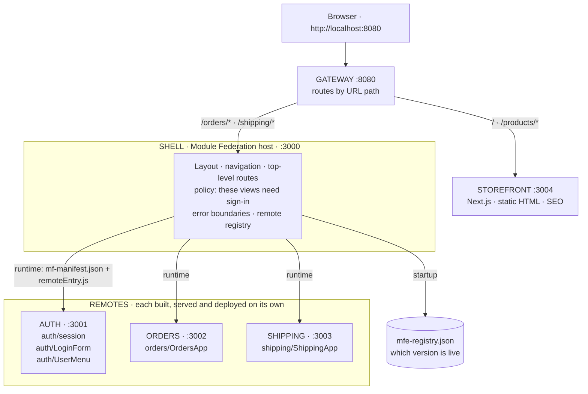
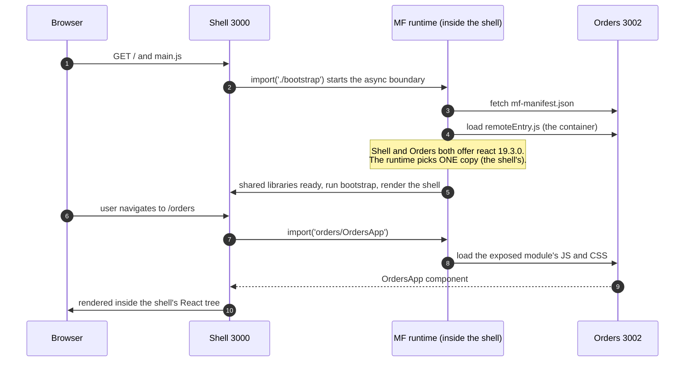
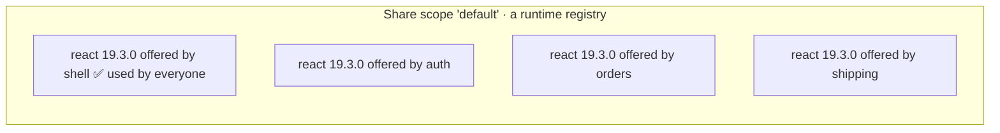
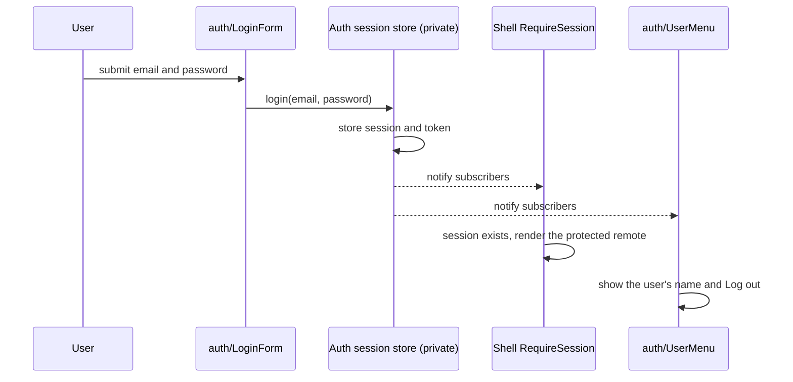
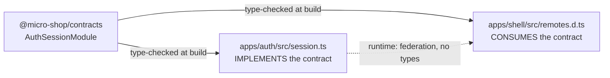
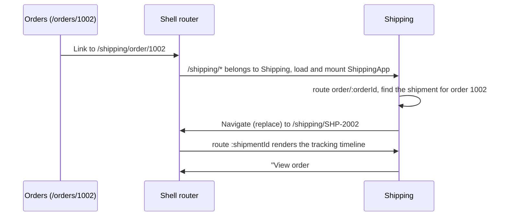
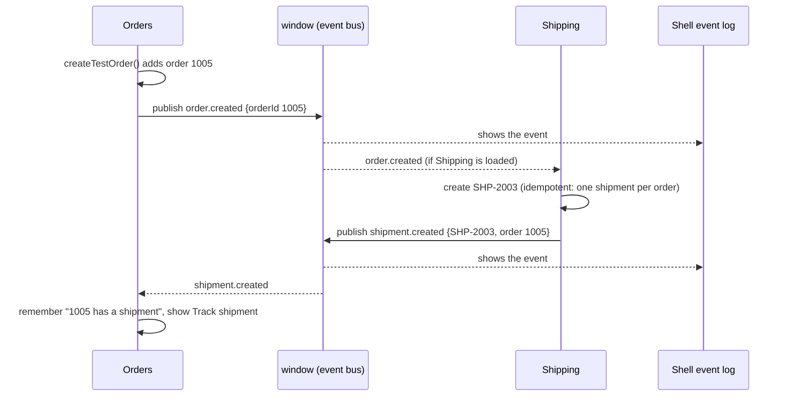
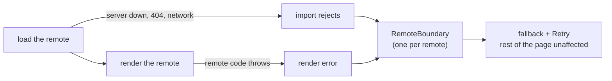
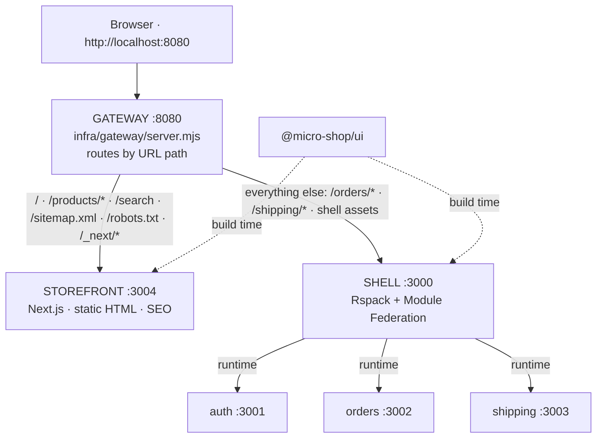
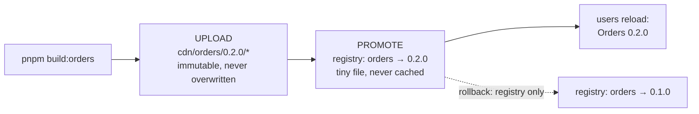

# Micro-Frontends by Example: the micro-shop guide

A hands-on introduction to micro-frontend architecture, built with **Module Federation 2.0**,
**Rspack 2**, **React 19**, **TypeScript**, **pnpm workspaces**, **Tailwind CSS v4** and
**shadcn/ui**.

**Who this is for:** frontend developers who know React well but haven't built micro-frontends.
You don't need to know Module Federation, Rspack or webpack internals.

**How to use it:** read the chapters in order. Each chapter matches a stage in which the project
grew, explains *why* each decision was made, shows the real code, and ends with questions and
an experiment. Run the project while you read.

---

## Contents

- [Part 0: Why micro-frontends (and when not)](#part-0-why-micro-frontends-and-when-not)
- [Part 1: The system at a glance](#part-1-the-system-at-a-glance)
- [Chapter 1: Host and remote, the core of Module Federation](#chapter-1-host-and-remote-the-core-of-module-federation)
- [Chapter 2: Shared dependencies](#chapter-2-shared-dependencies)
- [Chapter 3: Business boundaries, the Auth app](#chapter-3-business-boundaries-the-auth-app)
- [Chapter 4: Shared packages, the design system and contracts](#chapter-4-shared-packages-the-design-system-and-contracts)
- [Chapter 5: Routing and the Shipping app](#chapter-5-routing-and-the-shipping-app)
- [Chapter 6: Events between apps](#chapter-6-events-between-apps)
- [Chapter 7: Failure isolation](#chapter-7-failure-isolation)
- [Chapter 8: Public pages with Next.js](#chapter-8-public-pages-with-nextjs)
- [Chapter 9: Production: deploy, version, observe, test](#chapter-9-production-deploy-version-observe-test)
- [Chapter 10: What is still missing, and what comes next](#chapter-10-what-is-still-missing-and-what-comes-next)
- [Appendix A: Pitfalls we actually hit](#appendix-a-pitfalls-we-actually-hit)
- [Appendix B: Glossary](#appendix-b-glossary)
- [Appendix C: Presenting this to your team](#appendix-c-presenting-this-to-your-team)

---

## Part 0: Why micro-frontends (and when not)

### The problem

A company grows. Five teams now work on one frontend: identity, orders, shipping, catalog,
platform. They share one repository, one build, one deployment:

- The Orders team can't ship a bug fix until the Catalog team's half-finished feature is ready.
- One broken test blocks everybody's release.
- Upgrading React is a company-wide project.
- Nobody really owns the whole thing.

### The idea

**Split the frontend the way you split the organisation.** Each team owns a slice of the
product *end to end*: its code, build, deployment and on-call. The slices are assembled into
one page in the browser.

> Micro-frontends are an **organisational and deployment architecture**, not a UI technique.
> If you have one team and one release schedule, you probably don't need them.

### What it costs

| You gain | You pay |
| --- | --- |
| Teams deploy independently | Runtime integration can fail in production, not just at build time |
| Clear ownership per business domain | Shared dependencies need negotiation (React versions, CSS) |
| Smaller, faster builds per team | Duplicated code and bytes |
| Technology can evolve per team | Harder local setup: several servers |
| Failures can be contained to one area | You must *design* for failure (otherwise one app takes down all) |

### Ways to compose micro-frontends

| Technique | How | Typical use |
| --- | --- | --- |
| Build-time packages | Apps are npm packages, bundled into one app | Not really independent: every change needs a rebuild of the host |
| iframes | Each app in its own frame | Strong isolation, poor UX and integration |
| Edge / server composition | A proxy routes URL paths to different apps | Separate "zones" of a site, e.g. SEO pages vs. logged-in app |
| **Runtime JS composition (Module Federation)** | Host loads other apps' code at runtime | **What this project teaches.** Rich integration inside one page |

We use Module Federation for the logged-in application, and plan edge composition for public,
SEO-critical pages (see [Chapter 8](#chapter-8-public-pages-with-nextjs)).

---

## Part 1: The system at a glance

### Architecture



The apps also share **build-time packages** (bundled into each app, not loaded at runtime):
`@micro-shop/ui` (shadcn/ui + theme tokens), `@micro-shop/contracts` (public types: session
API, URLs, events), `@micro-shop/event-bus` (typed events over `window`) and
`@micro-shop/observability` (logging tagged with the app name).

At runtime the apps talk only through **URLs** (Chapter 5), **events** on `window`
(Chapter 6) and a few **exposed modules** (Chapters 1 and 3).

### Who owns what

| Application | Owns | Must not own |
| --- | --- | --- |
| **Storefront** | Public catalog pages, SEO (metadata, sitemap, robots) | Anything behind sign-in |
| **Shell** | Page layout, navigation, top-level routes, *policy* ("Orders needs a session"), CSS reset, theme token values, loading and isolating remotes | Any business logic |
| **Auth** | Identity: login UI, session, current user, the token | Whether a page needs login (that's the shell's policy) |
| **Orders** | Orders: list, details, status, creating orders | Shipments, users |
| **Shipping** | Shipments and tracking; creating a shipment when an order is placed | Order data (it only stores an order *id*) |

### Repository layout

```text
micro-shop/
├── apps/
│   ├── shell/          MF host         :3000
│   ├── auth/           MF remote       :3001
│   ├── orders/         MF remote       :3002
│   ├── shipping/       MF remote       :3003
│   └── storefront/     Next.js zone    :3004
├── packages/
│   ├── ui/             shadcn/ui components, Tailwind theme, tokens
│   ├── contracts/      TypeScript types shared between apps (session API, URLs, events)
│   ├── event-bus/      typed publish/subscribe over window events
│   └── observability/  logger tagged with the app name, pluggable sinks
├── infra/
│   ├── gateway/        :8080, one public origin, routes URLs to zones
│   ├── static/         static file server (plays the CDN and the shell host)
│   ├── deploy/         release.mjs: versioned uploads, registry, rollback
│   └── prod/           start.mjs: runs the production simulation
├── tests/
│   └── e2e/            Playwright tests against the whole system
├── docs/
│   ├── GUIDE.md                    ← you are here
│   ├── production-architecture.md  CDN, versioning, rollback, security, monitoring
│   ├── module-federation.md        deep dive: MF configuration
│   ├── architecture.md             deep dive: ownership, the Auth boundary
│   └── shared-packages.md          deep dive: ui, contracts, Tailwind across apps
├── package.json                    scripts: dev, build, test, release, start:prod
├── vitest.config.ts                unit tests for all apps and packages
└── pnpm-workspace.yaml
```

Each app has the same shape:

```text
apps/orders/
├── module-federation.config.mjs   ← the app's federation contract (name, exposes, shared)
├── rspack.config.mjs              ← build config (owned by the team, not shared)
├── postcss.config.mjs             ← runs Tailwind
├── index.html                     ← only used in standalone mode
└── src/
    ├── index.ts                   ← entry: standalone CSS + async boundary
    ├── bootstrap.tsx              ← standalone mode: mounts the app on its own page
    ├── OrdersApp.tsx              ← PUBLIC: the exposed module
    ├── orders-data.ts             ← private
    ├── orders.css                 ← utilities only (ships with the exposed module)
    └── standalone.css             ← reset + tokens (standalone page only)
```

### Running it

Requires Node ≥ 22.12 and pnpm.

```bash
pnpm install
pnpm dev             # every app + storefront + gateway (separate processes)
```

Open **http://localhost:8080** (the gateway). Mock login: `ada@example.com` / `demo`.

Or run applications one by one, the way each team would:

```bash
pnpm dev:auth        # http://localhost:3001  standalone Auth
pnpm dev:orders      # http://localhost:3002  standalone Orders
pnpm dev:shipping    # http://localhost:3003  standalone Shipping
pnpm dev:shell       # http://localhost:3000  the signed-in app without the gateway
pnpm dev:storefront  # http://localhost:3004  the public site without the gateway
pnpm dev:gateway     # http://localhost:8080
```

Every part of the page carries a coloured label: **STOREFRONT** (rose), **SHELL** (blue),
**AUTH** (violet), **ORDERS** (green), **SHIPPING** (amber). The label tells you which
application built and served that part of the screen.

Checks and the production simulation:

```bash
pnpm typecheck       # every app and package, including contract type-tests
pnpm test            # unit tests (Vitest)
pnpm test:e2e        # end-to-end tests (Playwright, local Chrome); starts everything itself

pnpm build           # every app → its own dist/ (.next for the storefront)
pnpm release all     # upload remotes to the local CDN and make them live
pnpm start:prod      # serve built artifacts only: http://localhost:8080
```

### Technology versions

| Tool | Version | Role |
| --- | --- | --- |
| Rspack | 2.2 | Bundler (Rust, webpack-compatible API) |
| @module-federation/enhanced | 2.9 | Module Federation 2.0 plugin + runtime |
| React | 19.3 | UI |
| React Router | 8.4 | Routing (declarative mode) |
| Next.js | 16.3 | Storefront zone (App Router, static generation) |
| Tailwind CSS | 4.3 | Utility CSS |
| shadcn/ui | new-york style | Copy-in component source |
| TypeScript | 7.0 | Types |
| Vitest | 5.0 | Unit tests |
| Playwright | 1.63 | End-to-end tests |
| pnpm | 12 | Workspaces |

---

## Chapter 1: Host and remote, the core of Module Federation

**Goal of this stage:** the shell renders a component that lives in a *different application*,
built separately and served from a different port.

### The mental model

Several **separate builds** end up in **one browser page**. Every build that offers code
produces a small **container** object with two functions:

- `init(shareScope)`: "here are the libraries available on this page"
- `get(moduleName)`: "give me one of your public modules"

The host calls them at runtime, over the network. **Nothing is linked at build time**: the
shell's `dist/` folder contains no Orders code at all.

### Vocabulary

| Term | In this repo | Meaning |
| --- | --- | --- |
| **Host** (consumer) | `shell` | Loads modules from other builds. Declares `remotes`. |
| **Remote** (producer) | `auth`, `orders`, `shipping` | Offers modules. Declares `exposes`. |
| **exposes** | `'./OrdersApp'` | The remote's **public API**. Everything else is private. |
| **remotes** | `orders: 'orders@http://…/mf-manifest.json'` | Alias → where to find a container. |
| **remoteEntry.js** | `apps/orders/dist/remoteEntry.js` | Script that creates the container. |
| **mf-manifest.json** | `apps/orders/dist/mf-manifest.json` | JSON description of a remote: entry file, exposed modules, shared versions, required JS/CSS per module. |
| **shared** | `react`, `react-dom`, `react-router` | Libraries negotiated at runtime so only one copy loads. |

### The remote side: what Orders offers

[`apps/orders/module-federation.config.mjs`](../apps/orders/module-federation.config.mjs)

```js
export default createModuleFederationConfig({
  name: 'orders',                 // globally unique container name
  filename: 'remoteEntry.js',
  exposes: {
    './OrdersApp': './src/OrdersApp.tsx',   // the ENTIRE public API
  },
  shared: {
    react:          { singleton: true, requiredVersion: '^19.3.0' },
    'react-dom':    { singleton: true, requiredVersion: '^19.3.0' },
    'react-router': { singleton: true, requiredVersion: '^8.4.0' },
  },
  manifest: true,                 // emit mf-manifest.json
  dts: false,                     // we write the consumer types by hand (see Chapter 4)
});
```

`orders-data.ts` is **unreachable** from outside: a remote can only hand out what it exposes.
Keep `exposes` small. Every entry is something another team may depend on, so you can no
longer change it freely.

### The host side: what the shell consumes

[`apps/shell/module-federation.config.mjs`](../apps/shell/module-federation.config.mjs)

```js
remotes: {
  auth:     'auth@http://localhost:3001/mf-manifest.json',
  orders:   'orders@http://localhost:3002/mf-manifest.json',
  shipping: 'shipping@http://localhost:3003/mf-manifest.json',
},
```

- The **left** side (`orders`) is the alias used in code: `import('orders/OrdersApp')`.
- `orders@` on the right must match the remote's `name`.
- The URL is **data, not code**. Point it somewhere else and the shell loads a different build of
  Orders without being rebuilt. That's the mechanism behind independent deployment.

And the usage, in [`apps/shell/src/App.tsx`](../apps/shell/src/App.tsx):

```tsx
const OrdersApp = lazy(() => import('orders/OrdersApp'));
// …
<Suspense fallback={<RemoteLoading remote="orders" />}>
  <OrdersApp />
</Suspense>
```

It looks like a normal lazy import. The difference is where the code comes from: another
server, another build, another team.

> **How this evolves later in the guide.** This chapter shows the simplest form, which is the
> right way to learn it. The finished shell changes two things:
> [Chapter 7](#chapter-7-failure-isolation) loads remotes with the runtime API
> (`loadRemote('orders/OrdersApp')`) so failed loads can be retried, and
> [Chapter 9](#chapter-9-production-deploy-version-observe-test) removes the hard-coded
> `remotes` block and reads remote URLs from a registry at startup.

### What happens in the browser

This is the real network sequence, observed in DevTools:



Things to notice:

1. **Orders' copy of React is never downloaded**: the shell's copy is reused.
2. **Steps 3–4 happen at startup**, before anyone opens Orders. That's the default
   `shareStrategy: 'version-first'`: to choose the highest version of each shared library,
   the runtime first asks *every* remote what it has. It also means one unreachable remote
   blanks the whole shell. [Chapter 7](#chapter-7-failure-isolation) switches to
   `'loaded-first'` and fixes that.
3. **CSS travels with the module.** The manifest lists the CSS each exposed module needs.

### The async boundary

Every app's entry file does almost nothing:

```ts
// apps/orders/src/index.ts
import './standalone.css';          // explained in Chapter 4
import('./bootstrap');              // ← the async boundary
```

Shared modules are resolved **asynchronously**: the runtime may need to fetch another app's
copy of React first. If `index.ts` imported React directly, the browser would throw:

```text
Shared module is not available for eager consumption
```

The dynamic `import('./bootstrap')` gives the runtime one async step to set up sharing before
any React code runs.

### Standalone mode

Every remote is a **complete application**. `pnpm dev:orders` opens http://localhost:3002
with Orders on its own page, with no shell and no login. That's how the Orders team works day
to day. The file `bootstrap.tsx` only runs in standalone mode; when the shell hosts Orders, only
the exposed module runs.

### Build settings that matter for federation

| Setting | Where | Why |
| --- | --- | --- |
| `output.publicPath: 'auto'` | remotes | A remote doesn't know its deployment URL. `'auto'` resolves its chunks relative to where `remoteEntry.js` was loaded from. Hard-coding a URL would bake an environment into the build. |
| `output.publicPath: '/'` | shell | The shell owns the origin. |
| `output.uniqueName` | all | Namespaces the chunk registry (`rspackChunkorders`) so builds on one page don't collide. |
| `Access-Control-Allow-Origin` header | remotes' dev servers | The shell `fetch()`es the manifest from another origin. `<script>` tags ignore CORS; `fetch` doesn't. In production, allow-list the shell's origin instead of `*`. |
| `lazyCompilation: false` | all | Rspack 2 compiles dynamic imports lazily in dev. With federation, that broke hot updates (see [Appendix A](#appendix-a-pitfalls-we-actually-hit)). |

### Questions

1. The Orders team renames `./OrdersApp` to `./Orders` and deploys. The shell still builds.
   What happens, and when do you find out?
2. Why do remotes need a CORS header while their `<script>` loads don't?
3. What would break if Orders hard-coded `publicPath: 'http://localhost:3002/'`?

### Experiment

Stop only the Orders server (`Ctrl+C` in its terminal) and reload http://localhost:3000. Look
at the console. What do you see? (With the original `version-first` configuration, the
*whole* shell went blank, even Home. [Chapter 7](#chapter-7-failure-isolation) explains why
and what changed.)

---

## Chapter 2: Shared dependencies

### Why share at all

React keeps module-level state: the current hooks dispatcher. If the shell renders
`<OrdersApp />` with React copy **A**, and Orders calls `useState` from React copy **B**,
React throws **"Invalid hook call"**. Some libraries **must exist exactly once** on the page.



Each app **offers** its own copy and **consumes** whichever copy the runtime picks.
`singleton: true` means "exactly one copy, even if versions differ".

### The options

| Option | Meaning |
| --- | --- |
| `singleton: true` | Only one copy on the page. |
| `requiredVersion: '^19.3.0'` | The range this app is known to work with. If the chosen singleton is outside it, the runtime **warns** and uses it anyway. |
| `strictVersion: true` | Fail instead of warn when the version doesn't match. |
| `eager: true` | Put the library in the entry chunk (usually avoid this; use the async boundary instead). |

### What we share, and why only that

| Shared | Why |
| --- | --- |
| `react`, `react-dom` | Hook state: must be one copy. |
| `react-router` | The router keeps the current URL in React **context**. Remotes render `<Routes>` inside the shell's `<BrowserRouter>`, and context only works within **one copy** of the library (Chapter 5). |

**Everything else is not shared on purpose.** Every shared library is a *runtime agreement*
between teams that deploy independently. Share `lodash`, and upgrading lodash in one app now
affects every app on the page.

> **Rule:** share what *must* be single (stateful frameworks, context providers), or what is so
> large that duplication really hurts. Nothing else.

### A detail worth seeing

`react-dom/client` (~200 KB) appears in **both** the shell's and each remote's build. The
shared key `'react-dom'` matches that exact import specifier, not the package's subpaths. It's
harmless here, because only the shell calls `createRoot`. It shows that **shared keys match
import paths, not packages**.

### Questions

1. Orders upgrades to React 19.4 while the shell stays on 19.3. Which copy loads? What changes
   with `strictVersion: true`?
2. Why is `react-router` shared but `clsx` isn't?

### Experiment

Remove `react` from `shared` in **only** `apps/orders/module-federation.config.mjs`. Restart
Orders and open `/orders`. How many copies of React does the Network tab show? What error do you
get? (Put it back afterwards.)

---

## Chapter 3: Business boundaries, the Auth app

**Goal of this stage:** add a second remote and learn how to draw a boundary between domains.

### Split by business capability, not by component

```text
❌  Header MFE · Button MFE · Sidebar MFE          (component fragmentation)
✅  Auth · Orders · Shipping · Catalog             (business capabilities)
```

A micro-frontend should map to something a **team owns end to end**.

### The Auth boundary

| Question | Owner |
| --- | --- |
| *Does this page need a signed-in user?* | **Shell** (composition policy) |
| *Who is the user? How does login work? Where is the token?* | **Auth** (identity) |
| *What orders does the user have?* | **Orders** (and, in production, the backend) |

The shell doesn't know how login works. Orders doesn't know that login exists.

### Auth's public API

```text
auth/session     getSession() · subscribe(listener) · logout()
auth/LoginForm   <LoginForm />      the ONLY way to log in
auth/UserMenu    <UserMenu />       "Ada Lovelace · Log out" or "Guest"
```

What is **not** exposed: `login()`, the token, storage keys, the user list. The file
[`apps/auth/src/session.ts`](../apps/auth/src/session.ts) is a *facade*: it re-exports only the
read side of the private store in `session-store.ts`.

Design choices worth copying:

- **Framework-agnostic API.** `auth/session` exports plain functions, not a `useSession()`
  hook. The shell adapts them to React itself
  ([`use-session.ts`](../apps/shell/src/use-session.ts)):

  ```ts
  const sessionApi = import('auth/session');   // requested once

  export function useSession() {
    const { subscribe, getSession } = use(sessionApi);
    return useSyncExternalStore(subscribe, getSession);
  }
  ```

- **`LoginForm` takes no props.** No `onSuccess` callback is needed: the shell is subscribed
  to the session and re-renders when one appears. Fewer props mean a smaller contract.
- **The shell decides *where*, Auth decides *what*.** The shell places `<UserMenu />` in its
  header; Auth decides what it shows.

### How signing in flows through the page



`auth/session`, `auth/LoginForm` and `auth/UserMenu` are loaded separately, but they come from
the **same container**, which has one module cache. So the private store exists once on the page.

### Remote code has no origin of its own

When the shell hosts Auth, Auth's JavaScript runs on **localhost:3000**, the shell's origin.
Its `sessionStorage.setItem(…)` writes to the shell's storage, not to localhost:3001.

> **There is no security boundary between micro-frontends on the same page.** Every remote can
> read `sessionStorage`, cookies (non-HttpOnly), and the DOM. Isolation requires iframes or
> separate origins. In production, keep tokens out of JavaScript entirely (an `HttpOnly`
> cookie set by an auth backend), and enforce authorization on the server.

### Questions

1. Why does `LoginForm` need no `onSuccess` prop?
2. Orders wants to display "Orders for Ada". Should Orders import `auth/session`? What does
   that do to Orders' independence?

### Experiment

Sign in, then run `sessionStorage` in the DevTools console on localhost:3000. Find the mock
token. Think about what a buggy or malicious remote could do with it.

---

## Chapter 4: Shared packages, the design system and contracts

**Goal of this stage:** one look-and-feel across apps (shadcn/ui), and type-checked agreements
between apps, without coupling their deployments.

### Two kinds of sharing

| | Build-time package | Runtime shared module (MF `shared`) |
| --- | --- | --- |
| Examples | `@micro-shop/ui`, `@micro-shop/contracts` | `react`, `react-dom`, `react-router` |
| Where the code lives | Copied into each app's bundle | Downloaded once, used by all |
| Version on the page | Each app has the version **it was built with** | One negotiated version |
| Upgrading | Each team, at its own pace | Coordinated: everyone runs one copy |
| Use for | Stateless, presentational code | Things that must be a singleton |

### What belongs in a shared package

> **Ask:** "If this changes, do I want every micro-frontend to potentially need a redeploy?"

| ✅ Share | ❌ Keep inside one app |
| --- | --- |
| `Button`, `Card`, `Input` (`@micro-shop/ui`) | Order-status → colour mapping (a business decision) |
| Theme tokens | Stores (Redux/Zustand), API clients, repositories |
| Public types between apps (`@micro-shop/contracts`) | A domain's internal types (`Order`, `Shipment`) |
| `cn()` | A "common utils" grab-bag. It becomes a *distributed monolith*. |

### `@micro-shop/contracts`: types only

```ts
// packages/contracts/src/auth.ts
export type User    = { id: string; name: string; email: string };
export type Session = { user: User; expiresAt: string };

export type AuthSessionModule = {
  getSession(): Session | null;
  subscribe(listener: () => void): () => void;
  logout(): void;
};
```

Both sides of the boundary compile against the same file:



- Auth types each export as `AuthSessionModule['getSession']`, so **Auth's own build fails** if
  it drifts from the promise.
- The shell's declaration of `auth/session` is built from the same type.
- It's a `devDependency`. Types are erased, so it adds **zero bytes** and **zero runtime coupling**.
  Its whole job is to turn "broken in production" into "broken at compile time".

What contracts **cannot** catch: a remote that was deployed with an older or newer contract
than the host was built with. Types don't exist at runtime. That's a versioning problem
(Chapter 9).

### `@micro-shop/ui`: shadcn/ui as an internal package

- The components are real shadcn "new-york" sources in
  [`packages/ui/src/components`](../packages/ui/src/components). Add more with:
  ```bash
  cd packages/ui && pnpm dlx shadcn@latest add dialog
  ```
- The package ships **source** (`.tsx`); each app compiles it.
- It is **not** in MF `shared`. Orders and Auth each bundle their own copy. The cost is bytes
  and possible visual drift between versions; the benefit is that no team's deploy depends on
  another team's UI upgrade.
- **It must not know the business.** `MfeFrame` (the dashed labelled box) takes a *colour*, not
  a domain name.

> **Context gotcha:** because each app has its own copy of the UI library, React **context does
> not cross app boundaries**. A `<TooltipProvider>` in the shell's copy of Radix is invisible to
> Orders' copy. (React Router is different because it *is* shared, see Chapter 5.)

### Tailwind across micro-frontends: who ships what

Tailwind generates CSS per build. With four builds on one page, the question is which
stylesheet ships which part:

| Stylesheet | CSS reset (preflight) | Token **values** (`--primary: …`) | Utility classes |
| --- | --- | --- | --- |
| Shell: `shell.css` (owns the page) | ✅ | ✅ | ✅ |
| Remote: `orders.css`, `auth.css`, `shipping.css` (ship with exposed modules) | ❌ | ❌ | ✅ |
| Remote standalone: `standalone.css` (only on the remote's own page) | ✅ | ✅ | — |

The theme lives in two files in `packages/ui/src/styles`:

- **`theme.css`** maps names to variables: `--color-primary: var(--primary)`. It tells
  Tailwind that `bg-primary` exists. It emits no values, so every app can include it.
- **`tokens.css`** holds the actual values: `:root { --primary: oklch(…) }`. **Page owner only.**

Because remotes reference `var(--primary)` and never the colour itself, **changing a token in
the shell re-themes every micro-frontend without redeploying them.**

### Why a remote must never ship token values (we measured it)

We added one line to Orders' CSS, `:root { --background: <green> }`, and measured the shell's
body colour:

```text
home (before Orders loads)   oklch(0.985 0 0)       shell's value
/orders                      oklch(0.93 0.06 150)   Orders' value took over the WHOLE page
back to home                 oklch(0.93 0.06 150)   still green: CSS is never unloaded
```

### Cascade layers keep the order stable

Every stylesheet starts with the same line:

```css
@layer theme, base, components, remote-utilities, utilities;
```

Layers with the same name **merge across stylesheets**, so the priority order holds no matter
which app's CSS loads first. **Unlayered CSS beats every layer.** A remote that ships plain
CSS, or Tailwind v3 (unlayered output), would override the shell's utilities. Keep everything
layered, and keep all apps on the same Tailwind major version.

Remotes put their utilities in `remote-utilities`, one layer **below** the page's. Two builds
generating the same class is not harmless: within one stylesheet Tailwind puts `hidden` before
`md:flex`, but across stylesheets the later one wins. A remote's `.hidden` loaded after the
shell's CSS once hid the shell's whole navigation. The shell's build also scans the remotes'
sources, so its top layer has their classes in the right order (see
[shared-packages.md](shared-packages.md#why-every-file-declares-the-same-layer-order)).

### Questions

1. `@micro-shop/ui` is bundled into each app instead of shared at runtime. What do you gain
   and lose? When would you switch?
2. Why do Orders' status colours live in Orders and not in `packages/ui`?

### Experiments

1. Change `--primary` in `packages/ui/src/styles/tokens.css`, restart **only the shell**, and
   look at Auth's "Sign in" button. Auth wasn't rebuilt. Why did it change?
2. Rename `logout` to `signOut` in `packages/contracts/src/auth.ts` and run `pnpm typecheck`.
   Which projects fail? (Revert afterwards.)

---

## Chapter 5: Routing and the Shipping app

**Goal of this stage:** real URLs (`/orders/1002`, `/shipping/SHP-2002`), a fourth application,
and navigation *between* micro-frontends.

### Who owns which part of the URL


- The **shell** owns the **first segment** and decides which app renders it.
- Each **remote** owns **everything below its prefix**.

In the shell ([`App.tsx`](../apps/shell/src/App.tsx)), the `/*` hands the rest of the URL to the
remote:

```tsx
<Route path="orders/*"   element={<ProtectedRemote remote="orders"><OrdersApp /></ProtectedRemote>} />
<Route path="shipping/*" element={<ProtectedRemote remote="shipping"><ShippingApp /></ProtectedRemote>} />
```

Inside Orders ([`OrdersApp.tsx`](../apps/orders/src/OrdersApp.tsx)), the routes are
**relative**, so Orders doesn't know or care that it's mounted at `/orders`:

```tsx
<Routes>
  <Route index element={<OrderList />} />
  <Route path=":orderId" element={<OrderDetails />} />
  <Route path="*" element={<NotFound what="page" />} />
</Routes>
```

### Why React Router must be shared

The shell renders the one `<BrowserRouter>`. Orders renders `<Routes>` **inside** it. `<Routes>`
finds the router through React context, and a context object only exists once per copy of the
library. So `react-router` is a **singleton** in every app that uses it. Otherwise Orders would
have its own, empty router context and throw.

This is the same rule as the Tooltip gotcha in Chapter 4, from the other side: **context crosses
app boundaries only if the library is shared.**

### URLs are a public API

Other apps link to your URLs, users bookmark them, search engines index them. Renaming
`/orders/:id` is a breaking change, just like renaming an export. So the public paths are part
of the contracts package ([`routes.ts`](../packages/contracts/src/routes.ts)):

```ts
export type AppPath =
  | '/'
  | '/orders' | `/orders/${string}`
  | '/shipping' | `/shipping/${string}`
  | `/shipping/order/${string}`;
```

Every cross-app link is type-checked against it:

```ts
const trackingUrl: AppPath = `/shipping/order/${order.id}`;   // ✅ compiles
const broken: AppPath = `/shipment/${order.id}`;              // ❌ type error
```

### Navigating between micro-frontends

Orders knows an order's id, but not its shipment id. That mapping is Shipping's data. So
Shipping publishes an entry point for exactly this case, `/shipping/order/:orderId`:



The two apps talk **only through the URL**. Neither imports the other's code, types or data.

### Reference other domains by id

```ts
// apps/shipping/src/shipping-data.ts
export type Shipment = {
  id: string;
  orderId: string;       // ← a reference, not a copy of the order
  carrier: string;
  status: ShipmentStatus;
  events: readonly TrackingEvent[];
};
```

Shipping never imports Orders' `Order` type and never copies order data. When it needs order
details, it links to `/orders/:id` and lets Orders render them.

### Standalone mode with routing

In standalone mode the remote owns the page, so it owns the router. It mounts itself at the
**same prefix** the shell uses:

```tsx
// apps/shipping/src/bootstrap.tsx
<BrowserRouter>
  <Routes>
    <Route index element={<Navigate to="/shipping" replace />} />
    <Route path="/shipping/*" element={<ShippingApp />} />
    <Route path="*" element={<ForeignRoute />} />   {/* "this URL belongs to another app" */}
  </Routes>
</BrowserRouter>
```

Deep links need one build setting: `HtmlRspackPlugin({ publicPath: '/' })`. Otherwise reloading
`/shipping/SHP-2002` would request `/shipping/main.js` and get the HTML fallback instead.

### Questions

1. Shipping wants to rename `/shipping/order/:orderId` to `/tracking/by-order/:orderId`. Who has
   to change? How would you migrate without breaking bookmarks?
2. Why does Orders only show "Track shipment" for shipped and delivered orders? Is that
   Orders' decision or Shipping's?
3. What would go wrong if Orders and Shipping each bundled their own `react-router`?

### Experiments

1. Open http://localhost:3000/orders/1002, click **Track shipment**, then use the browser's back
   button. Watch the URL and the coloured labels.
2. Open http://localhost:3003/orders/1002 (standalone Shipping). What renders, and why?

---

## Chapter 6: Events between apps

**Goal of this stage:** when Orders creates an order, Shipping reacts by creating a shipment,
without Orders knowing that Shipping exists.

### Three ways micro-frontends communicate

| Mechanism | Use it for | In this repo |
| --- | --- | --- |
| **URL** | "Show this thing": navigation, deep links, sharing | `/shipping/order/1002` (Chapter 5) |
| **Module API** | "Ask a question now": a narrow, synchronous read | `auth/session` → `getSession()` (Chapter 3) |
| **Events** | "Something happened": facts other apps may react to | `order.created`, `shipment.created`, `auth.user.logged-in/out` |

What we deliberately **don't** use: one global store (Redux/Zustand) shared by every app. It
would make every app depend on every other app's state shape, which is a distributed monolith.

### The event contract

Events are defined in [`packages/contracts/src/events.ts`](../packages/contracts/src/events.ts):

```ts
export type MicroShopEvents = {
  'auth.user.logged-in':  { version: 1; userId: string };
  'auth.user.logged-out': { version: 1; userId: string };
  'order.created':        { version: 1; orderId: string };
  'shipment.created':     { version: 1; shipmentId: string; orderId: string };
};
```

Rules we follow:

- **Facts, not commands.** `order.created` (past tense), not `createShipment`. The publisher
  doesn't know who listens, or whether anyone does.
- **Thin payloads.** Ids and a few fields, never a whole domain object. Shipping gets an order
  *id*, not Orders' `Order` type.
- **A `version` in every payload.** Publisher and consumer deploy independently, so a consumer
  may meet a version it doesn't understand. It must ignore it safely.

Every event travels in an **envelope** with metadata: a unique `id`, the `source` app and an
`occurredAt` timestamp.

### The bus: the browser is the shared runtime

[`packages/event-bus`](../packages/event-bus/src/index.ts) is about 100 lines on top of
`window.dispatchEvent(new CustomEvent(…))`:

```ts
const publish = createPublisher('orders');           // stamps source: 'orders'
publish('order.created', { version: 1, orderId });   // payload type-checked by the contract

subscribe('order.created', (event) => { … }, { replay: true });
```

Every app bundles its **own copy** of this package (it is *not* in MF `shared`), and it still
works, because all copies talk through the same `window`. No singleton library is needed.
Listeners also check the envelope's shape, because any script on the page can dispatch a DOM
event.

### The flow



Orders never asks Shipping anything. It keeps a small **local read model** ("which of my orders
have a shipment?"), filled from `shipment.created` events
([`orders-store.ts`](../apps/orders/src/orders-store.ts)). That's how one domain learns
about another without depending on it.

### The catch: an app that isn't loaded can't listen

Remotes load lazily. If you create an order on `/orders` right after a reload, **Shipping's
code isn't in the browser yet**. Nobody receives `order.created`, and Orders shows "Waiting for
Shipping…".

The bus therefore keeps a short in-memory log, and a subscriber can ask for a **replay** of
events it missed. Shipping subscribes with `{ replay: true }`, so the first time you open
`/shipping` it catches up. We measured this with the shell's event log:

```text
2:40:07  ORDERS    order.created     {orderId: "1005"}                           ← Shipping not loaded
2:40:18  SHIPPING  shipment.created  {shipmentId: "SHP-2003", orderId: "1005"}   ← on first visit to /shipping (replay)
2:41:53  ORDERS    order.created     {orderId: "1006"}                           ← Shipping already loaded
2:41:53  SHIPPING  shipment.created  {shipmentId: "SHP-2004", orderId: "1006"}   ← same second (live)
```

Replay delivers old events again, so **every handler must be idempotent**. Shipping creates at
most one shipment per order id; Orders ignores ids it already knows.

> **The real lesson:** a browser event bus only reaches code that is loaded **in this tab,
> right now**. It's for coordinating what's on screen. Business workflows ("an order was
> placed, so create a shipment") belong on the **backend**, e.g. order service → message
> queue → shipping service, where events are durable. Here the browser plays the backend's
> role so you can see the mechanics.

### The shell's event log

The panel in the bottom-right corner ([`EventLog.tsx`](../apps/shell/src/EventLog.tsx)) shows
every event, colour-coded by the app that published it. The shell only *observes*. It
reacts to nothing, which is the right amount of involvement for a host.

### Questions

1. Why is the event called `order.created` and not `create-shipment`? What would change if
   it were a command?
2. Shipping's handler runs twice for the same order. What happens? What would happen if it
   *weren't* idempotent?
3. Orders deploys `order.created` with `version: 2` and a new required field before Shipping
   understands it. What does Shipping do? How would you roll this out safely?
4. Where should the "order placed → create shipment" workflow live in production, and why?

### Experiments

1. Reload on `/orders`, click **Create test order**, and watch the event log. Then open
   **Shipping** once and come back. Explain the timestamps.
2. Now that Shipping is loaded, create another order. Why does the shipment appear instantly
   this time?
3. Run this in the DevTools console, then open the event log:
   `window.dispatchEvent(new CustomEvent('micro-shop:event', { detail: { hello: 'world' } }))`.
   Why doesn't it show up? What does that tell you about trusting events?

---

## Chapter 7: Failure isolation

**Goal of this stage:** if one application is down or crashes, only *its* area of the page
shows a fallback. Everything else keeps working, and the user can retry.

This is one of the main reasons to build micro-frontends at all. Without it, you have
several independent deployments that all fail together: the worst of both worlds.

### Before and after

| Scenario | Before | After |
| --- | --- | --- |
| Orders server down, open `/` | **Blank page** | Home works; no request to Orders at all |
| Orders server down, open `/orders` | Blank page | "Orders is temporarily unavailable · Retry"; header, Auth, event log keep working |
| Orders comes back, click Retry | — | Orders renders, no page reload |
| Orders crashes while rendering (`?break=orders`) | Whole React tree unmounted | Only the Orders area shows the fallback |
| Auth's user menu crashes (`?break=auth`) | Whole tree unmounted | Header shows "Auth unavailable · Retry"; pages keep working |
| Auth server down, open `/orders` | Blank page | "Auth is temporarily unavailable"; **Orders is not shown** (fails closed) |

Every row was verified in the browser.

### Fix 1: don't depend on remotes at startup

```js
// apps/shell/module-federation.config.mjs
shareStrategy: 'loaded-first',
```

With the default `'version-first'`, the runtime fetched **every** remote's manifest before the
shell could render, to find the highest version of each shared library. One unreachable
remote rejected that startup step, and the shell never rendered.

With `'loaded-first'`, the runtime uses what's already loaded (the shell's own React) and
fetches a remote only when it's first needed. The trade-off: if a remote ships a *newer*
React, it still uses the shell's. For singletons that's what you want anyway; the shell owns
the page.

### Fix 2: an error boundary per remote

[`apps/shell/src/remote.tsx`](../apps/shell/src/remote.tsx) wraps every remote:

```tsx
<Remote name="orders" load={loadOrdersApp} />
// = <RemoteBoundary> (error boundary)  →  <Suspense> (loading)  →  lazy remote component
```

A remote can fail in two ways, and the same boundary catches both:



Two variants: `page` (the main area) and `inline` (small places like the header's user menu).

### Fix 3: fail closed when identity is unknown

`RequireSession` has its own boundary. If Auth can't be reached, the shell can't know who the
user is, so it **doesn't render the protected remote**. Showing Orders "just in case" would be
failing *open*: a security bug that only appears during an outage.

### Retry: two bugs we hit on the way

Getting **Retry** to actually recover took two attempts. Both are worth knowing:

1. **`import('orders/OrdersApp')` never retries.** After one failed load, the bundler keeps the
   remote module installed as an empty object, so every later `import()` *resolves* to
   `{ default: {} }`. The shell now loads remotes through the Module Federation **runtime
   API** (`loadRemote`, wrapped with types in
   [`load-remote.ts`](../apps/shell/src/load-remote.ts)), which fetches again on every call
   that hasn't succeeded yet.
2. **A request burst.** The first version created the lazy component with
   `useMemo(() => lazy(load), [attempt])`. After a failed load, React re-renders the subtree
   that never committed, and uncommitted components lose memoized values. Every re-render
   created a new `lazy()` and a new request: **39 manifest requests** in a burst. Now one lazy
   component per remote is cached *outside* React, and only Retry clears it. Result: exactly
   **one** request per attempt.

### Break it on purpose

| How | What it simulates |
| --- | --- |
| Stop a remote's dev server (`Ctrl+C`) | Deployment down, network failure, CDN outage |
| Add `?break=orders`, `?break=shipping` or `?break=auth` to the URL | A bug in that remote's code |

The `?break=` switch lives in each remote (`src/fault-injection.ts`), because a crash has to
come from *inside* the remote to be realistic.

### What production adds

- **Retry with backoff** automatically before showing the fallback (MF has a retry plugin).
- **Timeouts**: a remote that hangs keeps the skeleton forever. Add a timeout to loading.
- **Report every failure** to error tracking, tagged with the remote name (Chapter 9).
- **Monitor fallback rates** per remote. A spike means a bad deploy; roll it back (Chapter 9).

### Questions

1. Why is the Auth fallback on `/orders` a security feature, not just a UX choice?
2. What does `'loaded-first'` give up compared with `'version-first'`? When would that matter?
3. Retry fixed a *network* failure. Would it fix `?break=orders`? Why or why not?

### Experiments

1. Stop Orders, open `/orders`, then open DevTools → Network and count requests to `:3002`.
   Start Orders again and click **Retry**.
2. Open `/shipping?break=auth`. Which parts still work? Remove the query string and click the
   header's **Retry**.
3. Stop Auth and open `/orders`. Why isn't the order list shown, even though the Orders server
   is fine?

---

## Chapter 8: Public pages with Next.js

**Goal of this stage:** public, SEO-critical pages (home, product pages) that search engines
and link previews can read **without running JavaScript**, in the same product as the
signed-in app.

### Why not make Next.js the Module Federation host?

Everything so far renders in the browser. That's fine behind a login, but a search engine
visiting `/products/standing-desk` would see an empty `<div id="root">`.

Next.js is excellent at server rendering. But the official Next.js integration for Module
Federation is **deprecated**: it doesn't support the App Router or Turbopack, and it requires
Next.js ≤ 15. Building the foundation on it would mean building on something being removed.

### The answer: split by URL at the edge (two "zones")



| Zone | Built with | Rendering | Owns URLs | Why |
| --- | --- | --- | --- | --- |
| **storefront** | Next.js 16 (App Router) | Static HTML at build time; `/search` per request | `/`, `/products/*`, `/search` | Public, must be crawlable and fast |
| **shell + remotes** | Rspack + Module Federation | In the browser | `/orders/*`, `/shipping/*` | Signed in, interactive, many teams |

- **The gateway** ([`infra/gateway/server.mjs`](../infra/gateway/server.mjs)) is about 80 lines of
  plain Node with no dependencies. In production this is a CDN or reverse proxy
  (CloudFront, Cloudflare, nginx, Vercel Microfrontends). It also forwards WebSockets, so hot
  reload works for both zones.
- **Crossing zones is a full page load.** Links between zones are plain `<a href>`, not
  `<Link>`: the storefront's "Orders" link and the shell's "Store" link.
- **One look.** Both zones use `@micro-shop/ui` and the same tokens, so users see one product.
- **No shared JavaScript at runtime.** The zones share only the domain.

### What a search engine sees

We fetched `http://localhost:8080/products/standing-desk` as raw HTML (no JavaScript):

```text
<title>                 Standing desk · Micro Shop
<meta description>      A dual-motor electric standing desk with a 160 × 80 cm top, …
<link rel=canonical>    http://localhost:8080/products/standing-desk
<meta og:title>         Standing desk
<script ld+json>        {"@type":"Product","name":"Standing desk", … "price":540 …}
```

All of it comes from [`app/products/[slug]/page.tsx`](../apps/storefront/app/products/[slug]/page.tsx):

- `generateStaticParams()`: prerender one HTML file per product **at build time**.
- `generateMetadata()`: title, description, canonical URL, Open Graph.
- A `<script type="application/ld+json">` with a schema.org `Product`: price and availability.
- [`sitemap.ts`](../apps/storefront/app/sitemap.ts) lists public pages only.
- [`robots.ts`](../apps/storefront/app/robots.ts) draws the SEO boundary:
  `Disallow: /orders`, `Disallow: /shipping`.

The build output confirms every storefront page is static:

```text
┌ ○ /                      (Static)
├ ● /products/[slug]       (SSG: 6 pages)
├ ○ /robots.txt
└ ○ /sitemap.xml
```

### Identity across zones: a cookie on the shared domain

The zones can't share JavaScript, so identity crosses the boundary on the **domain**:

1. You sign in inside the shell zone (Auth's `LoginForm`).
2. Auth sets a cookie `micro-shop-user=Ada Lovelace` (a *display name*, never the token).
3. You click **Store** and land on the storefront. A small client component
   ([`account-status.tsx`](../apps/storefront/components/account-status.tsx)) reads the
   cookie and shows **"Signed in as Ada Lovelace"**.

Why a **client** component? The product pages are static HTML shared by every visitor, so
they can't contain a name. Personalisation happens in a small interactive "island" in the
browser. The static page stays cacheable.

> In production, an auth backend sets an **HttpOnly** session cookie that JavaScript can't
> read, and the storefront asks an API "who am I?" from that island.

### Questions

1. Why are the links between the storefront and the shell plain `<a>` tags?
2. Why is "Signed in as …" rendered in the browser and not on the server?
3. What would it cost to make `/products/*` a Module Federation remote instead?

### Experiments

1. Run `curl http://localhost:8080/products/monitor-arm` (or View Source in the browser). Find
   the title, the description and the JSON-LD. Now do the same for `/orders`.
2. Open http://localhost:8080/robots.txt and http://localhost:8080/sitemap.xml.
3. Sign in on `/orders`, click **Store**, and look at the storefront header. Then sign out
   and reload the storefront.
4. Stop the storefront (`Ctrl+C`) and open http://localhost:8080/. What does the gateway
   answer? Does `/orders` still work?

---

## Chapter 9: Production: deploy, version, observe, test

**Goal of this stage:** release one micro-frontend without touching the others, roll it back
in seconds, see what's happening at runtime, and prove it all with tests.

The conceptual background (CDN, caching, compatibility, security, CSP, CORS, ownership) is in
[production-architecture.md](production-architecture.md). This chapter covers what's built.

### 9.1 The remote registry: no URLs in the shell's build

Until now the shell's config said `orders: 'orders@http://localhost:3002/mf-manifest.json'`.
That baked an **environment** and a **version** into the shell's build. Now the shell's
federation config has **no `remotes` at all**. At startup it does this
([`index.ts`](../apps/shell/src/index.ts), [`registry.ts`](../apps/shell/src/registry.ts)):

```ts
registerPlugins([observabilityPlugin()]);   // 1. measure every remote load
await loadRemoteRegistry();                 // 2. fetch /mfe-registry.json → registerRemotes(...)
await import('./bootstrap');                // 3. the async boundary, then React
```

```json
{
  "remotes": {
    "orders": { "version": "0.2.0", "entry": "http://localhost:8081/orders/0.2.0/mf-manifest.json" }
  }
}
```

| Environment | Who serves `/mfe-registry.json` |
| --- | --- |
| dev | the shell's dev server: `apps/shell/public/mfe-registry.json` (points at localhost:300x) |
| production | the CDN, through the gateway, written by the release script |

If the registry can't be fetched, the shell still renders and every remote shows its
fallback (Chapter 7).

### 9.2 Release and rollback



```bash
pnpm build
pnpm release all                     # auth, orders, shipping @ 0.1.0 → CDN, live
pnpm start:prod                      # http://localhost:8080 serves built artifacts only

# Team Orders ships 0.2.0 (bump "version" in apps/orders/package.json, or for a quick demo:)
#   bash:        APP_VERSION=0.2.0 pnpm build:orders
#   PowerShell:  $env:APP_VERSION='0.2.0'; pnpm build:orders; Remove-Item Env:APP_VERSION
pnpm release orders                  # upload 0.2.0 + promote
pnpm release rollback orders 0.1.0   # promote the old version again
pnpm release status
```

What we measured, with the production stack running the whole time:

| Step | Result |
| --- | --- |
| Release Orders 0.2.0 | After a reload the Orders card shows **v0.2.0**, loaded from `/orders/0.2.0/` |
| The shell during that release | `apps/shell/dist/main.js` hash **identical** before and after. The shell was not rebuilt |
| Rollback to 0.1.0 | **282 ms** (mostly pnpm start-up); after a reload the card shows **v0.1.0** |
| Cache headers | Registry and manifests `no-cache`; versioned files `max-age=31536000, immutable` |

### 9.3 Observability

[`@micro-shop/observability`](../packages/observability/src/index.ts) gives every app a
logger tagged with its name, and pluggable **sinks** where production connects Sentry or
OpenTelemetry. The shell adds a Module Federation **runtime plugin**
([`mf-observability.ts`](../apps/shell/src/mf-observability.ts)) that times every remote load
and reports every failure. The code that loads remotes doesn't change. Real console output:

```text
[shell] remote registry loaded {auth: dev, orders: dev, shipping: dev}
[shell] loading remote module auth/session
[shell] loaded remote module auth/session {ms: 146}
[shell] loading remote module orders/OrdersApp
[shell] loaded remote module orders/OrdersApp {ms: 130}
[orders] order created {orderId: "1005"}
[shipping] shipment created {shipmentId: "SHP-2003", orderId: "1005"}
```

When a remote fails, the error boundary logs
`[shell] remote "orders" failed; showing fallback` with the error and component stack. In
production that line becomes an alert routed to the Orders team, tagged with the live version.

### 9.4 Tests

| Layer | Tool | What | Where |
| --- | --- | --- | --- |
| Contracts | TypeScript | Invalid URLs, event payloads and sources must **not** compile (`@ts-expect-error`) | [`contracts.type-test.ts`](../packages/contracts/src/contracts.type-test.ts) |
| Unit | Vitest + happy-dom | Event bus (delivery, replay, untrusted input), logger (tags, sinks), stores (idempotency, replay, read model) | `*.test.ts` next to the code |
| End to end | Playwright + local Chrome | The whole system through the gateway | [`tests/e2e/specs`](../tests/e2e/specs) |

End-to-end scenarios (10 tests):

- **Journey:** sign in → Orders → order #1002 → Track shipment → Shipping timeline; Store
  shows "Signed in as …".
- **Events:** create an order → "Waiting for Shipping" → open Shipping → shipment appears →
  back in Orders, **Track shipment** appears.
- **Failure isolation:** Orders unreachable (the test blocks `localhost:3002` in the browser) →
  only Orders shows a fallback; **Retry** recovers; `?break=shipping` is contained; Auth
  unreachable → protected pages **fail closed**.
- **SEO:** raw HTML of a product page contains title, description, canonical URL and JSON-LD;
  `robots.txt` disallows the app zone; `/orders` is served by the shell zone.

```bash
pnpm test        # 15 unit tests, < 1 s
pnpm test:e2e    # 10 end-to-end tests, ~15 s (starts every server itself)
```

**The tests found a real bug.** The first run failed "Orders unreachable → the rest keeps
working": after Orders failed, the *Shipping* page also showed a fallback, with Orders'
error message. `/orders/*` and `/shipping/*` render the same component in the same place, so
React reused the error boundary, and its error state survived navigation. The fix is a
`resetKey` (remote name + URL): a boundary that shows an error resets when either changes.
Nobody had clicked that exact path by hand.

### Questions

1. Why must the registry be `no-cache` while the files it points to can be cached for a year?
2. Releasing Orders 0.2.0 didn't change a single byte of the shell. Which design decisions
   made that possible?
3. What can the contract type-tests catch, and what can only a deployed-version check catch?
4. The e2e tests simulate outages by blocking URLs in the browser. What does that test, and
   what doesn't it?

### Experiments

1. Run the release demo above. After `pnpm release orders`, reload `/orders` **without**
   restarting anything.
2. Break `infra/cdn/public/mfe-registry.json` (invalid JSON) and reload. What does the shell
   do? What does the console say?
3. Rename a Shipping route in `ShippingApp.tsx` and run `pnpm test:e2e`. Which test catches it?

---

## Chapter 10: What is still missing, and what comes next

Every stage of the original plan is built. What remains is **deliberately out of scope** for a
frontend learning project:

| Not built | Why it matters in production | Where to read more |
| --- | --- | --- |
| A real backend, identity provider and message queue | Authorization, durable cross-domain workflows (`order.created` should be a backend event) | [production-architecture.md §1, §5](production-architecture.md) |
| CI/CD per team | Build, test, upload, canary, promote, monitor, roll back automatically | §3 |
| Canary releases | Registry returns 0.2.0 to 5 % of users first | §3 |
| Real CSP, SRI, origin allow-lists | Remote JavaScript runs with full page privileges | §5 |
| Error tracking / tracing backends | Plug Sentry / OpenTelemetry into `addLogSink` | §4 |
| Events across tabs or reloads | The browser bus lives in one tab | Chapter 6 |

### Ideas for going further

- Add a **Cart** remote and a **checkout** flow that spans Storefront → Cart → Orders.
- Generate remote types automatically with MF's `dts` option instead of `remotes.d.ts`.
- Serve a **per-user registry** (canary: 10 % get Orders 0.2.0) and watch error rates by version.
- Compare with **single-spa + import maps**, the other major micro-frontend runtime.

### Roadmap

1. ✅ Shell loads Orders
2. ✅ Auth remote
3. ✅ Shared UI (shadcn/ui) + contracts
4. ✅ Shipping + URL routing
5. ✅ Cross-app events (`order.created` → Shipping)
6. ✅ Failure isolation
7. ✅ Next.js storefront + local gateway
8. ✅ Independent deployment (registry, versioned CDN, rollback), observability, tests

---

## Appendix A: Pitfalls we actually hit

Real problems from building this project, and how we solved them.

| Problem | Symptom | Cause | Fix |
| --- | --- | --- | --- |
| One remote down breaks the shell | Blank page, `RUNTIME-003 Failed to get manifest` | `version-first` loads every manifest at startup | `shareStrategy: 'loaded-first'` + an error boundary per remote |
| Retry never recovered | After a failed load, `import()` resolved to `{ default: {} }` | The bundler kept the failed remote module installed as an empty object | Load remotes with the MF runtime API (`loadRemote`) |
| A failed remote "infected" the next route | After Orders failed, Shipping showed a fallback with Orders' error | React reused the same error boundary instance across routes | `resetKey` (remote name + URL) resets a boundary in the error state. Found by an e2e test |
| `/orders` "Cannot GET" through the gateway | Worked in the browser, failed with `curl` | The dev server's SPA fallback only answers requests that `Accept: text/html` | Nothing to fix; test with a browser-like `Accept` header |
| 39 requests in a burst | Many manifest requests after one failure | `useMemo(() => lazy(…))` on uncommitted components re-created the lazy on every re-render | Cache one lazy per remote outside React; clear it only on Retry |
| HMR crash in dev | `rspackHotUpdateorders … reading 'push'` | Rspack 2's dev-mode lazy compilation sent hot updates for a container chunk the page never loaded | `lazyCompilation: false` |
| Standalone CSS leaked into the shell (dev) | Orders' reset + tokens appeared on the shell page | `radix-ui` imports `react-dom`; in dev, Rspack put that into the same chunk as `bootstrap.tsx` and its CSS | Import standalone CSS from `index.ts` (entry → `main.css`, which hosts never load) |
| Remote token values re-theme the page | Whole page changes colour when a remote loads, and stays changed | `:root` variables are global and CSS is never unloaded | Remotes ship utilities only |
| Deep links 404 in standalone | `/orders/1003` reload fails | HTML asset URLs relative to the current path | `HtmlRspackPlugin({ publicPath: '/' })` |
| Relative links resolving wrong | `..` from `/shipping/order/1002` went to `/shipping/order/…` | Path-relative vs route-relative resolution | Use absolute `AppPath` links across route levels |
| Minified CSS "missing" tokens | A grep for `oklch` found nothing | The minifier converted `oklch()` to hex | Check the real output, not the source syntax |
| Events "lost" | Orders shows "Waiting for Shipping…" forever after a reload | Shipping's code wasn't loaded, so nobody was listening | Replay from the bus's log + idempotent handlers; in production, backend messaging |
| Generic event type didn't compile | `EventEnvelope<T>` not assignable to `EventEnvelope` | TypeScript can't relate a generic to a *distributive* union type | A plain generic envelope type |

> **General lesson:** verify federation behaviour against a **production build**
> (`mf-manifest.json` lists exactly what each exposed module loads). Dev servers chunk code
> differently.

---

## Appendix B: Glossary

| Term | Meaning |
| --- | --- |
| **Micro-frontend (MFE)** | A slice of a web app owned end to end by one team and deployed independently. |
| **Host / shell** | The app that owns the page and composes the others. |
| **Remote** | An app that exposes modules for hosts to load at runtime. |
| **Container** | The runtime object a remote creates (`get`, `init`). |
| **Expose** | A module a remote makes public. |
| **Share scope** | Runtime registry of shared library versions. |
| **Singleton** | A shared library allowed to exist only once on the page. |
| **Async boundary** | The `import('./bootstrap')` that lets sharing initialise before app code runs. |
| **Manifest** | `mf-manifest.json`: machine-readable description of a remote build. |
| **Contract** | An explicit, versioned agreement between apps: types, URLs, events. |
| **Page owner** | The app that owns the document: the only one that ships the CSS reset and token values. |
| **Standalone mode** | A remote running on its own page for development. |
| **Distributed monolith** | Separately deployed apps that are so coupled they must be deployed together anyway. |
| **Event** | A fact in the past tense (`order.created`) that other apps may react to. |
| **Envelope** | The event plus metadata: id, source app, timestamp. |
| **Replay** | Re-delivering past events to a subscriber that started late. |
| **Idempotent** | Safe to run twice with the same input; required for replayed events. |
| **Read model** | A domain's own small copy of facts learned from another domain's events. |

---

## Appendix C: Presenting this to your team

A suggested session.

| Time | Topic | Show |
| --- | --- | --- |
| 0–5 | Why micro-frontends (and when not) | [Part 0](#part-0-why-micro-frontends-and-when-not) table of costs |
| 5–10 | The system | Architecture diagram; open http://localhost:3000 and point at the coloured labels |
| 10–20 | Host and remote | Two MF config files side by side; DevTools Network tab while opening `/orders` |
| 20–25 | Break it | Stop the Orders server, open `/orders`: only Orders shows a fallback. Restart it, click Retry. Then open `/shipping?break=auth`. |
| 25–32 | Boundaries | Auth's facade (`session.ts`); `sessionStorage` token in the console |
| 32–40 | Shared UI and CSS | The "who ships what" table; the green-page measurement |
| 40–45 | Routing and contracts | Orders → Track shipment → Shipping; rename a contract field and run `pnpm typecheck` |
| 45–55 | Events | Reload on `/orders`, create an order, point at the event log, open Shipping, watch the replay |
| 55–65 | Two zones | View Source on `/products/standing-desk` (title, JSON-LD); sign in on `/orders`, click Store |
| 65–75 | Deploy and roll back | `pnpm start:prod`; release Orders 0.2.0, reload; `pnpm release rollback orders 0.1.0`, reload |
| 75–80 | Tests | Run `pnpm test:e2e` live; tell the story of the bug the tests found |

(About 80 minutes in total. For a 45-minute slot, do the first seven rows and show the
release/rollback as a recording.)

**Demo checklist**

- [ ] `pnpm install` done, everything running (`pnpm dev`), browser on http://localhost:8080
- [ ] For the deploy demo: `pnpm build && pnpm release all` done beforehand
- [ ] Signed out before the demo (so the login gate is visible)
- [ ] DevTools open on the Network tab, filtered to `300`
- [ ] A second terminal ready to stop one server

**Good discussion questions for the audience**

1. Which parts of *our* product would be separate micro-frontends? Which teams would own them?
2. What would we share at runtime, and what only at build time?
3. How would we deploy a new version of one app, and roll it back?
