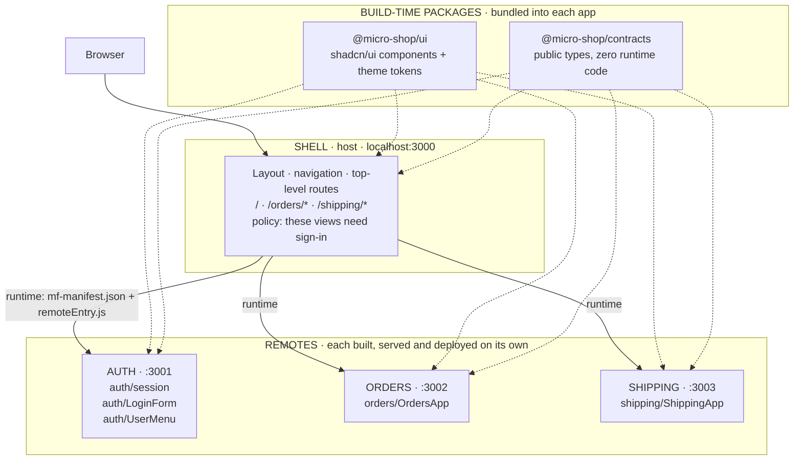
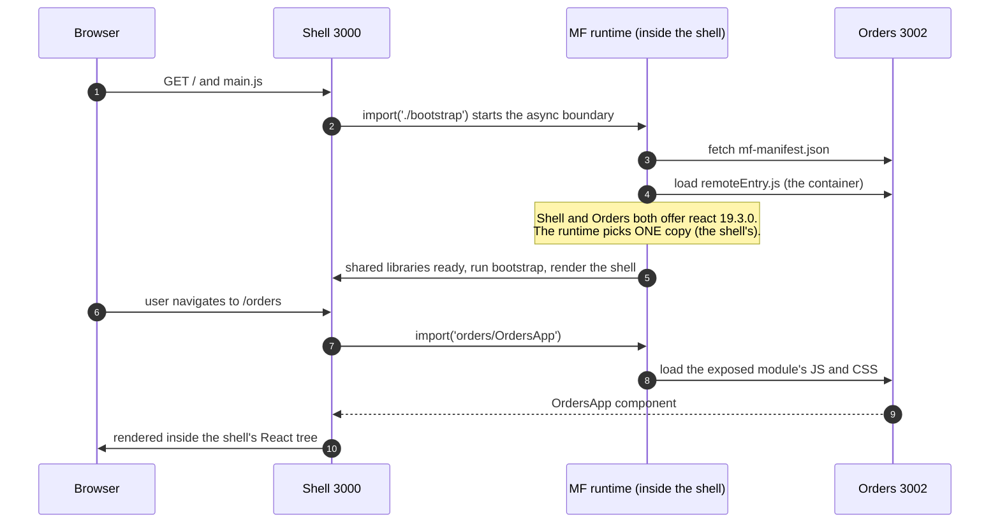
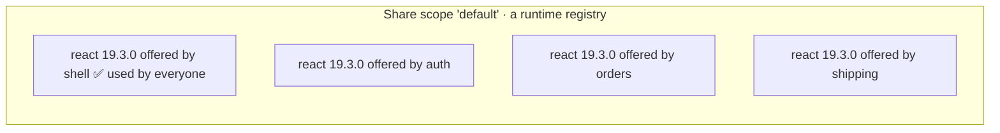
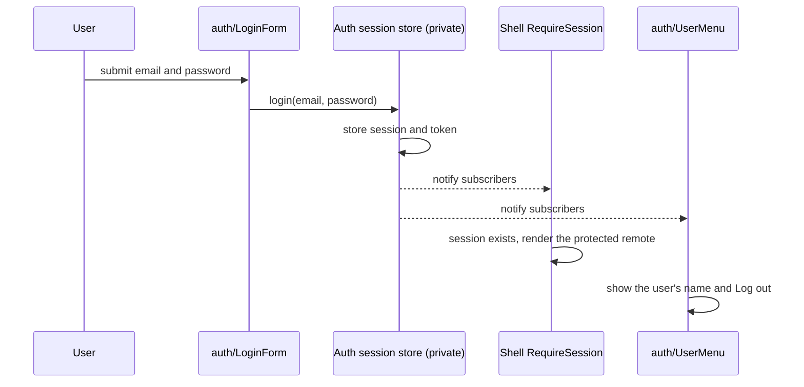
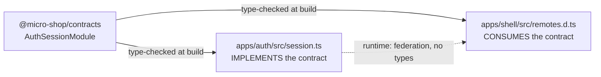
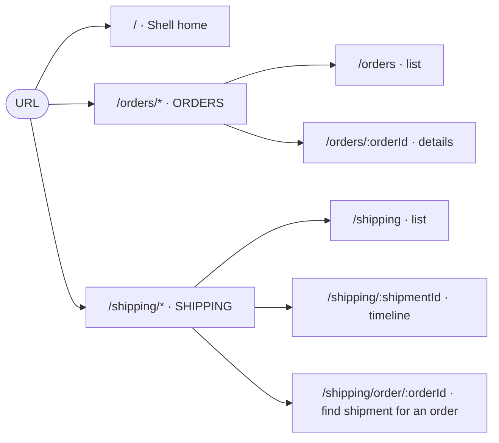
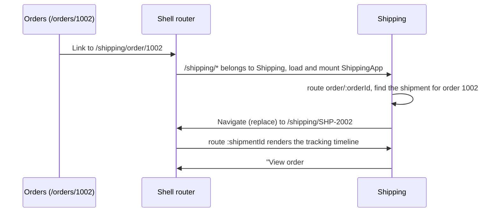
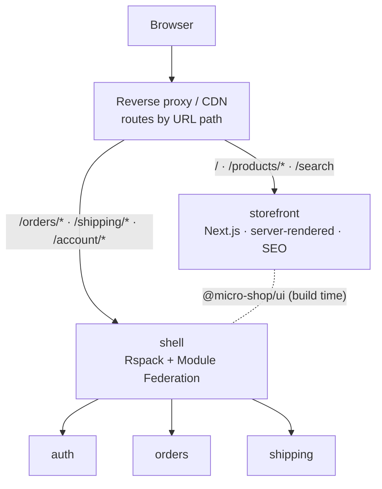

# Micro-Frontends by Example: the micro-shop guide

A hands-on introduction to micro-frontend architecture, built with **Module Federation 2.0**,
**Rspack 2**, **React 19**, **TypeScript**, **pnpm workspaces**, **Tailwind CSS v4** and
**shadcn/ui**.

**Who this is for:** frontend developers who know React well but haven't built micro-frontends.
You don't need to know Module Federation, Rspack or webpack internals.

**How to use it:** read the chapters in order. Each chapter matches a stage in which the project
grew, explains *why* each decision was made, shows the real code, and ends with questions and
an experiment. Run the project while you read.

---

## Contents

- [Part 0: Why micro-frontends (and when not)](#part-0-why-micro-frontends-and-when-not)
- [Part 1: The system at a glance](#part-1-the-system-at-a-glance)
- [Chapter 1: Host and remote, the core of Module Federation](#chapter-1-host-and-remote-the-core-of-module-federation)
- [Chapter 2: Shared dependencies](#chapter-2-shared-dependencies)
- [Chapter 3: Business boundaries, the Auth app](#chapter-3-business-boundaries-the-auth-app)
- [Chapter 4: Shared packages, the design system and contracts](#chapter-4-shared-packages-the-design-system-and-contracts)
- [Chapter 5: Routing and the Shipping app](#chapter-5-routing-and-the-shipping-app)
- [Chapter 6: What is still missing, and what comes next](#chapter-6-what-is-still-missing-and-what-comes-next)
- [Appendix A: Pitfalls we actually hit](#appendix-a-pitfalls-we-actually-hit)
- [Appendix B: Glossary](#appendix-b-glossary)
- [Appendix C: Presenting this to your team](#appendix-c-presenting-this-to-your-team)

---

## Part 0: Why micro-frontends (and when not)

### The problem

A company grows. Five teams now work on one frontend: identity, orders, shipping, catalog,
platform. They share one repository, one build, one deployment:

- The Orders team can't ship a bug fix until the Catalog team's half-finished feature is ready.
- One broken test blocks everybody's release.
- Upgrading React is a company-wide project.
- Nobody really owns the whole thing.

### The idea

**Split the frontend the way you split the organisation.** Each team owns a slice of the
product *end to end*: its code, build, deployment and on-call. The slices are assembled into
one page in the browser.

> Micro-frontends are an **organisational and deployment architecture**, not a UI technique.
> If you have one team and one release schedule, you probably don't need them.

### What it costs

| You gain | You pay |
| --- | --- |
| Teams deploy independently | Runtime integration can fail in production, not just at build time |
| Clear ownership per business domain | Shared dependencies need negotiation (React versions, CSS) |
| Smaller, faster builds per team | Duplicated code and bytes |
| Technology can evolve per team | Harder local setup: several servers |
| Failures can be contained to one area | You must *design* for failure (otherwise one app takes down all) |

### Ways to compose micro-frontends

| Technique | How | Typical use |
| --- | --- | --- |
| Build-time packages | Apps are npm packages, bundled into one app | Not really independent: every change needs a rebuild of the host |
| iframes | Each app in its own frame | Strong isolation, poor UX and integration |
| Edge / server composition | A proxy routes URL paths to different apps | Separate "zones" of a site, e.g. SEO pages vs. logged-in app |
| **Runtime JS composition (Module Federation)** | Host loads other apps' code at runtime | **What this project teaches.** Rich integration inside one page |

We use Module Federation for the logged-in application, and plan edge composition for public,
SEO-critical pages (see [Chapter 6](#chapter-6-what-is-still-missing-and-what-comes-next)).

---

## Part 1: The system at a glance

### Architecture



Solid arrows happen **in the browser, at runtime**. Dotted arrows happen **at build time**.

### Who owns what

| Application | Owns | Must not own |
| --- | --- | --- |
| **Shell** | Page layout, navigation, top-level routes, *policy* ("Orders needs a session"), CSS reset, theme token values | Any business logic |
| **Auth** | Identity: login UI, session, current user, the token | Whether a page needs login (that's the shell's policy) |
| **Orders** | Orders: list, details, status | Shipments, users |
| **Shipping** | Shipments and tracking | Order data (it only stores an order *id*) |

### Repository layout

```text
micro-shop/
├── apps/
│   ├── shell/       host      :3000
│   ├── auth/        remote    :3001
│   ├── orders/      remote    :3002
│   └── shipping/    remote    :3003
├── packages/
│   ├── ui/          shadcn/ui components, Tailwind theme, tokens
│   └── contracts/   TypeScript types shared between apps
├── docs/
│   ├── GUIDE.md                  ← you are here
│   ├── module-federation.md      deep dive: MF configuration
│   ├── architecture.md           deep dive: ownership, the Auth boundary
│   └── shared-packages.md        deep dive: ui, contracts, Tailwind across apps
├── package.json                  scripts: dev:*, build:*, typecheck
├── pnpm-workspace.yaml
└── tsconfig.base.json
```

Each app has the same shape:

```text
apps/orders/
├── module-federation.config.mjs   ← the app's federation contract (name, exposes, shared)
├── rspack.config.mjs              ← build config (owned by the team, not shared)
├── postcss.config.mjs             ← runs Tailwind
├── index.html                     ← only used in standalone mode
└── src/
    ├── index.ts                   ← entry: standalone CSS + async boundary
    ├── bootstrap.tsx              ← standalone mode: mounts the app on its own page
    ├── OrdersApp.tsx              ← PUBLIC: the exposed module
    ├── orders-data.ts             ← private
    ├── orders.css                 ← utilities only (ships with the exposed module)
    └── standalone.css             ← reset + tokens (standalone page only)
```

### Running it

Requires Node ≥ 22.12 and pnpm.

```bash
pnpm install

# four terminals: four separate applications
pnpm dev:auth        # http://localhost:3001  (standalone Auth)
pnpm dev:orders      # http://localhost:3002  (standalone Orders)
pnpm dev:shipping    # http://localhost:3003  (standalone Shipping)
pnpm dev:shell       # http://localhost:3000  (the composed app)

# or all at once, still four processes
pnpm dev
```

Open http://localhost:3000. Mock login: `ada@example.com` / `demo`.

Every part of the page carries a coloured label: **SHELL** (blue), **AUTH** (violet),
**ORDERS** (green), **SHIPPING** (amber). The label tells you which application built and
served that part of the screen.

### Technology versions

| Tool | Version | Role |
| --- | --- | --- |
| Rspack | 2.2 | Bundler (Rust, webpack-compatible API) |
| @module-federation/enhanced | 2.9 | Module Federation 2.0 plugin + runtime |
| React | 19.3 | UI |
| React Router | 8.4 | Routing (declarative mode) |
| Tailwind CSS | 4.3 | Utility CSS |
| shadcn/ui | new-york style | Copy-in component source |
| TypeScript | 7.0 | Types |
| pnpm | 12 | Workspaces |

---

## Chapter 1: Host and remote, the core of Module Federation

**Goal of this stage:** the shell renders a component that lives in a *different application*,
built separately and served from a different port.

### The mental model

Several **separate builds** end up in **one browser page**. Every build that offers code
produces a small **container** object with two functions:

- `init(shareScope)`: "here are the libraries available on this page"
- `get(moduleName)`: "give me one of your public modules"

The host calls them at runtime, over the network. **Nothing is linked at build time**: the
shell's `dist/` folder contains no Orders code at all.

### Vocabulary

| Term | In this repo | Meaning |
| --- | --- | --- |
| **Host** (consumer) | `shell` | Loads modules from other builds. Declares `remotes`. |
| **Remote** (producer) | `auth`, `orders`, `shipping` | Offers modules. Declares `exposes`. |
| **exposes** | `'./OrdersApp'` | The remote's **public API**. Everything else is private. |
| **remotes** | `orders: 'orders@http://…/mf-manifest.json'` | Alias → where to find a container. |
| **remoteEntry.js** | `apps/orders/dist/remoteEntry.js` | Script that creates the container. |
| **mf-manifest.json** | `apps/orders/dist/mf-manifest.json` | JSON description of a remote: entry file, exposed modules, shared versions, required JS/CSS per module. |
| **shared** | `react`, `react-dom`, `react-router` | Libraries negotiated at runtime so only one copy loads. |

### The remote side: what Orders offers

[`apps/orders/module-federation.config.mjs`](../apps/orders/module-federation.config.mjs)

```js
export default createModuleFederationConfig({
  name: 'orders',                 // globally unique container name
  filename: 'remoteEntry.js',
  exposes: {
    './OrdersApp': './src/OrdersApp.tsx',   // the ENTIRE public API
  },
  shared: {
    react:          { singleton: true, requiredVersion: '^19.3.0' },
    'react-dom':    { singleton: true, requiredVersion: '^19.3.0' },
    'react-router': { singleton: true, requiredVersion: '^8.4.0' },
  },
  manifest: true,                 // emit mf-manifest.json
  dts: false,                     // we write the consumer types by hand (see Chapter 4)
});
```

`orders-data.ts` is **unreachable** from outside: a remote can only hand out what it exposes.
Keep `exposes` small. Every entry is something another team may depend on, so you can no
longer change it freely.

### The host side: what the shell consumes

[`apps/shell/module-federation.config.mjs`](../apps/shell/module-federation.config.mjs)

```js
remotes: {
  auth:     'auth@http://localhost:3001/mf-manifest.json',
  orders:   'orders@http://localhost:3002/mf-manifest.json',
  shipping: 'shipping@http://localhost:3003/mf-manifest.json',
},
```

- The **left** side (`orders`) is the alias used in code: `import('orders/OrdersApp')`.
- `orders@` on the right must match the remote's `name`.
- The URL is **data, not code**. Point it somewhere else and the shell loads a different build of
  Orders without being rebuilt. That's the mechanism behind independent deployment.

And the usage, in [`apps/shell/src/App.tsx`](../apps/shell/src/App.tsx):

```tsx
const OrdersApp = lazy(() => import('orders/OrdersApp'));
// …
<Suspense fallback={<RemoteLoading remote="orders" />}>
  <OrdersApp />
</Suspense>
```

It looks like a normal lazy import. The difference is where the code comes from: another
server, another build, another team.

### What happens in the browser

This is the real network sequence, observed in DevTools:



Things to notice:

1. **Orders' copy of React is never downloaded**: the shell's copy is reused.
2. **Steps 3–4 happen at startup**, before anyone opens Orders. That's the default
   `shareStrategy: 'version-first'`: to choose the highest version of each shared library,
   the runtime first asks *every* remote what it has. The downside is covered in
   [Chapter 6](#chapter-6-what-is-still-missing-and-what-comes-next).
3. **CSS travels with the module.** The manifest lists the CSS each exposed module needs.

### The async boundary

Every app's entry file does almost nothing:

```ts
// apps/orders/src/index.ts
import './standalone.css';          // explained in Chapter 4
import('./bootstrap');              // ← the async boundary
```

Shared modules are resolved **asynchronously**: the runtime may need to fetch another app's
copy of React first. If `index.ts` imported React directly, the browser would throw:

```text
Shared module is not available for eager consumption
```

The dynamic `import('./bootstrap')` gives the runtime one async step to set up sharing before
any React code runs.

### Standalone mode

Every remote is a **complete application**. `pnpm dev:orders` opens http://localhost:3002
with Orders on its own page, with no shell and no login. That's how the Orders team works day
to day. The file `bootstrap.tsx` only runs in standalone mode; when the shell hosts Orders, only
the exposed module runs.

### Build settings that matter for federation

| Setting | Where | Why |
| --- | --- | --- |
| `output.publicPath: 'auto'` | remotes | A remote doesn't know its deployment URL. `'auto'` resolves its chunks relative to where `remoteEntry.js` was loaded from. Hard-coding a URL would bake an environment into the build. |
| `output.publicPath: '/'` | shell | The shell owns the origin. |
| `output.uniqueName` | all | Namespaces the chunk registry (`rspackChunkorders`) so builds on one page don't collide. |
| `Access-Control-Allow-Origin` header | remotes' dev servers | The shell `fetch()`es the manifest from another origin. `<script>` tags ignore CORS; `fetch` doesn't. In production, allow-list the shell's origin instead of `*`. |
| `lazyCompilation: false` | all | Rspack 2 compiles dynamic imports lazily in dev. With federation, that broke hot updates (see [Appendix A](#appendix-a-pitfalls-we-actually-hit)). |

### Questions

1. The Orders team renames `./OrdersApp` to `./Orders` and deploys. The shell still builds.
   What happens, and when do you find out?
2. Why do remotes need a CORS header while their `<script>` loads don't?
3. What would break if Orders hard-coded `publicPath: 'http://localhost:3002/'`?

### Experiment

Stop only the Orders server (`Ctrl+C` in its terminal) and reload http://localhost:3000. Look
at the console. What do you see, and why does even the Home page break?

---

## Chapter 2: Shared dependencies

### Why share at all

React keeps module-level state: the current hooks dispatcher. If the shell renders
`<OrdersApp />` with React copy **A**, and Orders calls `useState` from React copy **B**,
React throws **"Invalid hook call"**. Some libraries **must exist exactly once** on the page.



Each app **offers** its own copy and **consumes** whichever copy the runtime picks.
`singleton: true` means "exactly one copy, even if versions differ".

### The options

| Option | Meaning |
| --- | --- |
| `singleton: true` | Only one copy on the page. |
| `requiredVersion: '^19.3.0'` | The range this app is known to work with. If the chosen singleton is outside it, the runtime **warns** and uses it anyway. |
| `strictVersion: true` | Fail instead of warn when the version doesn't match. |
| `eager: true` | Put the library in the entry chunk (usually avoid this; use the async boundary instead). |

### What we share, and why only that

| Shared | Why |
| --- | --- |
| `react`, `react-dom` | Hook state: must be one copy. |
| `react-router` | The router keeps the current URL in React **context**. Remotes render `<Routes>` inside the shell's `<BrowserRouter>`, and context only works within **one copy** of the library (Chapter 5). |

**Everything else is not shared on purpose.** Every shared library is a *runtime agreement*
between teams that deploy independently. Share `lodash`, and upgrading lodash in one app now
affects every app on the page.

> **Rule:** share what *must* be single (stateful frameworks, context providers), or what is so
> large that duplication really hurts. Nothing else.

### A detail worth seeing

`react-dom/client` (~200 KB) appears in **both** the shell's and each remote's build. The
shared key `'react-dom'` matches that exact import specifier, not the package's subpaths. It's
harmless here, because only the shell calls `createRoot`. It shows that **shared keys match
import paths, not packages**.

### Questions

1. Orders upgrades to React 19.4 while the shell stays on 19.3. Which copy loads? What changes
   with `strictVersion: true`?
2. Why is `react-router` shared but `clsx` isn't?

### Experiment

Remove `react` from `shared` in **only** `apps/orders/module-federation.config.mjs`. Restart
Orders and open `/orders`. How many copies of React does the Network tab show? What error do you
get? (Put it back afterwards.)

---

## Chapter 3: Business boundaries, the Auth app

**Goal of this stage:** add a second remote and learn how to draw a boundary between domains.

### Split by business capability, not by component

```text
❌  Header MFE · Button MFE · Sidebar MFE          (component fragmentation)
✅  Auth · Orders · Shipping · Catalog             (business capabilities)
```

A micro-frontend should map to something a **team owns end to end**.

### The Auth boundary

| Question | Owner |
| --- | --- |
| *Does this page need a signed-in user?* | **Shell** (composition policy) |
| *Who is the user? How does login work? Where is the token?* | **Auth** (identity) |
| *What orders does the user have?* | **Orders** (and, in production, the backend) |

The shell doesn't know how login works. Orders doesn't know that login exists.

### Auth's public API

```text
auth/session     getSession() · subscribe(listener) · logout()
auth/LoginForm   <LoginForm />      the ONLY way to log in
auth/UserMenu    <UserMenu />       "Ada Lovelace · Log out" or "Guest"
```

What is **not** exposed: `login()`, the token, storage keys, the user list. The file
[`apps/auth/src/session.ts`](../apps/auth/src/session.ts) is a *facade*: it re-exports only the
read side of the private store in `session-store.ts`.

Design choices worth copying:

- **Framework-agnostic API.** `auth/session` exports plain functions, not a `useSession()`
  hook. The shell adapts them to React itself
  ([`use-session.ts`](../apps/shell/src/use-session.ts)):

  ```ts
  const sessionApi = import('auth/session');   // requested once

  export function useSession() {
    const { subscribe, getSession } = use(sessionApi);
    return useSyncExternalStore(subscribe, getSession);
  }
  ```

- **`LoginForm` takes no props.** No `onSuccess` callback is needed: the shell is subscribed
  to the session and re-renders when one appears. Fewer props mean a smaller contract.
- **The shell decides *where*, Auth decides *what*.** The shell places `<UserMenu />` in its
  header; Auth decides what it shows.

### How signing in flows through the page



`auth/session`, `auth/LoginForm` and `auth/UserMenu` are loaded separately, but they come from
the **same container**, which has one module cache. So the private store exists once on the page.

### Remote code has no origin of its own

When the shell hosts Auth, Auth's JavaScript runs on **localhost:3000**, the shell's origin.
Its `sessionStorage.setItem(…)` writes to the shell's storage, not to localhost:3001.

> **There is no security boundary between micro-frontends on the same page.** Every remote can
> read `sessionStorage`, cookies (non-HttpOnly), and the DOM. Isolation requires iframes or
> separate origins. In production, keep tokens out of JavaScript entirely (an `HttpOnly`
> cookie set by an auth backend), and enforce authorization on the server.

### Questions

1. Why does `LoginForm` need no `onSuccess` prop?
2. Orders wants to display "Orders for Ada". Should Orders import `auth/session`? What does
   that do to Orders' independence?

### Experiment

Sign in, then run `sessionStorage` in the DevTools console on localhost:3000. Find the mock
token. Think about what a buggy or malicious remote could do with it.

---

## Chapter 4: Shared packages, the design system and contracts

**Goal of this stage:** one look-and-feel across apps (shadcn/ui), and type-checked agreements
between apps, without coupling their deployments.

### Two kinds of sharing

| | Build-time package | Runtime shared module (MF `shared`) |
| --- | --- | --- |
| Examples | `@micro-shop/ui`, `@micro-shop/contracts` | `react`, `react-dom`, `react-router` |
| Where the code lives | Copied into each app's bundle | Downloaded once, used by all |
| Version on the page | Each app has the version **it was built with** | One negotiated version |
| Upgrading | Each team, at its own pace | Coordinated: everyone runs one copy |
| Use for | Stateless, presentational code | Things that must be a singleton |

### What belongs in a shared package

> **Ask:** "If this changes, do I want every micro-frontend to potentially need a redeploy?"

| ✅ Share | ❌ Keep inside one app |
| --- | --- |
| `Button`, `Card`, `Input` (`@micro-shop/ui`) | Order-status → colour mapping (a business decision) |
| Theme tokens | Stores (Redux/Zustand), API clients, repositories |
| Public types between apps (`@micro-shop/contracts`) | A domain's internal types (`Order`, `Shipment`) |
| `cn()` | A "common utils" grab-bag. It becomes a *distributed monolith*. |

### `@micro-shop/contracts`: types only

```ts
// packages/contracts/src/auth.ts
export type User    = { id: string; name: string; email: string };
export type Session = { user: User; expiresAt: string };

export type AuthSessionModule = {
  getSession(): Session | null;
  subscribe(listener: () => void): () => void;
  logout(): void;
};
```

Both sides of the boundary compile against the same file:



- Auth types each export as `AuthSessionModule['getSession']`, so **Auth's own build fails** if
  it drifts from the promise.
- The shell's declaration of `auth/session` is built from the same type.
- It's a `devDependency`. Types are erased, so it adds **zero bytes** and **zero runtime coupling**.
  Its whole job is to turn "broken in production" into "broken at compile time".

What contracts **cannot** catch: a remote that was deployed with an older or newer contract
than the host was built with. Types don't exist at runtime. That's a versioning problem
(Chapter 6).

### `@micro-shop/ui`: shadcn/ui as an internal package

- The components are real shadcn "new-york" sources in
  [`packages/ui/src/components`](../packages/ui/src/components). Add more with:
  ```bash
  cd packages/ui && pnpm dlx shadcn@latest add dialog
  ```
- The package ships **source** (`.tsx`); each app compiles it.
- It is **not** in MF `shared`. Orders and Auth each bundle their own copy. The cost is bytes
  and possible visual drift between versions; the benefit is that no team's deploy depends on
  another team's UI upgrade.
- **It must not know the business.** `MfeFrame` (the dashed labelled box) takes a *colour*, not
  a domain name.

> **Context gotcha:** because each app has its own copy of the UI library, React **context does
> not cross app boundaries**. A `<TooltipProvider>` in the shell's copy of Radix is invisible to
> Orders' copy. (React Router is different because it *is* shared, see Chapter 5.)

### Tailwind across micro-frontends: who ships what

Tailwind generates CSS per build. With four builds on one page, the question is which
stylesheet ships which part:

| Stylesheet | CSS reset (preflight) | Token **values** (`--primary: …`) | Utility classes |
| --- | --- | --- | --- |
| Shell: `shell.css` (owns the page) | ✅ | ✅ | ✅ |
| Remote: `orders.css`, `auth.css`, `shipping.css` (ship with exposed modules) | ❌ | ❌ | ✅ |
| Remote standalone: `standalone.css` (only on the remote's own page) | ✅ | ✅ | — |

The theme lives in two files in `packages/ui/src/styles`:

- **`theme.css`** maps names to variables: `--color-primary: var(--primary)`. It tells
  Tailwind that `bg-primary` exists. It emits no values, so every app can include it.
- **`tokens.css`** holds the actual values: `:root { --primary: oklch(…) }`. **Page owner only.**

Because remotes reference `var(--primary)` and never the colour itself, **changing a token in
the shell re-themes every micro-frontend without redeploying them.**

### Why a remote must never ship token values (we measured it)

We added one line to Orders' CSS, `:root { --background: <green> }`, and measured the shell's
body colour:

```text
home (before Orders loads)   oklch(0.985 0 0)       shell's value
/orders                      oklch(0.93 0.06 150)   Orders' value took over the WHOLE page
back to home                 oklch(0.93 0.06 150)   still green: CSS is never unloaded
```

### Cascade layers keep the order stable

Every stylesheet starts with the same line:

```css
@layer theme, base, components, utilities;
```

Layers with the same name **merge across stylesheets**, so the priority order holds no matter
which app's CSS loads first. **Unlayered CSS beats every layer.** A remote that ships plain
CSS, or Tailwind v3 (unlayered output), would override the shell's utilities. Keep everything
layered, and keep all apps on the same Tailwind major version.

### Questions

1. `@micro-shop/ui` is bundled into each app instead of shared at runtime. What do you gain
   and lose? When would you switch?
2. Why do Orders' status colours live in Orders and not in `packages/ui`?

### Experiments

1. Change `--primary` in `packages/ui/src/styles/tokens.css`, restart **only the shell**, and
   look at Auth's "Sign in" button. Auth wasn't rebuilt. Why did it change?
2. Rename `logout` to `signOut` in `packages/contracts/src/auth.ts` and run `pnpm typecheck`.
   Which projects fail? (Revert afterwards.)

---

## Chapter 5: Routing and the Shipping app

**Goal of this stage:** real URLs (`/orders/1002`, `/shipping/SHP-2002`), a fourth application,
and navigation *between* micro-frontends.

### Who owns which part of the URL



- The **shell** owns the **first segment** and decides which app renders it.
- Each **remote** owns **everything below its prefix**.

In the shell ([`App.tsx`](../apps/shell/src/App.tsx)), the `/*` hands the rest of the URL to the
remote:

```tsx
<Route path="orders/*"   element={<ProtectedRemote remote="orders"><OrdersApp /></ProtectedRemote>} />
<Route path="shipping/*" element={<ProtectedRemote remote="shipping"><ShippingApp /></ProtectedRemote>} />
```

Inside Orders ([`OrdersApp.tsx`](../apps/orders/src/OrdersApp.tsx)), the routes are
**relative**, so Orders doesn't know or care that it's mounted at `/orders`:

```tsx
<Routes>
  <Route index element={<OrderList />} />
  <Route path=":orderId" element={<OrderDetails />} />
  <Route path="*" element={<NotFound what="page" />} />
</Routes>
```

### Why React Router must be shared

The shell renders the one `<BrowserRouter>`. Orders renders `<Routes>` **inside** it. `<Routes>`
finds the router through React context, and a context object only exists once per copy of the
library. So `react-router` is a **singleton** in every app that uses it. Otherwise Orders would
have its own, empty router context and throw.

This is the same rule as the Tooltip gotcha in Chapter 4, from the other side: **context crosses
app boundaries only if the library is shared.**

### URLs are a public API

Other apps link to your URLs, users bookmark them, search engines index them. Renaming
`/orders/:id` is a breaking change, just like renaming an export. So the public paths are part
of the contracts package ([`routes.ts`](../packages/contracts/src/routes.ts)):

```ts
export type AppPath =
  | '/'
  | '/orders' | `/orders/${string}`
  | '/shipping' | `/shipping/${string}`
  | `/shipping/order/${string}`;
```

Every cross-app link is type-checked against it:

```ts
const trackingUrl: AppPath = `/shipping/order/${order.id}`;   // ✅ compiles
const broken: AppPath = `/shipment/${order.id}`;              // ❌ type error
```

### Navigating between micro-frontends

Orders knows an order's id, but not its shipment id. That mapping is Shipping's data. So
Shipping publishes an entry point for exactly this case, `/shipping/order/:orderId`:



The two apps talk **only through the URL**. Neither imports the other's code, types or data.

### Reference other domains by id

```ts
// apps/shipping/src/shipping-data.ts
export type Shipment = {
  id: string;
  orderId: string;       // ← a reference, not a copy of the order
  carrier: string;
  status: ShipmentStatus;
  events: readonly TrackingEvent[];
};
```

Shipping never imports Orders' `Order` type and never copies order data. When it needs order
details, it links to `/orders/:id` and lets Orders render them.

### Standalone mode with routing

In standalone mode the remote owns the page, so it owns the router. It mounts itself at the
**same prefix** the shell uses:

```tsx
// apps/shipping/src/bootstrap.tsx
<BrowserRouter>
  <Routes>
    <Route index element={<Navigate to="/shipping" replace />} />
    <Route path="/shipping/*" element={<ShippingApp />} />
    <Route path="*" element={<ForeignRoute />} />   {/* "this URL belongs to another app" */}
  </Routes>
</BrowserRouter>
```

Deep links need one build setting: `HtmlRspackPlugin({ publicPath: '/' })`. Otherwise reloading
`/shipping/SHP-2002` would request `/shipping/main.js` and get the HTML fallback instead.

### Questions

1. Shipping wants to rename `/shipping/order/:orderId` to `/tracking/by-order/:orderId`. Who has
   to change? How would you migrate without breaking bookmarks?
2. Why does Orders only show "Track shipment" for shipped and delivered orders? Is that
   Orders' decision or Shipping's?
3. What would go wrong if Orders and Shipping each bundled their own `react-router`?

### Experiments

1. Open http://localhost:3000/orders/1002, click **Track shipment**, then use the browser's back
   button. Watch the URL and the coloured labels.
2. Open http://localhost:3003/orders/1002 (standalone Shipping). What renders, and why?

---

## Chapter 6: What is still missing, and what comes next

### Known limitations (on purpose, for now)

| Limitation | Symptom | Planned fix |
| --- | --- | --- |
| **No failure isolation** | Stop any remote and the shell shows a **blank page**, even Home. `version-first` fetches every manifest at startup, and there's no error boundary around remotes. | Error boundaries per remote, retry, and a startup that tolerates missing remotes |
| **Hard-coded remote URLs** | `http://localhost:300x` is baked into the shell build | Per-environment remote URLs / a remote registry |
| **No cross-app events** | Orders can't tell Shipping "an order was paid" | A typed browser event bus (`order.created` → Shipping reacts) |
| **No tests, no observability** | — | Contract tests, a Playwright journey, a small logger with the MFE name |
| **Client-side rendering only** | Public pages would be invisible to search engines | A Next.js *storefront* for SEO pages (below) |

### The planned SEO split

Public, SEO-critical pages (home, product pages, search) need server rendering. Next.js is
great at that. But the official Next.js integration for Module Federation is **deprecated**:
it doesn't support the App Router or Turbopack. So instead of making Next.js the host, the
plan splits the site **by URL at the edge**:



- Next.js does what it's best at: public pages that search engines can read.
- Module Federation composes the logged-in application, where independent deploys matter.
- Both use `@micro-shop/ui`, so users see one product.
- The session is shared through a cookie on the common domain.

### Roadmap

1. ✅ Shell loads Orders
2. ✅ Auth remote
3. ✅ Shared UI (shadcn/ui) + contracts
4. ✅ Shipping + URL routing
5. Cross-app events (`order.created` → Shipping)
6. Failure isolation
7. Next.js storefront + local reverse proxy
8. Independent deployment: versioned remotes, rollback, observability, tests

---

## Appendix A: Pitfalls we actually hit

Real problems from building this project, and how we solved them.

| Problem | Symptom | Cause | Fix |
| --- | --- | --- | --- |
| One remote down breaks the shell | Blank page, `RUNTIME-003 Failed to get manifest` | `version-first` loads every manifest at startup | Planned (failure isolation stage) |
| HMR crash in dev | `rspackHotUpdateorders … reading 'push'` | Rspack 2's dev-mode lazy compilation sent hot updates for a container chunk the page never loaded | `lazyCompilation: false` |
| Standalone CSS leaked into the shell (dev) | Orders' reset + tokens appeared on the shell page | `radix-ui` imports `react-dom`; in dev, Rspack put that into the same chunk as `bootstrap.tsx` and its CSS | Import standalone CSS from `index.ts` (entry → `main.css`, which hosts never load) |
| Remote token values re-theme the page | Whole page changes colour when a remote loads, and stays changed | `:root` variables are global and CSS is never unloaded | Remotes ship utilities only |
| Deep links 404 in standalone | `/orders/1003` reload fails | HTML asset URLs relative to the current path | `HtmlRspackPlugin({ publicPath: '/' })` |
| Relative links resolving wrong | `..` from `/shipping/order/1002` went to `/shipping/order/…` | Path-relative vs route-relative resolution | Use absolute `AppPath` links across route levels |
| Minified CSS "missing" tokens | A grep for `oklch` found nothing | The minifier converted `oklch()` to hex | Check the real output, not the source syntax |

> **General lesson:** verify federation behaviour against a **production build**
> (`mf-manifest.json` lists exactly what each exposed module loads). Dev servers chunk code
> differently.

---

## Appendix B: Glossary

| Term | Meaning |
| --- | --- |
| **Micro-frontend (MFE)** | A slice of a web app owned end to end by one team and deployed independently. |
| **Host / shell** | The app that owns the page and composes the others. |
| **Remote** | An app that exposes modules for hosts to load at runtime. |
| **Container** | The runtime object a remote creates (`get`, `init`). |
| **Expose** | A module a remote makes public. |
| **Share scope** | Runtime registry of shared library versions. |
| **Singleton** | A shared library allowed to exist only once on the page. |
| **Async boundary** | The `import('./bootstrap')` that lets sharing initialise before app code runs. |
| **Manifest** | `mf-manifest.json`: machine-readable description of a remote build. |
| **Contract** | An explicit, versioned agreement between apps: types, URLs, events. |
| **Page owner** | The app that owns the document: the only one that ships the CSS reset and token values. |
| **Standalone mode** | A remote running on its own page for development. |
| **Distributed monolith** | Separately deployed apps that are so coupled they must be deployed together anyway. |

---

## Appendix C: Presenting this to your team

A suggested 45-minute session.

| Time | Topic | Show |
| --- | --- | --- |
| 0–5 | Why micro-frontends (and when not) | [Part 0](#part-0-why-micro-frontends-and-when-not) table of costs |
| 5–10 | The system | Architecture diagram; open http://localhost:3000 and point at the coloured labels |
| 10–20 | Host and remote | Two MF config files side by side; DevTools Network tab while opening `/orders` |
| 20–25 | Break it | Stop the Orders server, reload: blank page. Ask the room why. |
| 25–32 | Boundaries | Auth's facade (`session.ts`); `sessionStorage` token in the console |
| 32–40 | Shared UI and CSS | The "who ships what" table; the green-page measurement |
| 40–45 | Routing and contracts | Orders → Track shipment → Shipping; rename a contract field and run `pnpm typecheck` |

**Demo checklist**

- [ ] `pnpm install` done, all four servers running (`pnpm dev`)
- [ ] Signed out before the demo (so the login gate is visible)
- [ ] DevTools open on the Network tab, filtered to `300`
- [ ] A second terminal ready to stop one server

**Good discussion questions for the audience**

1. Which parts of *our* product would be separate micro-frontends? Which teams would own them?
2. What would we share at runtime, and what only at build time?
3. How would we deploy a new version of one app, and roll it back?
