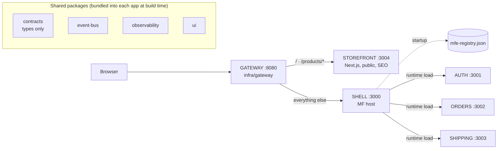
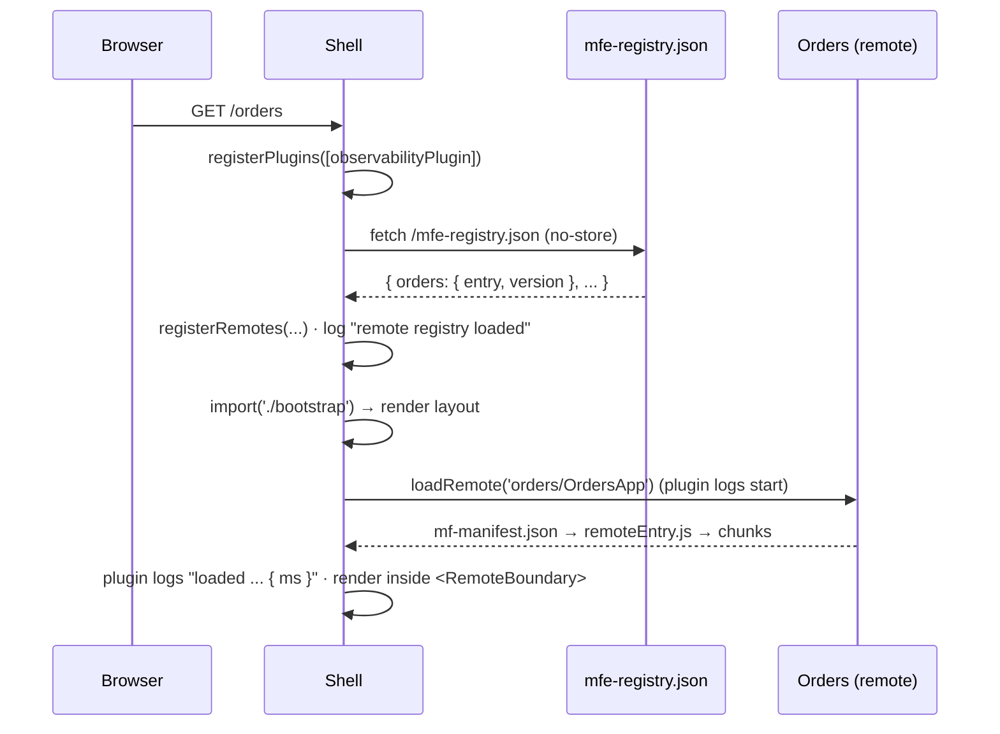
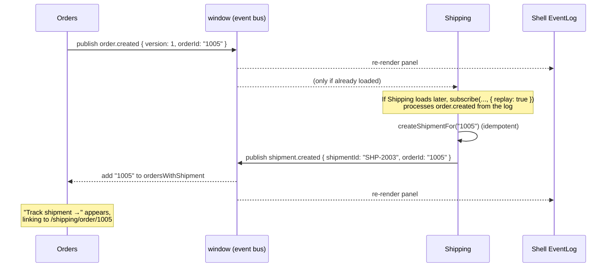

# micro-shop: developer overview

A reference for developers joining the project. It covers what each app does, what the
shared packages (`contracts`, `event-bus`, `observability`, `ui`) are for, how they work
together at runtime, and how to make common changes safely.

For the step-by-step explanation of *why* the system is built this way, read
[GUIDE.md](GUIDE.md). This page is the map; the guide is the tour.

---

## Contents

- [The system in one picture](#the-system-in-one-picture)
- [The apps](#the-apps)
- [The shared packages](#the-shared-packages)
  - [`@micro-shop/contracts`](#micro-shopcontracts)
  - [`@micro-shop/event-bus`](#micro-shopevent-bus)
  - [`@micro-shop/observability`](#micro-shopobservability)
  - [`@micro-shop/ui`](#micro-shopui)
- [How it all works together](#how-it-all-works-together)
- [Infrastructure](#infrastructure)
- [Tests](#tests)
- [Common tasks](#common-tasks)
- [Rules of the road](#rules-of-the-road)

---

## The system in one picture



- **Two zones** behind one gateway: the Next.js **storefront** for public pages, and the
  Module Federation **shell** for signed-in pages.
- The shell is a **host**. **Auth**, **Orders** and **Shipping** are **remotes**: separately
  built and deployed apps the shell loads in the browser at runtime.
- The shared packages are **not** shared at runtime through Module Federation. Each app
  bundles its own copy. The ones that need shared state (`event-bus`, `observability`) keep
  it on `window`, so all copies on the page see the same data.

---

## The apps

| App | Kind | Port | Owns | Exposes / serves |
| --- | --- | --- | --- | --- |
| [shell](../apps/shell/) | MF host | 3000 | Layout, top-level routing, session gate, error isolation, event log | Nothing (host only) |
| [auth](../apps/auth/) | MF remote | 3001 | Identity: who the user is, login, logout | `./session`, `./LoginForm`, `./UserMenu` |
| [orders](../apps/orders/) | MF remote | 3002 | Orders, everything under `/orders/*` | `./OrdersApp` |
| [shipping](../apps/shipping/) | MF remote | 3003 | Shipments and tracking, everything under `/shipping/*` | `./ShippingApp` |
| [storefront](../apps/storefront/) | Next.js zone | 3004 | Public catalog: `/`, `/products/*`, sitemap, robots | Prerendered HTML |
| [gateway](../infra/gateway/) | Reverse proxy | 8080 | The single public origin | Routes to storefront or shell |

### Shell (`apps/shell`)

The page owner. It decides **which app renders which URL prefix**, but not what happens below
the prefix.

- **Startup** ([src/index.ts](../apps/shell/src/index.ts)): registers the observability runtime
  plugin, fetches `/mfe-registry.json` to learn where each remote lives, then crosses the
  async boundary into [bootstrap.tsx](../apps/shell/src/bootstrap.tsx). No remote URLs are
  compiled into the shell.
- **Routing** ([src/App.tsx](../apps/shell/src/App.tsx)): owns the one `<BrowserRouter>`.
  `orders/*` goes to Orders and `shipping/*` goes to Shipping, both wrapped in `RequireSession`.
- **Loading remotes** ([src/load-remote.ts](../apps/shell/src/load-remote.ts)): a typed wrapper
  around the federation runtime's `loadRemote`. A typo in a remote id is a compile error.
- **Failure isolation** ([src/remote.tsx](../apps/shell/src/remote.tsx)): `<Remote>` adds a
  loading skeleton, one error boundary per remote, and a Retry button. A remote that fails to
  load or crashes only blanks its own area.
- **Session gate**: the shell asks Auth whether a session exists
  ([src/use-session.ts](../apps/shell/src/use-session.ts)); if not, it renders Auth's
  `LoginForm`. If Auth itself is down, protected pages **fail closed**.
- **Event log** ([src/EventLog.tsx](../apps/shell/src/EventLog.tsx)): a dev panel in the
  bottom-right that shows every cross-app event on the page.

### Auth (`apps/auth`)

Owns identity. Its public surface is deliberately small:

- `auth/session`: a framework-agnostic read API: `getSession()`, `subscribe()`, `logout()`.
  Typed by `AuthSessionModule` from contracts.
- `auth/LoginForm`: the **only** way to log in. No props; the host re-renders when the session
  appears.
- `auth/UserMenu`: the name and "Log out" button in the shell header.

The token and `login()` stay private in
[session-store.ts](../apps/auth/src/session-store.ts). Login is a **mock**: credentials are
checked in the browser (`ada@example.com` or `grace@example.com`, password `demo`). On
login/logout it publishes `auth.user.logged-in` / `auth.user.logged-out`, and it writes a
display-name-only cookie (`micro-shop-user`) so the storefront can show "Signed in as Ada".

### Orders (`apps/orders`)

Owns orders. Routes (relative, under `/orders/*`): the list, and `/:orderId` for details.

- **Create test order** simulates checkout and publishes `order.created`.
- It keeps a small **read model** of Shipping's data: the set of order ids that have a
  shipment, filled only from `shipment.created` events. That's how the "Track shipment →"
  button knows when to appear, without Orders ever calling Shipping.
- Links to Shipping use the URL contract: `/shipping/order/:orderId`.

### Shipping (`apps/shipping`)

Owns shipments. Routes under `/shipping/*`: the list, `/:shipmentId` for the tracking
timeline, and `/order/:orderId`, which resolves an order id to its shipment and redirects.

- Subscribes to `order.created` (with **replay**) and creates one shipment per order, then
  publishes `shipment.created`.
- Stores only an `orderId` reference, never a copy of Orders' data.

### Storefront (`apps/storefront`)

A Next.js app for pages that must work **without JavaScript** (search engines, link previews).
It is not a federation host or remote.

- `/` and `/products/[slug]` are prerendered at build time, with metadata, Open Graph,
  canonical URLs and JSON-LD. `sitemap.xml` and `robots.txt` are generated.
- The only client-side code is [account-status.tsx](../apps/storefront/components/account-status.tsx),
  which reads Auth's display-name cookie.
- Links into `/orders` and `/shipping` are plain `<a href>`: they cross into the other zone, so
  they need a full page load.

### Standalone mode

Every remote has its own `index.html` and [bootstrap.tsx](../apps/orders/src/bootstrap.tsx), so
its team can run it alone (`pnpm dev:orders` → http://localhost:3002). The shell never runs
that code: it loads `remoteEntry.js` / `mf-manifest.json` and only the exposed modules.

---

## The shared packages

All four live in [packages/](../packages/) and are consumed as TypeScript source through
workspace dependencies. They are **build-time** dependencies: each app bundles its own copy.

| Package | Runtime code? | Shared state | Used by |
| --- | --- | --- | --- |
| `contracts` | No, types only | none | every app |
| `event-bus` | Yes | `window.__microShopEventLog__` | auth, orders, shipping (publish/subscribe), shell (log panel) |
| `observability` | Yes | `window.__microShopLogSinks__` | shell, auth, orders, shipping |
| `ui` | Yes (React components, CSS) | none | every app, including the storefront |

### `@micro-shop/contracts`

**What it is:** the public API between apps, written as TypeScript types. It has no runtime
code and no business logic. Source: [packages/contracts/src/](../packages/contracts/src/).

**Why it exists:** apps are built and deployed separately, so nothing checks at runtime that
the shell and Auth agree on what `getSession()` returns. Putting the shape in one shared file
means both producer and consumer compile against it. A breaking change fails the **build** of
every affected app, instead of failing in a user's browser.

It defines three contracts:

#### 1. Auth API ([auth.ts](../packages/contracts/src/auth.ts))

```ts
type User = { id: string; name: string; email: string };
type Session = { user: User; expiresAt: string };   // never contains the token

type AuthSessionModule = {
  getSession(): Session | null;
  subscribe(listener: () => void): () => void;
  logout(): void;
};
```

- **Producer:** Auth types its exports with it in [session.ts](../apps/auth/src/session.ts).
- **Consumer:** the shell's [remotes.d.ts](../apps/shell/src/remotes.d.ts) declares the
  `auth/session` module from the same type.

#### 2. URLs ([routes.ts](../packages/contracts/src/routes.ts))

```ts
type AppPath =
  | '/' | `/products/${string}`
  | '/orders' | `/orders/${string}`
  | '/shipping' | `/shipping/${string}`
  | `/shipping/order/${string}`;
```

URLs are treated as public API: other apps link to them, users bookmark them, search engines
index them. Any cross-app link is typed as `AppPath`:

```ts
const trackingUrl: AppPath = `/shipping/order/${order.id}`;
```

A typo like `/shipment/1002` doesn't compile.

#### 3. Events ([events.ts](../packages/contracts/src/events.ts))

```ts
type AppName = 'shell' | 'auth' | 'orders' | 'shipping';

type MicroShopEvents = {
  'auth.user.logged-in':  { version: 1; userId: string };
  'auth.user.logged-out': { version: 1; userId: string };
  'order.created':        { version: 1; orderId: string };
  'shipment.created':     { version: 1; shipmentId: string; orderId: string };
};

type EventEnvelope<T> = {
  id: string;          // unique, for de-duplication
  type: T;
  source: AppName;     // who published it
  occurredAt: string;  // ISO 8601
  payload: MicroShopEvents[T];
};
```

The rules the event types enforce:

- **Events are facts, in the past tense** (`order.created`), not commands (`create shipment`).
  The publisher doesn't know who listens.
- **Payloads are thin:** ids and a few fields, never a whole domain object. Shipping gets an
  `orderId`, not Orders' `Order` type.
- **Every payload has a `version`.** Publisher and consumer deploy independently, so a consumer
  may receive a version it doesn't know yet.

#### Type tests

[contracts.type-test.ts](../packages/contracts/src/contracts.type-test.ts) holds compile-time
tests. Lines marked `// @ts-expect-error` must fail to compile, for example an unknown URL, a
payload without `version`, or a "fat" payload with extra fields. `pnpm typecheck` fails if any of
these rules stops holding, so a contract change shows up in review.

### `@micro-shop/event-bus`

**What it is:** typed publish/subscribe between micro-frontends, built on browser
`CustomEvent`s. Source: [packages/event-bus/src/index.ts](../packages/event-bus/src/index.ts).

**Why it works without Module Federation `shared`:** every app bundles its own copy of the
package, but all copies dispatch and listen on the same `window`. The browser is the shared
runtime. There is no singleton library and no global store.

#### API

```ts
import { createPublisher, subscribe, subscribeAll, getEventLog } from '@micro-shop/event-bus';

// Publishing: create once per app, stamped with the app's name.
const publish = createPublisher('orders');
publish('order.created', { version: 1, orderId: '1005' });   // payload type-checked

// Subscribing to one type. Returns an unsubscribe function.
const stop = subscribe('order.created', (event) => {
  event.payload.orderId;   // typed as string
}, { replay: true });

// Subscribing to everything (logging, dev tools).
subscribeAll((event) => console.log(event.type));

// Reading everything published so far, oldest first.
getEventLog();
```

#### How it works

1. `publish(type, payload)` wraps the payload in an `EventEnvelope`, adding a
   `crypto.randomUUID()` id, the source app and a timestamp.
2. It appends the envelope to `window.__microShopEventLog__`, which keeps the last **200**
   events.
3. It dispatches a `CustomEvent('micro-shop:event', { detail: envelope })` on `window`.
4. Every subscriber's listener receives it. The listener checks that `detail` looks like an
   envelope before calling your handler, because any script on the page can dispatch that DOM
   event, so input is treated as untrusted. `subscribe` then filters by `type`.

#### Replay, and why handlers must be idempotent

Delivery is fire-and-forget. An app that hasn't been loaded yet has no listener, so it misses
the event. Example: you create an order on `/orders` before ever opening `/shipping`.

`{ replay: true }` fixes this by first calling the handler for every matching event already in
the log, then listening for new ones. Both Orders and Shipping subscribe this way when their
modules first load.

Replay can deliver the same fact more than once (and so can React StrictMode or hot reload), so
**every handler must be idempotent**. Shipping checks "does this order already have a
shipment?" before creating one; Orders checks "is this order id already in my set?".

#### Handling versions

Consumers check the payload version and ignore versions they don't understand, logging a
warning:

```ts
subscribe('order.created', (event) => {
  if (event.payload.version !== 1) {
    log.warn('ignoring unknown order.created version', { payload: event.payload });
    return;
  }
  createShipmentFor(event.payload.orderId);
}, { replay: true });
```

#### Limits (by design)

- It only reaches code running **in this tab right now**. The 200-event log is in memory and
  is lost on reload.
- In production, a workflow like "order placed → create shipment" belongs on the **backend**
  (order service → message queue → shipping service). Here the browser bus stands in for it.
  In a real system, use browser events for UI reactions, such as refreshing a badge or clearing
  a per-user cache on logout.
- The envelope check is structural. It doesn't verify that `type` is a known event or that
  the payload matches, which is another reason consumers check `version`.

### `@micro-shop/observability`

**What it is:** a small logger that tags every entry with the app that produced it, plus
pluggable **sinks** where production monitoring plugs in. Source:
[packages/observability/src/index.ts](../packages/observability/src/index.ts).

**Why it exists:** when four teams' code runs on one page, "TypeError in main.js" is useless.
`[orders] failed to render order 1005` goes straight to the team that owns it.

#### API

```ts
import { createLogger, addLogSink, errorData } from '@micro-shop/observability';

const log = createLogger('orders');           // AppName from contracts
log.info('order created', { orderId: '1005' });
// console: [orders] order created { orderId: '1005' }

try { risky(); } catch (error) {
  log.error('render failed', errorData(error));  // { error: message, name }
}

// Send every entry on the page somewhere else. Returns a remover.
const remove = addLogSink((entry) => {
  // entry: { app, level: 'info'|'warn'|'error', message, data?, at }
});
```

#### How it works

- Each call writes to the console as `[app] message` and then passes a structured `LogEntry` to
  every sink.
- Sinks live on `window.__microShopLogSinks__`, so a sink registered once (by the shell, say)
  receives entries from every app's copy of the logger.
- Each sink call is wrapped in `try/catch`: **a broken sink can never break the app that is
  logging.**
- `errorData(error)` turns any thrown value into loggable data.

#### What gets logged today

| Where | What |
| --- | --- |
| [shell/src/mf-observability.ts](../apps/shell/src/mf-observability.ts) | A **Module Federation runtime plugin**. It logs every remote module load with its duration in ms (`beforeRequest` / `onLoad`) and every load failure (`errorLoadRemote`), without changing the code that calls `loadRemote()`. |
| [shell/src/registry.ts](../apps/shell/src/registry.ts) | Which remote versions were registered at startup, or that the registry was unreachable. |
| [shell/src/remote.tsx](../apps/shell/src/remote.tsx) | `RemoteBoundary.componentDidCatch`: a remote crashed and its fallback is showing, tagged with the **remote's** name and the component stack. |
| auth, orders, shipping stores | Business facts: logged in/out, order created, shipment created, unknown event version ignored. |

#### Connecting real monitoring

**No sink is registered yet.** Everything currently goes only to the browser console. To ship
logs to Sentry, OpenTelemetry or a log endpoint, register a sink once in the shell before
remotes load, for example in [shell/src/index.ts](../apps/shell/src/index.ts):

```ts
addLogSink((entry) => {
  if (entry.level === 'error') {
    Sentry.captureMessage(entry.message, { level: 'error', tags: { app: entry.app }, extra: entry.data });
  }
});
```

Tagging by `entry.app` is what lets you route alerts to the right team and ask questions like
"p95 load time of `orders/OrdersApp`" or "failure rate of shipping since release 0.2.0".

### `@micro-shop/ui`

The design system: shadcn/ui components (Button, Card, Table, Alert, Badge, Input, Label,
Skeleton) plus Tailwind v4 theme tokens. It is **presentational only**, with no stores, API
clients or domain logic. Which colour means "shipped" is decided in Orders, not here.

It also contains `MfeFrame` / `MfeLabel`, a learning aid that draws a labelled dashed border
around each app's area so you can see which app rendered what.

Import paths: `@micro-shop/ui/components/<name>`, `@micro-shop/ui/lib/utils`,
`@micro-shop/ui/styles/*`. Add components with `cd packages/ui && pnpm dlx shadcn@latest add <name>`.
See [shared-packages.md](shared-packages.md) for how Tailwind and tokens are split between the
shell and remotes.

---

## How it all works together

### Shell startup



If the registry is unreachable, the shell still renders; each remote area shows its fallback.

### Signing in

1. The user opens `/orders`. `RequireSession` loads `auth/session` and finds no session.
2. The shell renders `auth/LoginForm` in place of Orders.
3. The form calls Auth's private `login()`. Auth stores the session, sets the display-name
   cookie, notifies its `subscribe` listeners, logs `[auth] user logged in`, and publishes
   `auth.user.logged-in`.
4. The shell's `useSession` hook re-renders, the gate opens, and Orders loads.

### Creating an order (cross-app events)



Orders and Shipping never import each other. They share only the event **types** (contracts)
and the **transport** (`window`).

### When something breaks

| Failure | What the user sees | What is logged |
| --- | --- | --- |
| A remote's server is down | That area shows "X is temporarily unavailable" + Retry; the rest works | `[shell] failed to load remote module ...` + `[shell] remote "x" failed; showing fallback` |
| A remote throws while rendering (`?break=orders`) | Same fallback, only in that area | `[shell] remote "orders" failed; showing fallback` with component stack |
| Auth is down on a protected page | Protected page is **not** rendered (fail closed) | same as above, for `auth` |
| Registry missing | Shell renders; every remote shows its fallback | `[shell] remote registry unavailable` |

Try these yourself with the links on the shell's home page (`http://localhost:3000/`).

---

## Infrastructure

Everything in [infra/](../infra/) is plain Node with no dependencies, standing in for
production infrastructure:

| Path | Role |
| --- | --- |
| [gateway/server.mjs](../infra/gateway/server.mjs) | Reverse proxy on :8080. Sends `/`, `/products/*`, `/_next/*`, `sitemap.xml` and `robots.txt` to the storefront, and everything else to the shell. Forwards WebSockets for hot reload. In prod mode, `/mfe-registry.json` goes to the CDN. |
| [static/serve.mjs](../infra/static/serve.mjs) | Static server used as the CDN (`--cors`) and as the shell host (`--spa`). `mf-manifest.json`, `mfe-registry.json` and HTML get `no-cache`; everything else is cached as immutable. |
| [deploy/release.mjs](../infra/deploy/release.mjs) | Mock release pipeline. **Upload** copies `apps/<app>/dist` to `infra/cdn/public/<app>/<version>/` (never overwritten), then **promote** updates `mfe-registry.json`. Rollback only re-points the registry. |
| [cdn/public/](../infra/cdn/public/) | The mock CDN's contents, generated by `release.mjs`. Don't edit by hand. |
| [prod/start.mjs](../infra/prod/start.mjs) | Runs the production setup from built artifacts: CDN :8081, shell :3000, storefront :3004, gateway :8080. |

In **dev**, the registry is [apps/shell/public/mfe-registry.json](../apps/shell/public/mfe-registry.json),
which points at the dev servers (localhost:3001–3003). In **prod mode**, it's the one written by
`release.mjs`. Releasing or rolling back a remote never rebuilds the shell.

See [production-architecture.md](production-architecture.md) for CDN, caching, CSP/CORS/SRI and
monitoring in a real deployment.

---

## Tests

| Command | What runs |
| --- | --- |
| `pnpm test` | Vitest unit tests (happy-dom). Each file gets fresh module state and a fresh `window`. |
| `pnpm typecheck` | TypeScript across every workspace, **including the contract type-tests**. |
| `pnpm test:e2e` | Playwright against the full composed app (starts everything itself). |

What the unit tests cover:

- **event-bus**: delivery by type, envelope stamping, replay to late subscribers,
  unsubscribe, rejecting invalid DOM events.
- **observability**: `[app]` console prefix, structured entries to sinks, broken sinks don't
  break the caller.
- **orders store**: creating an order publishes `order.created`; the shipment read model is
  filled only from events; snapshot identity is stable.
- **shipping store**: reacts to `order.created`, is idempotent, never reuses ids, and catches up
  via replay ([shipping-store.replay.test.ts](../apps/shipping/src/shipping-store.replay.test.ts)).

E2E specs in [tests/e2e/specs/](../tests/e2e/specs/): `journey` (sign in → orders → shipping),
`events` (cross-app events and replay), `failure` (isolation and retry), `seo` (storefront HTML).

---

## Common tasks

### Run things

```bash
pnpm install
pnpm dev                 # everything; open http://localhost:8080 (ada@example.com / demo)
pnpm dev:orders          # one app standalone on its own port
pnpm build && pnpm release all && pnpm start:prod   # production simulation
pnpm release status      # live vs uploaded versions
pnpm release rollback orders 0.1.0
```

### Add a new event

1. Add it to `MicroShopEvents` in [events.ts](../packages/contracts/src/events.ts): a
   past-tense name, a thin payload, `version: 1`.
2. Optionally add a type-test line in
   [contracts.type-test.ts](../packages/contracts/src/contracts.type-test.ts).
3. Publisher: `createPublisher('<app>')` then `publish('your.event', { version: 1, ... })`.
4. Consumer: `subscribe('your.event', handler, { replay: true })`. Check `payload.version`, and
   make the handler idempotent.
5. Add a unit test next to the store that publishes or consumes it.

### Change an existing event (breaking)

Don't change `version: 1` in place: consumers already deployed would receive a shape they
can't read. Add the new shape as a union (`{ version: 1; ... } | { version: 2; ... }`), update
consumers to handle both, deploy them, and only then switch the publisher to version 2.

### Add or change a public URL

Update `AppPath` in [routes.ts](../packages/contracts/src/routes.ts). Removing or renaming a
path is a breaking change for every app, bookmark and search result that links to it. Keep the
old path working (for example with a redirect route) until nothing uses it.

### Expose something new from a remote

1. Add it to `exposes` in the remote's `module-federation.config.mjs`.
2. If other apps need to agree on its shape, add a type to `contracts`.
3. Declare the module in the shell's [remotes.d.ts](../apps/shell/src/remotes.d.ts) and add it
   to `RemoteModules` in [load-remote.ts](../apps/shell/src/load-remote.ts).
4. Render it through `<Remote name="..." load={...} />` with a **module-level** loader function,
   so it gets loading, isolation and retry.

### Add logging to your app

```ts
const log = createLogger('shipping');   // once per module
log.info('shipment created', { shipmentId, orderId });
log.error('carrier lookup failed', errorData(error));
```

Log facts with ids in `data`, not personal data. Messages go to monitoring once a sink is
connected.

### Add a new remote app

Copy the structure of `apps/shipping`: MF config with `name`, `exposes`, `manifest: true` and the
shared singletons (`react`, `react-dom`, `react-router`); an `index.ts` async boundary; a
standalone `bootstrap.tsx`. Then add it to the `AppName` union in contracts, to both
registries (dev `apps/shell/public/mfe-registry.json` and `REMOTES` in `release.mjs`), to
`remotes.d.ts` / `load-remote.ts`, and a route in the shell's `App.tsx`.

---

## Rules of the road

1. **Only `exposes` is public.** Everything else in a remote's `src/` is private. Never import
   another app's files.
2. **Reference other domains by id.** Shipping stores `orderId`, not an `Order`. To show order
   details, link to `/orders/:id`.
3. **Communicate through contracts:** a typed module API, a typed URL, or a typed event. No
   shared stores.
4. **Events are past-tense facts with thin, versioned payloads.** Handlers are idempotent and
   subscribe with `replay: true` if they may load late.
5. **Shared packages hold no business logic.** `contracts` is types only; `ui` is
   presentational only.
6. **Nothing touching React runs before the async boundary** (`import('./bootstrap')`).
7. **Tag every log with your app** (`createLogger('<app>')`) so failures reach the right team.
8. **Cross-zone links are plain `<a href>`**, storefront ↔ shell, because they need a full
   page load.

---

## Further reading

| Document | For |
| --- | --- |
| [GUIDE.md](GUIDE.md) | The full chapter-by-chapter guide (events are Chapter 6, failure isolation Chapter 7, production Chapter 9) |
| [module-federation.md](module-federation.md) | MF configuration, the network sequence, the async boundary |
| [architecture.md](architecture.md) | Ownership, the Auth boundary, remote code and origins |
| [shared-packages.md](shared-packages.md) | Build-time vs runtime sharing, contracts, Tailwind across apps |
| [production-architecture.md](production-architecture.md) | CDN, caching, versioning, rollback, security, monitoring |
