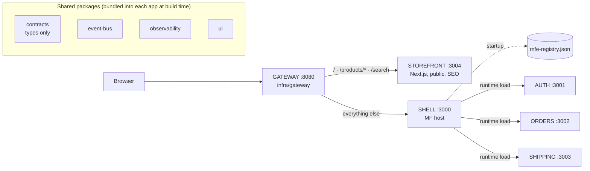
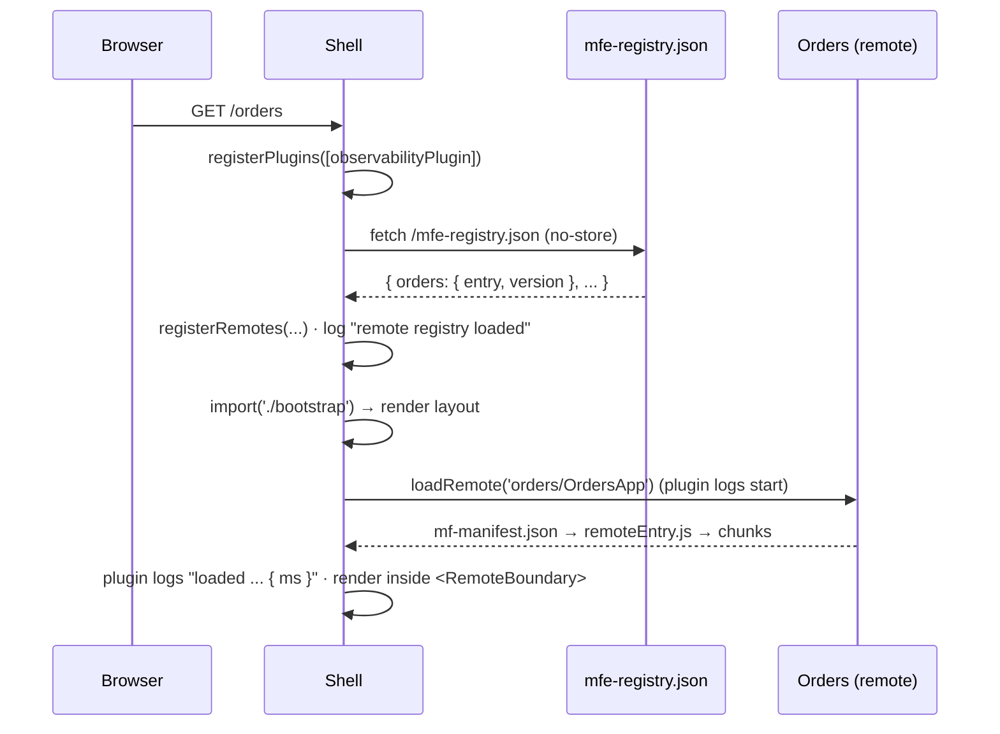
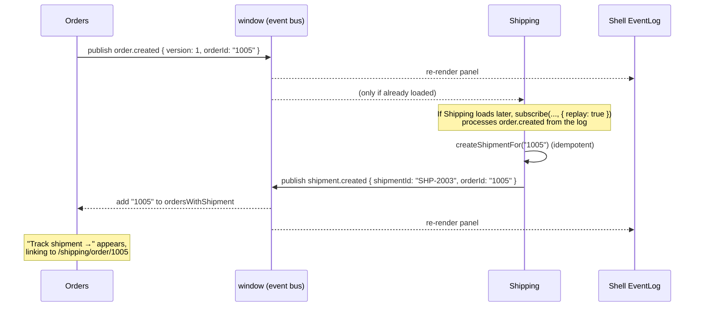
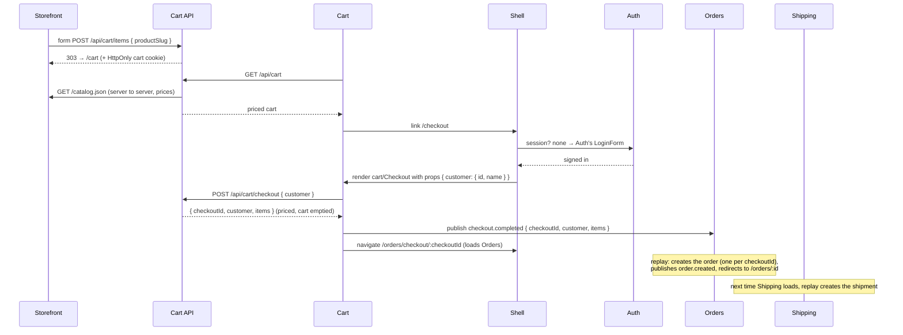

# micro-shop: developer overview

A reference for developers joining the project. It covers what each app does, what the
shared packages (`contracts`, `event-bus`, `observability`, `ui`) are for, how they work
together at runtime, and how to make common changes safely.

For the step-by-step explanation of *why* the system is built this way, read
[GUIDE.md](GUIDE.md). This page is the map; the guide is the tour.

---

## Contents

- [The system in one picture](#the-system-in-one-picture)
- [The apps](#the-apps)
- [The shared packages](#the-shared-packages)
  - [`@micro-shop/contracts`](#micro-shopcontracts)
  - [`@micro-shop/event-bus`](#micro-shopevent-bus)
  - [`@micro-shop/observability`](#micro-shopobservability)
  - [`@micro-shop/ui`](#micro-shopui)
  - [`@micro-shop/service-kit`](#micro-shopservice-kit)
- [How it all works together](#how-it-all-works-together)
- [Infrastructure](#infrastructure)
- [Tests](#tests)
- [Common tasks](#common-tasks)
- [Rules of the road](#rules-of-the-road)

---

## The system in one picture



- **Two zones** behind one gateway: the Next.js **storefront** for public pages, and the
  Module Federation **shell** for signed-in pages.
- The shell is a **host**. **Auth**, **Orders** and **Shipping** are **remotes**: separately
  built and deployed apps the shell loads in the browser at runtime.
- The shared packages are **not** shared at runtime through Module Federation. Each app
  bundles its own copy. The ones that need shared state (`event-bus`, `observability`) keep
  it on `window`, so all copies on the page see the same data.

---

## The apps

| App | Kind | Port | Owns | Exposes / serves |
| --- | --- | --- | --- | --- |
| [shell](../apps/shell/) | MF host | 3000 | Layout, top-level routing, session gate, error isolation, event log | Nothing (host only) |
| [auth](../apps/auth/) | MF remote | 3001 | Identity: who the user is, login, logout | `./session`, `./LoginForm`, `./UserMenu` |
| [orders](../apps/orders/) | MF remote | 3002 | Orders, everything under `/orders/*` | `./OrdersApp` |
| [shipping](../apps/shipping/) | MF remote | 3003 | Shipments and tracking, everything under `/shipping/*` | `./ShippingApp` |
| [cart](../apps/cart/) | MF remote | 3005 | The cart (`/cart/*`, guests too) and checkout (`/checkout`, signed in) | `./CartApp`, `./Checkout`, `./CartBadge` |
| [cart-api](../apps/cart-api/) | Fastify API | 4005 | Carts on the server, priced from the catalog | `/api/cart/*` via the gateway |
| [auth-api](../apps/auth-api/) | Fastify API | 4001 | Users (scrypt-hashed passwords) and sessions (HttpOnly cookie) | `/api/auth/*` via the gateway |
| [storefront](../apps/storefront/) | Next.js zone | 3004 | Public catalog: `/`, `/products/*`, `/search`, sitemap, robots | Server-rendered HTML |
| [gateway](../infra/gateway/) | Reverse proxy | 8080 | The single public origin | Routes to storefront or shell |

### Shell (`apps/shell`)

The page owner. It decides **which app renders which URL prefix**, but not what happens below
the prefix.

- **Startup** ([src/index.ts](../apps/shell/src/index.ts)): registers the observability runtime
  plugin, fetches `/mfe-registry.json` to learn where each remote lives, then crosses the
  async boundary into [bootstrap.tsx](../apps/shell/src/bootstrap.tsx). No remote URLs are
  compiled into the shell.
- **Routing** ([src/App.tsx](../apps/shell/src/App.tsx)): owns the one `<BrowserRouter>`.
  `orders/*` goes to Orders and `shipping/*` goes to Shipping, both wrapped in `RequireSession`.
- **Loading remotes** ([src/load-remote.ts](../apps/shell/src/load-remote.ts)): a typed wrapper
  around the federation runtime's `loadRemote`. A typo in a remote id is a compile error.
- **Failure isolation** ([src/remote.tsx](../apps/shell/src/remote.tsx)): `<Remote>` adds a
  loading skeleton, one error boundary per remote, and a Retry button. A remote that fails to
  load or crashes only blanks its own area.
- **Session gate**: the shell asks Auth whether a session exists
  ([src/use-session.ts](../apps/shell/src/use-session.ts)); if not, it renders Auth's
  `LoginForm`. If Auth itself is down, protected pages **fail closed**.
- **Event log** ([src/EventLog.tsx](../apps/shell/src/EventLog.tsx)): a dev panel in the
  bottom-right that shows every cross-app event on the page.

### Auth (`apps/auth`)

Owns identity. Its public surface is deliberately small:

- `auth/session`: a framework-agnostic read API: `ready()`, `getSession()`, `subscribe()`,
  `logout()`. Typed by `AuthSessionModule` from contracts. The shell waits for `ready()` (Auth's
  first answer from its API) before deciding "signed out", so a signed-in user never sees the
  sign-in form flash.
- `auth/LoginForm`: the **only** way to log in. No props; the host re-renders when the session
  appears.
- `auth/UserMenu`: an avatar with initials and a dropdown (name, email, My orders, Sign out) in
  the shell header, built from the shadcn `avatar` and `dropdown-menu` components.

Sign-in is real: [session-store.ts](../apps/auth/src/session-store.ts) calls the **Auth API**
(below) and remembers its answer; it never sees a password hash or the session token. Demo
accounts: `ada@example.com`, `grace@example.com`, `margaret@example.com`, password `demo`. On
login/logout it publishes `auth.user.logged-in` / `auth.user.logged-out`.

### Auth API (`apps/auth-api`)

The Auth team's backend on :4001, behind the gateway at `/api/auth/*`, built on
[`@micro-shop/service-kit`](#micro-shopservice-kit).

| Endpoint | Does |
| --- | --- |
| `GET /api/auth/session` | `{ session }` or `{ session: null }`. **Cross-team** (`SessionEndpoint` in contracts): other services forward the browser's Cookie header here to learn who a request comes from. |
| `POST /api/auth/login` | `{ email, password }` → sets the session cookie. 401 for a wrong password or an unknown email, alike. |
| `POST /api/auth/register` | `{ name, email, password }` → creates the user and signs them in (201, same body as login). 409 `email_taken` if the email has an account; 400 for a blank name, a malformed email or a password under 8 characters (`MIN_PASSWORD_LENGTH`). |
| `POST /api/auth/logout` | Deletes the session on the server and clears the cookies. |

- **Passwords** are stored as salted **scrypt** hashes (Node's built-in crypto), checked in
  constant time. An unknown email is checked against a dummy hash, so response times don't
  reveal which emails exist.
- **Sessions**: a random 256-bit token in the `micro-shop-session` cookie (`HttpOnly`,
  `SameSite=Lax`, `Path=/`, 8 hours). The database stores only its SHA-256, so a leaked
  `sessions` table can't be used to sign in. Logout deletes the row, so a copied cookie stops
  working at once.
- **Login CSRF**: login, register and logout accept JSON only, so another site's plain form
  can't sign a visitor in or out.
- **Sign-up**: new users get a random id (`u-<uuid>`). The unique index on `email` decides
  who wins when two sign-ups race for one address. The Auth form (`LoginForm`) switches
  between "Sign in" and "Create account" itself, so hosts render one remote for both.
- A second, non-HttpOnly cookie (`micro-shop-user`) holds only the display name, for the
  storefront's "Signed in as Ada".
- Tables in its own `auth` schema: `users`, `sessions`. `pnpm db:seed` creates the demo users.
- **Not done yet, on purpose:** email verification, password reset, rate limiting of login
  and sign-up attempts.

### Orders (`apps/orders`)

Owns orders. Routes (relative, under `/orders/*`): the list, and `/:orderId` for details.

- **Create test order** simulates checkout and publishes `order.created`.
- It keeps a small **read model** of Shipping's data: the set of order ids that have a
  shipment, filled only from `shipment.created` events. That's how the "Track shipment →"
  button knows when to appear, without Orders ever calling Shipping.
- Links to Shipping use the URL contract: `/shipping/order/:orderId`.

### Shipping (`apps/shipping`)

Owns shipments. Routes under `/shipping/*`: the list, `/:shipmentId` for the tracking
timeline, and `/order/:orderId`, which resolves an order id to its shipment and redirects.

- Subscribes to `order.created` (with **replay**) and creates one shipment per order, then
  publishes `shipment.created`.
- Stores only an `orderId` reference, never a copy of Orders' data.

### Cart (`apps/cart`)

Owns the shopping cart and checkout. It exposes three modules:

- `cart/CartApp`, mounted at `/cart/*` **without** a session gate, so guests can fill a cart.
  `/cart/add?product=<slug>` is kept as a link-shaped entry point for apps that can only link;
  it adds one item and then replaces itself with `/cart`.
- `cart/Checkout`, mounted at `/checkout` **behind** the shell's sign-in policy. It is the only
  remote that takes props: the shell passes the signed-in customer (`CheckoutProps`), because
  remotes never talk to Auth themselves.
- `cart/CartBadge`, the item count in the shell header.

How it works:

- The cart lives in the **Cart API** (below). [cart-store.ts](../apps/cart/src/cart-store.ts)
  is the page's one shared copy of it: it fetches `/api/cart`, sends changes, ignores answers
  that arrive after a newer one, and keeps the last confirmed cart (with an error message) when
  a change fails. The cart page, checkout and the header badge all read it, so the badge
  updates the moment you add something.
- **Place order** calls `POST /api/cart/checkout`: the server prices and empties the cart and
  returns the items. Cart then publishes `checkout.completed` with exactly that and navigates to
  `/orders/checkout/:checkoutId`. Cart never creates the order itself: that's Orders' job.
- Standalone (`pnpm dev:cart`, :3005) uses a demo customer and proxies `/api/cart` to the Cart
  API on :4005.

### Cart API (`apps/cart-api`)

The Cart team's backend on :4005, behind the gateway at `/api/cart/*`, so the browser calls it on
the page's own origin (no CORS, cookies just work). It's built on
[`@micro-shop/service-kit`](#micro-shopservice-kit), so it contains only cart code: routes,
rules and the cart store. Node runs its TypeScript directly, so there is no build step.

| Endpoint | Does |
| --- | --- |
| `GET /api/cart` | The cart, priced from the catalog. If the catalog is down it still answers, unpriced (`pricesAvailable: false`). |
| `POST /api/cart/items` | Adds a product. Accepts JSON, or a **plain HTML form** (the storefront's button), which gets `303 → /cart`. Unknown products are a 404. |
| `PUT /api/cart/items/:slug` | Sets a quantity (1–10; 0 removes). |
| `DELETE /api/cart/items/:slug` | Removes a product. |
| `POST /api/cart/checkout` | Prices the cart **on the server**, empties it, returns `{ checkoutId, customer, items }`. `409` if empty. |

- **Identity of the cart:** a random UUID in the `micro-shop-cart` cookie: `HttpOnly` (no page
  script can read it), `SameSite=Lax`, `Path=/api/cart` (sent to this API only).
- **Prices** come from the storefront's `/catalog.json`, fetched server to server and cached for
  30 s. The browser never sends a price.
- **Its types** are in [api-types.ts](../apps/cart-api/src/api-types.ts), shared with `apps/cart`
  only, because the same team owns both. Only the storefront's "Add to cart" form is cross-team,
  so only that is in contracts (`AddToCartEndpoint`, `AddToCartFields`).
- **Storage: Neon Postgres, through Drizzle.** Tables live in the service's own `cart` schema
  ([src/db/schema.ts](../apps/cart-api/src/db/schema.ts)): `carts` and `cart_lines`, with the
  API's limits enforced by the database too. Every change is atomic: adding to a line is one
  upsert, and checkout locks the cart, so two tabs or a double click can't lose an update or
  check out twice. Without `DATABASE_URL` the API falls back to an in-memory store (and says so).
- **Who checks out:** the Cart API asks the Auth API (`GET /api/auth/session`, forwarding the
  browser's cookies). Checkout takes no body: nothing the browser says about the customer or
  prices is trusted. Signed out → 401 `not_signed_in`; Auth down → 503 `auth_unavailable`.
- **Not done yet:** moving the Cart → Orders hand-off to the server (an `orders-api`).

#### Working with the database

Three apps own a schema each in the shared Neon database: **auth-api** (`auth`), **cart-api**
(`cart`) and the **storefront** (`catalog`). Each has the same scripts:

| Command (in the app, or from the root for all of them) | Does |
| --- | --- |
| `pnpm db:generate` | After editing the app's Drizzle schema: writes a new SQL migration to its `drizzle/`. Review it and commit it. |
| `pnpm db:migrate` | Applies pending migrations to `DATABASE_URL`. History: `<schema>.__drizzle_migrations`. |
| `pnpm db:seed` | Demo data: users (auth-api), 6 categories and 20 products (storefront). Safe to re-run. |
| `pnpm db:studio` | Drizzle Studio, a browser UI for the app's tables. |

Setup: copy each app's `.env.example` to `.env` (git-ignored) with a connection string from the
Neon console (project **mciro-shop**). **Develop against the `dev` branch, never
`production`**: a Neon branch is a full copy of the database, created in a second, so every
developer or feature can have their own. Then, from the root: `pnpm db:migrate && pnpm db:seed`,
and `pnpm dev`. Without a `DATABASE_URL`, every app still runs: carts and sessions in memory,
the catalog from its seed data. Tests for the Postgres stores run when `DATABASE_URL` is set
([cart-store.contract.test.ts](../apps/cart-api/src/cart-store.contract.test.ts)); they clean
up after themselves.

### Storefront (`apps/storefront`)

A Next.js app for pages that must work **without JavaScript** (search engines, link previews).
It is not a federation host or remote.

- **The catalog is in Postgres**, in the storefront's own `catalog` schema
  ([db/schema.ts](../apps/storefront/db/schema.ts): `categories`, `products` with prices in
  integer cents), read by Server Components through Drizzle
  ([lib/catalog.ts](../apps/storefront/lib/catalog.ts)). Without a database it serves its seed
  data ([lib/catalog-data.ts](../apps/storefront/lib/catalog-data.ts), 20 products), which is
  also what `pnpm db:seed` writes.
- `/`, `/categories/<slug>` and `/products/<slug>` are prerendered (ISR), with metadata, Open
  Graph, canonical URLs and JSON-LD, and regenerated in the background at most every 5 minutes,
  so a price change in the database shows up without a rebuild. Products and categories added
  later render on first request. `sitemap.xml` lists every category and product.
- Every product card has its own **Add to cart** button; product pages have a shadcn
  breadcrumb and "More in <category>".
- `/search?q=<words>` is **catalog search**. It renders on each request, because it reads
  `searchParams`. The search box in the header uses `next/form`: a GET form that still works
  without JavaScript. Results pages are `noindex, follow` and left out of the sitemap. The search
  logic is `searchProducts()` in [lib/catalog.ts](../apps/storefront/lib/catalog.ts): every word
  must appear in the name, category, summary or description.
- `/catalog.json` is the catalog's public **read API** (slug, name, price), typed by
  `CatalogResponse` in contracts and generated at build time. The Cart API uses it for prices.
- **Add to cart** is a plain HTML form that POSTs to the Cart API (`/api/cart/items`), so it
  needs no JavaScript; the API answers 303 → `/cart?added=<slug>`, and the cart page confirms
  with a toast.
- The only client-side code is [account-status.tsx](../apps/storefront/components/account-status.tsx),
  which reads Auth's display-name cookie.
- Links into `/orders` and `/shipping` are plain `<a href>`: they cross into the other zone, so
  they need a full page load.

### Standalone mode

Every remote has its own `index.html` and [bootstrap.tsx](../apps/orders/src/bootstrap.tsx), so
its team can run it alone (`pnpm dev:orders` → http://localhost:3002). The shell never runs
that code: it loads `remoteEntry.js` / `mf-manifest.json` and only the exposed modules.

---

## The shared packages

They all live in [packages/](../packages/) and are consumed as TypeScript source through
workspace dependencies. They are **build-time** dependencies: each app bundles (or, for a
service, imports) its own copy.

| Package | Runtime code? | Shared state | Used by |
| --- | --- | --- | --- |
| `contracts` | No, types only | none | every app |
| `event-bus` | Yes | `window.__microShopEventLog__` | auth, orders, shipping, cart (publish/subscribe), shell (log panel) |
| `observability` | Yes | `window.__microShopLogSinks__` | shell, auth, orders, shipping, cart |
| `ui` | Yes (React components, CSS) | none | every app, including the storefront |
| `service-kit` | Yes (Node) | none | every backend service (`apps/*-api`) |

**The rule for all of them:** share *how* things are done, never *what* a team does. Logging,
UI components, a server setup: shared. Orders' rules, the cart's pricing, anything a team
changes for its own feature: in that team's app, so it ships without touching anyone else.

### `@micro-shop/contracts`

**What it is:** the public API between apps, written as TypeScript types. It has no runtime
code and no business logic. Source: [packages/contracts/src/](../packages/contracts/src/).

**Why it exists:** apps are built and deployed separately, so nothing checks at runtime that
the shell and Auth agree on what `getSession()` returns. Putting the shape in one shared file
means both producer and consumer compile against it. A breaking change fails the **build** of
every affected app, instead of failing in a user's browser.

It defines five contracts: the three below, plus the catalog read API
([catalog.ts](../packages/contracts/src/catalog.ts): `CatalogResponse`, served at `/catalog.json`)
and the props the shell passes to Cart's checkout
([cart.ts](../packages/contracts/src/cart.ts): `CheckoutProps = { customer: { id, name } }`).

#### 1. Auth API ([auth.ts](../packages/contracts/src/auth.ts))

```ts
type User = { id: string; name: string; email: string };
type Session = { user: User; expiresAt: string };   // never contains the token

type AuthSessionModule = {
  getSession(): Session | null;
  subscribe(listener: () => void): () => void;
  logout(): void;
};
```

- **Producer:** Auth types its exports with it in [session.ts](../apps/auth/src/session.ts).
- **Consumer:** the shell's [remotes.d.ts](../apps/shell/src/remotes.d.ts) declares the
  `auth/session` module from the same type.

#### 2. URLs ([routes.ts](../packages/contracts/src/routes.ts))

```ts
type AppPath =
  | '/' | `/products/${string}`
  | '/search' | `/search?q=${string}`
  | '/orders' | `/orders/${string}`          // incl. /orders/checkout/:checkoutId
  | '/shipping' | `/shipping/${string}`
  | `/shipping/order/${string}`
  | '/cart' | `/cart/add?product=${string}`
  | '/checkout';
```

URLs are treated as public API: other apps link to them, users bookmark them, search engines
index them. Any cross-app link is typed as `AppPath`:

```ts
const trackingUrl: AppPath = `/shipping/order/${order.id}`;
```

A typo like `/shipment/1002` doesn't compile.

#### 3. Events ([events.ts](../packages/contracts/src/events.ts))

```ts
type AppName = 'shell' | 'auth' | 'orders' | 'shipping' | 'cart';

type MicroShopEvents = {
  'auth.user.logged-in':  { version: 1; userId: string };
  'auth.user.logged-out': { version: 1; userId: string };
  'checkout.completed':   { version: 1; checkoutId: string; customer: Customer;
                            items: readonly CheckoutItem[] };  // slug, name, quantity, unitPrice
  'order.created':        { version: 1; orderId: string };
  'shipment.created':     { version: 1; shipmentId: string; orderId: string };
};

type EventEnvelope<T> = {
  id: string;          // unique, for de-duplication
  type: T;
  source: AppName;     // who published it
  occurredAt: string;  // ISO 8601
  payload: MicroShopEvents[T];
};
```

The rules the event types enforce:

- **Events are facts, in the past tense** (`order.created`), not commands (`create shipment`).
  The publisher doesn't know who listens.
- **Payloads are thin:** ids and a few fields, never a whole domain object. Shipping gets an
  `orderId`, not Orders' `Order` type. The one deliberate exception is `checkout.completed`: its
  items *are* the fact (what was bought, at what price, at that moment), and prices change
  later, so a reference to the cart would not be enough.
- **Every payload has a `version`.** Publisher and consumer deploy independently, so a consumer
  may receive a version it doesn't know yet.

#### Type tests

[contracts.type-test.ts](../packages/contracts/src/contracts.type-test.ts) holds compile-time
tests. Lines marked `// @ts-expect-error` must fail to compile, for example an unknown URL, a
payload without `version`, or a "fat" payload with extra fields. `pnpm typecheck` fails if any of
these rules stops holding, so a contract change shows up in review.

### `@micro-shop/event-bus`

**What it is:** typed publish/subscribe between micro-frontends, built on browser
`CustomEvent`s. Source: [packages/event-bus/src/index.ts](../packages/event-bus/src/index.ts).

**Why it works without Module Federation `shared`:** every app bundles its own copy of the
package, but all copies dispatch and listen on the same `window`. The browser is the shared
runtime. There is no singleton library and no global store.

#### API

```ts
import { createPublisher, subscribe, subscribeAll, getEventLog } from '@micro-shop/event-bus';

// Publishing: create once per app, stamped with the app's name.
const publish = createPublisher('orders');
publish('order.created', { version: 1, orderId: '1005' });   // payload type-checked

// Subscribing to one type. Returns an unsubscribe function.
const stop = subscribe('order.created', (event) => {
  event.payload.orderId;   // typed as string
}, { replay: true });

// Subscribing to everything (logging, dev tools).
subscribeAll((event) => console.log(event.type));

// Reading everything published so far, oldest first.
getEventLog();
```

#### How it works

1. `publish(type, payload)` wraps the payload in an `EventEnvelope`, adding a
   `crypto.randomUUID()` id, the source app and a timestamp.
2. It appends the envelope to `window.__microShopEventLog__`, which keeps the last **200**
   events.
3. It dispatches a `CustomEvent('micro-shop:event', { detail: envelope })` on `window`.
4. Every subscriber's listener receives it. The listener checks that `detail` looks like an
   envelope before calling your handler, because any script on the page can dispatch that DOM
   event, so input is treated as untrusted. `subscribe` then filters by `type`.

#### Replay, and why handlers must be idempotent

Delivery is fire-and-forget. An app that hasn't been loaded yet has no listener, so it misses
the event. Example: you create an order on `/orders` before ever opening `/shipping`.

`{ replay: true }` fixes this by first calling the handler for every matching event already in
the log, then listening for new ones. Both Orders and Shipping subscribe this way when their
modules first load.

Replay can deliver the same fact more than once (and so can React StrictMode or hot reload), so
**every handler must be idempotent**. Shipping checks "does this order already have a
shipment?" before creating one; Orders checks "is this order id already in my set?".

#### Handling versions

Consumers check the payload version and ignore versions they don't understand, logging a
warning:

```ts
subscribe('order.created', (event) => {
  if (event.payload.version !== 1) {
    log.warn('ignoring unknown order.created version', { payload: event.payload });
    return;
  }
  createShipmentFor(event.payload.orderId);
}, { replay: true });
```

#### Limits (by design)

- It only reaches code running **in this tab right now**. The 200-event log is in memory and
  is lost on reload.
- In production, a workflow like "order placed → create shipment" belongs on the **backend**
  (order service → message queue → shipping service). Here the browser bus stands in for it.
  In a real system, use browser events for UI reactions, such as refreshing a badge or clearing
  a per-user cache on logout.
- The envelope check is structural. It doesn't verify that `type` is a known event or that
  the payload matches, which is another reason consumers check `version`.

### `@micro-shop/observability`

**What it is:** a small logger that tags every entry with the app that produced it, plus
pluggable **sinks** where production monitoring plugs in. Source:
[packages/observability/src/index.ts](../packages/observability/src/index.ts).

**Why it exists:** when four teams' code runs on one page, "TypeError in main.js" is useless.
`[orders] failed to render order 1005` goes straight to the team that owns it.

#### API

```ts
import { createLogger, addLogSink, errorData } from '@micro-shop/observability';

const log = createLogger('orders');           // AppName from contracts
log.info('order created', { orderId: '1005' });
// console: [orders] order created { orderId: '1005' }

try { risky(); } catch (error) {
  log.error('render failed', errorData(error));  // { error: message, name }
}

// Send every entry on the page somewhere else. Returns a remover.
const remove = addLogSink((entry) => {
  // entry: { app, level: 'info'|'warn'|'error', message, data?, at }
});
```

#### How it works

- Each call writes to the console as `[app] message` and then passes a structured `LogEntry` to
  every sink.
- Sinks live on `window.__microShopLogSinks__`, so a sink registered once (by the shell, say)
  receives entries from every app's copy of the logger.
- Each sink call is wrapped in `try/catch`: **a broken sink can never break the app that is
  logging.**
- `errorData(error)` turns any thrown value into loggable data.

#### What gets logged today

| Where | What |
| --- | --- |
| [shell/src/mf-observability.ts](../apps/shell/src/mf-observability.ts) | A **Module Federation runtime plugin**. It logs every remote module load with its duration in ms (`beforeRequest` / `onLoad`) and every load failure (`errorLoadRemote`), without changing the code that calls `loadRemote()`. |
| [shell/src/registry.ts](../apps/shell/src/registry.ts) | Which remote versions were registered at startup, or that the registry was unreachable. |
| [shell/src/remote.tsx](../apps/shell/src/remote.tsx) | `RemoteBoundary.componentDidCatch`: a remote crashed and its fallback is showing, tagged with the **remote's** name and the component stack. |
| auth, orders, shipping stores | Business facts: logged in/out, order created, shipment created, unknown event version ignored. |

#### Connecting real monitoring

**No sink is registered yet.** Everything currently goes only to the browser console. To ship
logs to Sentry, OpenTelemetry or a log endpoint, register a sink once in the shell before
remotes load, for example in [shell/src/index.ts](../apps/shell/src/index.ts):

```ts
addLogSink((entry) => {
  if (entry.level === 'error') {
    Sentry.captureMessage(entry.message, { level: 'error', tags: { app: entry.app }, extra: entry.data });
  }
});
```

Tagging by `entry.app` is what lets you route alerts to the right team and ask questions like
"p95 load time of `orders/OrdersApp`" or "failure rate of shipping since release 0.2.0".

### `@micro-shop/ui`

The design system: shadcn/ui components (Button, Card, Table, Alert, Badge, Input, Label,
Skeleton) plus Tailwind v4 theme tokens. It is **presentational only**, with no stores, API
clients or domain logic. Which colour means "shipped" is decided in Orders, not here.

It also contains `MfeFrame` / `MfeLabel`, a learning aid that draws a labelled dashed border
around each app's area so you can see which app rendered what.

Import paths: `@micro-shop/ui/components/<name>`, `@micro-shop/ui/lib/utils`,
`@micro-shop/ui/styles/*`. Add components with `cd packages/ui && pnpm dlx shadcn@latest add <name>`.
See [shared-packages.md](shared-packages.md) for how Tailwind and tokens are split between the
shell and remotes.

### `@micro-shop/service-kit`

**What it is:** the platform every backend service is built on, so that the second, third and
tenth API don't each re-write the same Fastify setup. Source:
[packages/service-kit/src/](../packages/service-kit/src/). It owns the one Fastify dependency,
so the whole backend upgrades Fastify in one place.

| Export | Gives every service |
| --- | --- |
| `createService({ name })` | A configured Fastify: JSON logs tagged with the service name (and no per-request noise), `GET /health`, one error shape `{ error, message }` (400 invalid input, 404 unknown route, 500 with details logged but never sent), and HTML form posts parsed like JSON |
| `startService(app, { port })`, `portFromEnv()` | Listen (127.0.0.1, or `HOST`), and close cleanly on Ctrl+C / SIGTERM |
| `sendError(reply, status, code, message)`, `ErrorBody<Code>` | The error shape, with each service's own codes |
| `readCookie()`, `serializeCookie()` | Cookies with safe defaults: `HttpOnly`, `SameSite=Lax`, `Secure` when `COOKIE_SECURE=true` |
| `fetchJson(url, { timeoutMs })`, `UpstreamUnavailableError` | Calls to other services with a timeout; every failure becomes one error type to degrade on |
| `isFormPost(request)` | Tells a plain HTML form apart from a `fetch` (answer with a redirect vs JSON) |
| `runMigrations({ schema, folder })` | `pnpm db:migrate` for any service: applies its Drizzle migrations, keeping the history in its own schema |
| `createDatabasePool(url)`, `databaseHealthCheck(pool)` | A Postgres pool tuned for Neon (small, patient with a waking compute, survives dropped idle connections), and a `/health` check for it. Each service still owns its tables through its own Drizzle schema and migrations |
| `waitForDatabase(pool, { onRetry })`, `logRetry(label)` | Retries `select 1` with backoff (4 attempts) until the database answers. A suspended Neon compute sometimes drops the first connection; `runMigrations` and the seed scripts call this first, so a cold start doesn't fail them |
| Fastify types | `FastifyInstance`, `FastifyRequest`, `FastifyReply`, re-exported |

**What it must never contain:** routes, domain types, a list of services, or anything one team
would need to change for its own feature. `cart-api`'s cart store, pricing and endpoints stay in
`apps/cart-api`. If a change to the kit is needed for one team's feature, it probably belongs in
that team's service instead.

Services share one TypeScript setup too: [tsconfig.service.json](../tsconfig.service.json) at
the root (Node runs the `.ts` files directly, so imports name the real `.ts` file).

---

## How it all works together

### Shell startup



If the registry is unreachable, the shell still renders; each remote area shows its fallback.

### Signing in

1. The user opens `/orders`. `RequireSession` loads `auth/session` and finds no session.
2. The shell renders `auth/LoginForm` in place of Orders.
3. The form calls Auth's private `login()`. Auth stores the session, sets the display-name
   cookie, notifies its `subscribe` listeners, logs `[auth] user logged in`, and publishes
   `auth.user.logged-in`.
4. The shell's `useSession` hook re-renders, the gate opens, and Orders loads.

### Creating an order (cross-app events)



Orders and Shipping never import each other. They share only the event **types** (contracts)
and the **transport** (`window`).

### Buying: from a product page to a shipment



Four apps and an API take part, and none imports another. The hand-offs are a form POST
(storefront → Cart API), a typed prop (shell → checkout), an event (cart → orders → shipping)
and a read API (Cart API → catalog).

### When something breaks

| Failure | What the user sees | What is logged |
| --- | --- | --- |
| A remote's server is down | That area shows "X is temporarily unavailable" + Retry; the rest works | `[shell] failed to load remote module ...` + `[shell] remote "x" failed; showing fallback` |
| A remote throws while rendering (`?break=orders`) | Same fallback, only in that area | `[shell] remote "orders" failed; showing fallback` with component stack |
| Auth is down on a protected page | Protected page is **not** rendered (fail closed) | same as above, for `auth` |
| Registry missing | Shell renders; every remote shows its fallback | `[shell] remote registry unavailable` |
| The catalog is down | The Cart API serves the cart unpriced; Cart shows "prices unavailable" + Retry; checkout waits | cart-api: `catalog unavailable; serving the cart unpriced` |
| The Cart API is down | The cart page shows "can't be loaded" + Retry; the rest of the page works | `[cart] cart request failed: GET /api/cart` |

Try these yourself with the links on the shell's home page (`http://localhost:3000/`).

---

## Infrastructure

Everything in [infra/](../infra/) is plain Node with no dependencies, standing in for
production infrastructure:

| Path | Role |
| --- | --- |
| [gateway/server.mjs](../infra/gateway/server.mjs) | Reverse proxy on :8080. Sends `/`, `/products/*`, `/search`, `/catalog.json`, `/_next/*`, `sitemap.xml` and `robots.txt` to the storefront, `/api/cart/*` to the Cart API, and everything else to the shell. Runs with `node --watch` in dev, so route changes apply on save. Forwards WebSockets for hot reload. In prod mode, `/mfe-registry.json` goes to the CDN. |
| [static/serve.mjs](../infra/static/serve.mjs) | Static server used as the CDN (`--cors`) and as the shell host (`--spa`). `mf-manifest.json`, `mfe-registry.json` and HTML get `no-cache`; everything else is cached as immutable. |
| [deploy/release.mjs](../infra/deploy/release.mjs) | Mock release pipeline. **Upload** copies `apps/<app>/dist` to `infra/cdn/public/<app>/<version>/` (never overwritten), then **promote** updates `mfe-registry.json`. Rollback only re-points the registry. |
| [cdn/public/](../infra/cdn/public/) | The mock CDN's contents, generated by `release.mjs`. Don't edit by hand. |
| [prod/start.mjs](../infra/prod/start.mjs) | Runs the production setup from built artifacts: CDN :8081, shell :3000, storefront :3004, gateway :8080. |

In **dev**, the registry is [apps/shell/public/mfe-registry.json](../apps/shell/public/mfe-registry.json),
which points at the dev servers (localhost:3001–3003). In **prod mode**, it's the one written by
`release.mjs`. Releasing or rolling back a remote never rebuilds the shell.

See [production-architecture.md](production-architecture.md) for CDN, caching, CSP/CORS/SRI and
monitoring in a real deployment.

---

## Tests

| Command | What runs |
| --- | --- |
| `pnpm test` | Vitest unit tests (happy-dom). Each file gets fresh module state and a fresh `window`. |
| `pnpm typecheck` | TypeScript across every workspace, **including the contract type-tests**. |
| `pnpm test:e2e` | Playwright against the full composed app (starts everything itself). |

What the unit tests cover:

- **event-bus**: delivery by type, envelope stamping, replay to late subscribers,
  unsubscribe, rejecting invalid DOM events.
- **observability**: `[app]` console prefix, structured entries to sinks, broken sinks don't
  break the caller.
- **orders store**: creating an order publishes `order.created`; the shipment read model is
  filled only from events; snapshot identity is stable.
- **shipping store**: reacts to `order.created`, is idempotent, never reuses ids, and catches up
  via replay ([shipping-store.replay.test.ts](../apps/shipping/src/shipping-store.replay.test.ts)).
- **cart API** ([app.test.ts](../apps/cart-api/src/app.test.ts), in-process with
  `app.inject()`): cookie-keyed carts, the HTML form's 303, validation, merge/cap/update/remove,
  server-side prices at checkout, customer fields stripped, degrading when the catalog is down.
- **cart client**: one shared load, changes sent as API calls, a slow older answer never
  overwrites a newer one, the last confirmed cart is kept when a change fails; checkout
  announces exactly what the server priced, and nothing when the server refuses.
- **orders from checkout**: loaded late, Orders replays `checkout.completed` and creates exactly
  one order per checkout
  ([orders-store.checkout.test.ts](../apps/orders/src/orders-store.checkout.test.ts)).
- **catalog search**: matching rules and query normalization.

E2E specs in [tests/e2e/specs/](../tests/e2e/specs/): `journey` (sign in → orders → shipping),
`events` (cross-app events and replay), `failure` (isolation and retry), `seo` (storefront HTML),
`search` (catalog search from both headers, results HTML, noindex), `cart` (catalog API, guest
cart, checkout → order → shipment, a crashing Cart contained).

---

## Common tasks

### Run things

```bash
pnpm install
pnpm dev                 # everything; open http://localhost:8080 (ada@example.com / demo)
pnpm dev:orders          # one app standalone on its own port
pnpm build && pnpm release all && pnpm start:prod   # production simulation
pnpm release status      # live vs uploaded versions
pnpm release rollback orders 0.1.0
```

### Add a new event

1. Add it to `MicroShopEvents` in [events.ts](../packages/contracts/src/events.ts): a
   past-tense name, a thin payload, `version: 1`.
2. Optionally add a type-test line in
   [contracts.type-test.ts](../packages/contracts/src/contracts.type-test.ts).
3. Publisher: `createPublisher('<app>')` then `publish('your.event', { version: 1, ... })`.
4. Consumer: `subscribe('your.event', handler, { replay: true })`. Check `payload.version`, and
   make the handler idempotent.
5. Add a unit test next to the store that publishes or consumes it.

### Change an existing event (breaking)

Don't change `version: 1` in place: consumers already deployed would receive a shape they
can't read. Add the new shape as a union (`{ version: 1; ... } | { version: 2; ... }`), update
consumers to handle both, deploy them, and only then switch the publisher to version 2.

### Add or change a public URL

Update `AppPath` in [routes.ts](../packages/contracts/src/routes.ts). Removing or renaming a
path is a breaking change for every app, bookmark and search result that links to it. Keep the
old path working (for example with a redirect route) until nothing uses it.

### Expose something new from a remote

1. Add it to `exposes` in the remote's `module-federation.config.mjs`.
2. If other apps need to agree on its shape, add a type to `contracts`.
3. Declare the module in the shell's [remotes.d.ts](../apps/shell/src/remotes.d.ts) and add it
   to `RemoteModules` in [load-remote.ts](../apps/shell/src/load-remote.ts).
4. Render it through `<Remote name="..." load={...} />` with a **module-level** loader function,
   so it gets loading, isolation and retry.

### Add logging to your app

```ts
const log = createLogger('shipping');   // once per module
log.info('shipment created', { shipmentId, orderId });
log.error('carrier lookup failed', errorData(error));
```

Log facts with ids in `data`, not personal data. Messages go to monitoring once a sink is
connected.

### Add a new remote app

Copy the structure of `apps/shipping`: MF config with `name`, `exposes`, `manifest: true` and the
shared singletons (`react`, `react-dom`, `react-router`); an `index.ts` async boundary; a
standalone `bootstrap.tsx`. Then add it to the `AppName` union in contracts, to both
registries (dev `apps/shell/public/mfe-registry.json` and `REMOTES` in `release.mjs`), to
`remotes.d.ts` / `load-remote.ts`, and a route in the shell's `App.tsx`.

### Add a new backend service (e.g. `orders-api`)

A new service is only its own code, on top of the kit:

1. `apps/orders-api/package.json`: copy `apps/cart-api`'s (the `dev`/`start` scripts run
   TypeScript directly), depend on `@micro-shop/service-kit`, **not** on `fastify`.
2. `tsconfig.json`: `{ "extends": "../../tsconfig.service.json", "include": ["src"] }`.
3. `src/app.ts`: `const app = createService({ name: 'orders-api' })`, then the team's routes under
   `/api/orders/...`. Answer errors with `sendError`. Export it as `buildApp()` so tests can
   `app.inject()` without a port.
4. `src/server.ts`: `await startService(buildApp(...), { port: portFromEnv('ORDERS_API_PORT', 4002) })`.
   If it stores data: a Drizzle schema in its own Postgres schema (`pgSchema('orders')`), a
   `drizzle.config.ts` with `schemaFilter: ['orders']` and its migration history in that schema,
   `createDatabasePool` from the kit, and the `db:*` scripts. Copy them from `apps/cart-api`.
5. Route `/api/orders/*` to it in [infra/gateway/server.mjs](../infra/gateway/server.mjs) and add
   it to [infra/prod/start.mjs](../infra/prod/start.mjs); add `dev:orders-api` to the root scripts.
6. Request/response types go in the service's own `src/api-types.ts` if only its own frontend
   uses them, in `@micro-shop/contracts` if another team calls it.

---

## Rules of the road

1. **Only `exposes` is public.** Everything else in a remote's `src/` is private. Never import
   another app's files.
2. **Reference other domains by id.** Shipping stores `orderId`, not an `Order`. To show order
   details, link to `/orders/:id`.
3. **Communicate through contracts:** a typed module API, a typed URL, or a typed event. No
   shared stores.
4. **Events are past-tense facts with thin, versioned payloads.** Handlers are idempotent and
   subscribe with `replay: true` if they may load late.
5. **Shared packages hold no business logic.** `contracts` is types only; `ui` is
   presentational only.
6. **Nothing touching React runs before the async boundary** (`import('./bootstrap')`).
7. **Tag every log with your app** (`createLogger('<app>')`) so failures reach the right team.
8. **Cross-zone links are plain `<a href>`**, storefront ↔ shell, because they need a full
   page load.

---

## Further reading

| Document | For |
| --- | --- |
| [GUIDE.md](GUIDE.md) | The full chapter-by-chapter guide (events are Chapter 6, failure isolation Chapter 7, production Chapter 9) |
| [module-federation.md](module-federation.md) | MF configuration, the network sequence, the async boundary |
| [architecture.md](architecture.md) | Ownership, the Auth boundary, remote code and origins |
| [shared-packages.md](shared-packages.md) | Build-time vs runtime sharing, contracts, Tailwind across apps |
| [production-architecture.md](production-architecture.md) | CDN, caching, versioning, rollback, security, monitoring |
