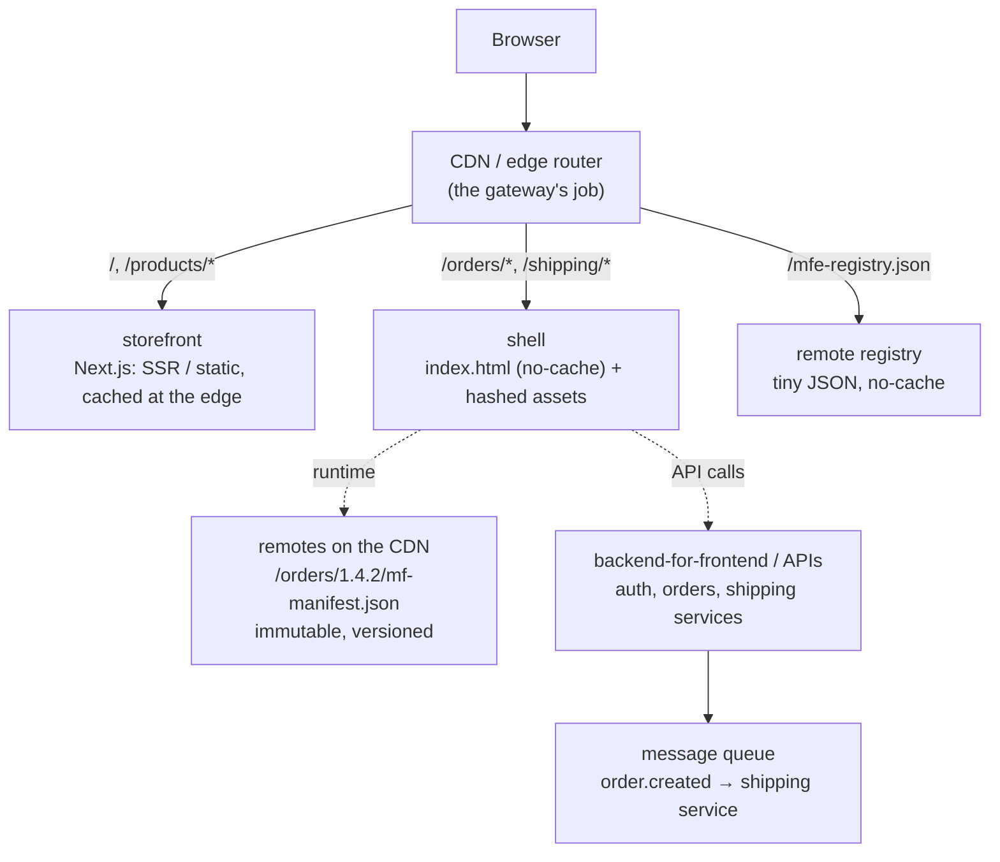

# Production architecture

How the ideas in this repository map to a real production system, and what this learning
project deliberately leaves out. Read [GUIDE.md](GUIDE.md) first; this document assumes its
vocabulary.

---

## 1. The target picture



| Concern | In this repo | In production |
| --- | --- | --- |
| Routing between zones | `infra/gateway/server.mjs` | CDN / edge rules (CloudFront, Cloudflare, Fastly, Vercel Microfrontends) |
| Remote hosting | `infra/static/serve.mjs` on :8081 | Object storage + CDN (S3/GCS + CloudFront/Cloudflare) |
| Which version is live | `infra/cdn/public/mfe-registry.json` | A registry service or a config file behind the CDN, with audit log and approvals |
| Release / rollback | `pnpm release …` | CI/CD pipeline per team |
| Cross-domain workflows | Browser event bus (`order.created`) | Backend messaging (queue / event stream) |
| Identity | Mock login, display-name cookie | Identity provider + auth backend, `HttpOnly` session cookie |
| Observability | `@micro-shop/observability` → console | Same API, sinks to Sentry / OpenTelemetry / log pipeline |

---

## 2. CDN hosting and caching

Every remote build is uploaded to a **versioned, immutable path**:

```text
https://cdn.example.com/orders/1.4.2/mf-manifest.json
https://cdn.example.com/orders/1.4.2/remoteEntry.js
https://cdn.example.com/orders/1.4.2/959.js
```

| File | Cache-Control | Why |
| --- | --- | --- |
| Versioned remote files (`/orders/1.4.2/*.js`, `*.css`) | `public, max-age=31536000, immutable` | A file at a versioned path never changes, so caching forever is safe |
| `mf-manifest.json` | `no-cache` (or a short max-age) | Small; revalidated so fixes to the manifest itself are picked up |
| `mfe-registry.json` | `no-cache` | This file *is* the deployment. It must never be stale |
| Shell `index.html` | `no-cache` | Points at the shell's hashed assets |
| Shell assets | content-hashed filenames + `immutable` | Standard SPA caching |

**Cache invalidation is avoided by design.** Nothing is overwritten, so nothing needs purging.
A release publishes new files and changes one pointer.

> This repo's builds use numeric chunk names (`959.js`) without content hashes. That's fine
> here because every file lives under a versioned folder. If you deploy *without* versioned
> folders, you need `[contenthash]` in `output.filename` and `output.chunkFilename`.

---

## 3. Versioning, release and rollback

```text
build → upload to /orders/<version>/ → smoke test → promote (registry) → monitor → (rollback)
```

- **Upload** and **promote** are separate steps. Uploading never affects users.
- **Promote** = change the registry entry. It can be gradual: a percentage of users, internal
  users first, one region first (canary). The registry can return different entries per
  cohort.
- **Rollback** = point the registry back at a version that is still on the CDN. No rebuild,
  no new artifact, seconds to take effect. We measured 282 ms locally, most of it pnpm
  start-up.
- **Keep old versions** on the CDN for as long as you might roll back to them.
- **The shell is never rebuilt** to release a remote. That's the test of independent
  deployment: if releasing Orders requires a shell build, you have a distributed monolith.

### Compatibility between independently deployed apps

Independent deployment means **any live version of the shell must work with any live
version of each remote**, in both directions, at least across one release.

| Contract | How it breaks | How to evolve it safely |
| --- | --- | --- |
| Exposed modules (`./OrdersApp`) | Renamed or removed expose → the shell's load fails | Add the new expose, keep the old one until every consumer moved (expand → migrate → contract) |
| Component props | A new *required* prop → old shells don't pass it | New props optional with defaults |
| Events (`order.created` v1) | Changed payload → consumers mis-read it | Additive changes within a version; a breaking change is v2, published *alongside* v1 until all consumers handle v2 |
| URLs (`/orders/:id`) | Renamed → bookmarks, links and SEO break | Keep the old URL as a redirect, forever if it was ever public |
| Shared singletons (React, React Router) | A remote built against an incompatible major | Coordinated upgrades; `requiredVersion` + monitoring of version-mismatch warnings; `strictVersion` for hard failures |

`@micro-shop/contracts` catches breaking changes **at build time inside this monorepo**. It
cannot catch a mismatch between two *deployed* versions. That needs version fields in the
payloads (which we have), consumer-driven contract tests in CI, and monitoring.

---

## 4. Observability

Every log line, error and metric must carry **which micro-frontend** and **which version**
produced it. Otherwise the on-call engineer can't route the problem to the right team.

What this repo already does:

- `createLogger('orders')` tags every entry with the app.
- A Module Federation **runtime plugin** (`apps/shell/src/mf-observability.ts`) times every
  remote load and reports every load failure.
- The error boundary logs which remote failed and shows a fallback.

What production adds, using the same `addLogSink` hook:

- **Error tracking** (Sentry or similar): tag events with `app`, `version` (from the registry),
  and route. Upload source maps per remote version.
- **Tracing** (OpenTelemetry): a span per remote load; trace IDs passed to backend calls.
- **Dashboards per remote**: load time p50/p95, load failure rate, fallback render rate,
  JavaScript error rate, each broken down **by version**.
- **Release health**: compare the new version's error rate with the previous version's for
  the first minutes after a promote; roll back automatically on regression.

---

## 5. Security

### Loading remote JavaScript is a security boundary

When the shell loads `https://cdn.example.com/orders/1.4.2/remoteEntry.js`, that code runs
**with the shell's full privileges**: same origin, same DOM, same cookies (if not
`HttpOnly`), same `localStorage`. A compromised remote, CDN bucket or registry entry is a
compromised application.

> **Micro-frontends on one page do not provide security isolation.** They are an
> organisational boundary, not a sandbox.

Mitigations:

| Risk | Mitigation |
| --- | --- |
| Registry points at an attacker's URL | Registry changes only via CI with approvals; the shell validates entries against an allow-list of origins before `registerRemotes` |
| Script injection from an unexpected origin | **CSP** `script-src 'self' https://cdn.example.com` (no `unsafe-inline`, no wildcards) |
| Tampered file on the CDN | Immutable, versioned uploads; restricted write access; **SRI** hashes where the loader supports it (the MF manifest can carry integrity hashes; `rspack.SubresourceIntegrityPlugin` for the shell's own assets) |
| Compromised npm dependency | Lockfiles, pnpm's supply-chain checks, dependency review, minimal shared dependencies |
| Token theft via XSS in *any* remote | Keep tokens out of JavaScript: `HttpOnly`, `Secure`, `SameSite` session cookies set by an auth backend |
| One team's XSS reaching another team's data | Output encoding, CSP, and **server-side authorization on every API call**. The UI boundary protects nothing |

### CORS

The shell `fetch()`es each remote's `mf-manifest.json` cross-origin, so the CDN must send
`Access-Control-Allow-Origin`. In production, allow-list the shell's origins instead of `*`.
Scripts loaded with `<script>` are not subject to CORS, but you want `crossorigin="anonymous"`
for readable error stacks.

### Authentication and authorization

- **Authentication** (who are you?) belongs to an identity provider and an auth backend. The
  Auth micro-frontend owns the *UI* of it and exposes identity, never credentials.
- **Authorization** (may you see order 1005?) must be enforced by the **backend** on every
  request. The shell's "this page needs sign-in" is a UX policy, not security.
- The shell **fails closed**: if Auth can't be reached, protected remotes are not rendered.

### iframe isolation vs. JavaScript integration

| | Module Federation (this repo) | iframes |
| --- | --- | --- |
| Security isolation | None: same origin | Strong with a separate origin + `sandbox` |
| Shared React, routing, styles | Yes | No; each frame is its own document |
| UX (scrolling, focus, modals, performance) | Native | Awkward |
| Use for | Your own teams' code | Untrusted or third-party code (payment widgets, partner content) |

---

## 6. Dependency sharing policy

- Share at runtime **only** what must be a singleton: `react`, `react-dom`, `react-router`.
- Everything else is bundled per app, including the design system (`@micro-shop/ui`), so
  teams upgrade on their own schedule.
- Upgrading a shared singleton's **major** version is a coordinated, cross-team project. Plan
  it like a platform migration.
- Watch bundle size per remote; duplicated libraries are the price of independence. Pay it
  knowingly.

---

## 7. Deployment ownership

| Artifact | Owner | Pipeline |
| --- | --- | --- |
| Shell | Platform team | Builds and deploys the shell; owns the gateway and CDN rules |
| Registry | Platform team (process), product teams (their entries) | Changes via CI, with approvals and an audit log |
| Each remote | Its product team | Build → upload → canary → promote → monitor → rollback |
| Storefront | Catalog team | Next.js deployment |
| `@micro-shop/ui`, contracts | Design-system / platform team | Versioned packages; consumers upgrade independently |

Each team can deploy **at any time without asking another team**, as long as it keeps its
contracts compatible. That's the organisational goal the whole architecture serves.

---

## 8. What this project deliberately does not do

- No real backend, database, identity provider or message queue.
- No CI/CD pipeline; `pnpm release` stands in for one.
- No canary routing in the registry (one live version per remote).
- No production-grade CSP/SRI configuration.
- No SSR for the Module Federation zone (the storefront covers the SEO use case).
